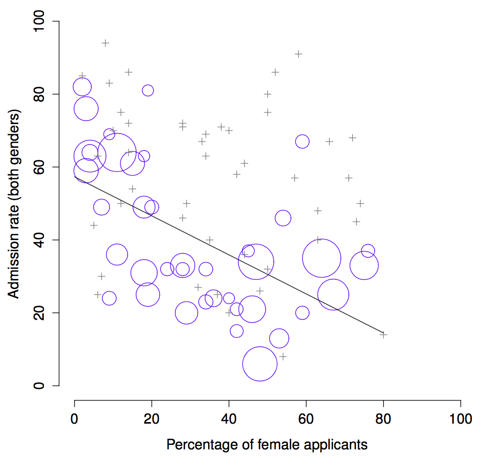

# Week 1: Introduction {#Introduction}

<div class="marginnote">
Adapted nearly verbatim from Chapter 1 and 2 in Navarro, D. ["Learning Statistics with R."](https://learningstatisticswithr.com)
</div>

To the surprise of many students, statistics is a fairly significant part of any bachelor program. To the surprise of no-one, statistics is very rarely the *favorite* part of one’s bachelor studies. After all, if you really loved the idea of doing statistics, you’d probably be enrolled in a statistics program right now, not a university college. So, not surprisingly, there’s a pretty large proportion of the student base that isn’t happy about the fact this program has much statistics in it. In view of this, I thought that the right place to start might be to answer some of the more common questions that people have about statistics…

A big part of this issue at hand relates to the very idea of statistics. What is it? What’s it there for? And why are scientists so bloody obsessed with it? These are all good questions, when you think about it. So let’s start with the last one. As a group, scientists seem to be bizarrely fixated on running statistical tests on everything. In fact, we use statistics so often that we sometimes forget to explain to people why we do. It’s a kind of article of faith among scientists – and especially social scientists – that your findings can’t be trusted until you’ve done some statistics. Undergraduate students might be forgiven for thinking that we’re all completely mad, because no-one takes the time to answer one very simple question:

> *Why do you do statistics? Why don’t scientists just use common sense?*

It’s a naive question in some ways, but most good questions are. There’s a lot of good answers to it, but for my money, the best answer is a really simple one: we don’t trust ourselves enough. We worry that we’re human, and susceptible to all of the biases, temptations and frailties that humans suffer from. Much of statistics is basically a safeguard. Using “common sense” to evaluate evidence means trusting gut instincts, relying on verbal arguments and on using the raw power of human reason to come up with the right answer. Most scientists don’t think this approach is likely to work.

Is it plausible to think that this “common sense” approach is very trustworthy? Verbal arguments have to be constructed in language, and all languages have biases – some things are harder to say than others, and not necessarily because they’re false (e.g., quantum electrodynamics is a good theory, but hard to explain in words). The instincts of our “gut” aren’t designed to solve scientific problems, they’re designed to handle day to day inferences – and given that biological evolution is slower than cultural change, we should say that they’re designed to solve the day to day problems for a *different world* than the one we live in. Most fundamentally, reasoning sensibly requires people to engage in “induction”, making wise guesses and going beyond the immediate evidence of the senses to make generalisations about the world. If you think that you can do that without being influenced by various distractors, well, I have a bridge in Brooklyn I’d like to sell you. Heck, as the next section shows, we can’t even solve “deductive” problems (ones where no guessing is required) without being influenced by our pre-existing biases.

## The curse of belief bias

People are mostly pretty smart. We’re certainly smarter than the other species that we share the planet with (though many people might disagree). Our minds are quite amazing things, and we seem to be capable of the most incredible feats of thought and reason. That doesn’t make us perfect though. And among the many things that psychologists have shown over the years is that we really do find it hard to be neutral, to evaluate evidence impartially and without being swayed by pre-existing biases. A good example of this is the **belief bias effect** in logical reasoning: if you ask people to decide whether a particular argument is logically valid (i.e., conclusion would be true if the premises were true), we tend to be influenced by the believability of the conclusion, even when we shouldn’t. For instance, here’s a valid argument where the conclusion is believable:

- No cigarettes are inexpensive (Premise 1)
- Some addictive things are inexpensive (Premise 2)
- Therefore, some addictive things are not cigarettes (Conclusion)

And here’s a valid argument where the conclusion is not believable:

- No addictive things are inexpensive (Premise 1)
- Some cigarettes are inexpensive (Premise 2)
- Therefore, some cigarettes are not addictive (Conclusion)

The logical *structure* of argument \#2 is identical to the structure of argument \#1, and they’re both valid. However, in the second argument, there are good reasons to think that premise 1 is incorrect, and as a result it’s probably the case that the conclusion is also incorrect. But that’s entirely irrelevant to the topic at hand: an argument is deductively valid if the conclusion is a logical consequence of the premises. That is, a valid argument doesn’t have to involve true statements.

On the other hand, here’s an invalid argument that has a believable conclusion:

- No addictive things are inexpensive (Premise 1)
- Some cigarettes are inexpensive (Premise 2)
- Therefore, some addictive things are not cigarettes (Conclusion)

And finally, an invalid argument with an unbelievable conclusion:

- No cigarettes are inexpensive (Premise 1)
- Some addictive things are inexpensive (Premise 2)
- Therefore, some cigarettes are not addictive (Conclusion)

Now, suppose that people really are perfectly able to set aside their pre-existing biases about what is true and what isn’t, and purely evaluate an argument on its logical merits. We’d expect 100% of people to say that the valid arguments are valid, and 0% of people to say that the invalid arguments are valid. So if you ran an experiment looking at this, you’d expect to see data like this:
                         
                        conlusion feels true   conclusion feels false
  -------------------- ---------------------- ------------------------
  argument is valid       100% say “valid”     100% say “valid”
  argument is invalid     0% say “valid”        0% say “valid”
  -------------------- ---------------------- ------------------------

If the data looked like this (or even a good approximation to this), we might feel safe in just trusting our gut instincts. That is, it’d be perfectly okay just to let scientists evaluate data based on their common sense, and not bother with all this murky statistics stuff. By now you probably know where this is going.

In a classic study, @Evans1983 ran an experiment looking at exactly this. What they found is that when pre-existing biases (i.e., beliefs) were in agreement with the structure of the data, everything went the way you’d hope:
                         
                        conlusion feels true   conclusion feels false 
  -------------------- ---------------------- ------------------------
  argument is valid       92% say “valid”              --
  argument is invalid     --                    8% say “valid”
  -------------------- ---------------------- ------------------------

Not perfect, but that’s pretty good. But look what happens when our intuitive feelings about the truth of the conclusion run against the logical structure of the argument:


                        conlusion feels true   conclusion feels false
  -------------------- ---------------------- -------------------------
  argument is valid       92% say “valid”     **46% say “valid”**
  argument is invalid     **92% say “valid”**        8% say “valid”
  -------------------- ---------------------- -------------------------

Oh dear, that’s not as good. Apparently, when people are presented with a strong argument that contradicts our pre-existing beliefs, we find it pretty hard to even perceive it to be a strong argument (people only did so 46% of the time). Even worse, when people are presented with a weak argument that agrees with our pre-existing biases, almost no-one can see that the argument is weak (people got that one wrong 92% of the time!)

If you think about it, it’s not as if these data are horribly damning. Overall, people did do better than chance at compensating for their prior biases, since about 60% of people’s judgements were correct (you’d expect 50% by chance). Even so, if you were a professional “evaluator of evidence”, and someone came along and offered you a magic tool that improves your chances of making the right decision from 60% to (say) 95%, you’d probably jump at it, right? Of course you would. Thankfully, we actually do have a tool that can do this. But it’s not magic, it’s statistics. So that’s reason \#1 why scientists love statistics. It’s just *too easy* for us to “believe what we want to believe”; so if we want to “believe in the data” instead, we’re going to need a bit of help to keep our personal biases under control. That’s what statistics does: it helps keep us honest.

## The cautionary tale of Simpson’s paradox

The following is a true story (I think...). In 1973, the University of California, Berkeley had some worries about the admissions of students into their postgraduate courses. Specifically, the thing that caused the problem was that the gender breakdown of their admissions, which looked like this:

  --------- ---------------------- ------------------
             Number of applicants   Percent admitted
  Males              8442                 44%
  Females            4321                 35%
  --------- ---------------------- ------------------

and they were worried about being sued. Given that there were nearly 13,000 applicants, a difference of 9% in admission rates between males and females is just way too big to be a coincidence. Pretty compelling data, right? And if I were to say to you that these data *actually* reflect a weak bias in favour of women (sort of!), you’d probably think that I was either crazy or sexist.

<div class="marginnote">
Earlier versions of these notes incorrectly suggested that they actually were sued – apparently that’s not true. There’s a nice commentary on this here: https://www.refsmmat.com/posts/2016-05-08-simpsons-paradox-berkeley.html. A big thank you to Wilfried Van Hirtum for pointing this out to me!
</div>

When people started looking more carefully at the admissions data [@Bickel1975] they told a rather different story. Specifically, when they looked at it on a department by department basis, it turned out that most of the departments actually had a slightly *higher* success rate for female applicants than for male applicants. The table below shows the admission figures for the six largest departments (with the names of the departments removed for privacy reasons):

<!-- From https://github.com/ekothe/rbook/blob/master/bookdown/01.01-intro.Rmd so it includes the correct column names -->
```{r simpsontable, echo=FALSE, warning = FALSE}
simpson <- cbind(c("A", "B", "C", "D", "E", "F"), 
                 c(825,560,325,417,191,272), 
                 c("62%","63%","37%","33%","28%","6%"),
                 c(108,25,593,375,393,341),
                 c("82%","68%","34%","35%","24%","7%"))
knitr::kable(simpson, col.names = c("Department","Male Applicants", "Male Percent Admitted", "Female Applicants", "Female Percent admitted"), align="c", caption = "Admission figures for the six largest departments by gender")
```

Remarkably, most departments had a *higher* rate of admissions for females than for males! Yet the overall rate of admission across the university for females was *lower* than for males. How can this be? How can both of these statements be true at the same time?

Here’s what’s going on. Firstly, notice that the departments are *not* equal to one another in terms of their admission percentages: some departments (e.g., engineering, chemistry) tended to admit a high percentage of the qualified applicants, whereas others (e.g., English) tended to reject most of the candidates, even if they were high quality. So, among the six departments shown above, notice that department A is the most generous, followed by B, C, D, E and F in that order. Next, notice that males and females tended to apply to different departments. If we rank the departments in terms of the total number of male applicants, we get **A**$>$**B**$>$D$>$C$>$F$>$E (the “easy” departments are in bold). On the whole, males tended to apply to the departments that had high admission rates. Now compare this to how the female applicants distributed themselves. Ranking the departments in terms of the total number of female applicants produces a quite different ordering C$>$E$>$D$>$F$>$**A**$>$**B**. In other words, what these data seem to be suggesting is that the female applicants tended to apply to “harder” departments. And in fact, if we look at all Figure \@ref(fig:1simpson) we see that this trend is systematic, and quite striking. This effect is known as **Simpson's paradox**. It’s not common, but it does happen in real life, and most people are very surprised by it when they first encounter it, and many people refuse to even believe that it’s real. It is very real. And while there are lots of very subtle statistical lessons buried in there, I want to use it to make a much more important point …doing research is hard, and there are *lots* of subtle, counterintuitive traps lying in wait for the unwary. That’s reason \#2 why scientists love statistics, and why we teach research methods. Because science is hard, and the truth is sometimes cunningly hidden in the nooks and crannies of complicated data.

```{r 1simpson, fig.cap="The Berkeley 1973 college admissions data. This figure plots the admission rate for the 85 departments that had at least one female applicant, as a function of the percentage of applicants that were female. The plot is a redrawing of Figure 1 from Bickel et al. (1975). Circles plot departments with more than 40 applicants; the area of the circle is proportional to the total number of applicants. The crosses plot department with fewer than 40 applicants."}


```


Before leaving this topic entirely, I want to point out something else really critical that is often overlooked in a research methods class. Statistics only solves *part* of the problem. Remember that we started all this with the concern that Berkeley’s admissions processes might be unfairly biased against female applicants. When we looked at the “aggregated” data, it did seem like the university was discriminating against women, but when we “disaggregate” and looked at the individual behaviour of all the departments, it turned out that the actual departments were, if anything, slightly biased in favour of women. The gender bias in total admissions was caused by the fact that women tended to self-select for harder departments. From a legal perspective, that would probably put the university in the clear. Postgraduate admissions are determined at the level of the individual department (and there are good reasons to do that), and at the level of individual departments, the decisions are more or less unbiased (the weak bias in favour of females at that level is small, and not consistent across departments). Since the university can’t dictate which departments people choose to apply to, and the decision making takes place at the level of the department it can hardly be held accountable for any biases that those choices produce.

But that’s not exactly the whole story, is it? After all, if we’re interested in this from a more sociological and psychological perspective, we might want to ask *why* there are such strong gender differences in applications. Why do males tend to apply to engineering more often than females, and why is this reversed for the English department? And why is it it the case that the departments that tend to have a female-application bias tend to have lower overall admission rates than those departments that have a male-application bias? Might this not still reflect a gender bias, even though every single department is itself unbiased? It might. 
Suppose, hypothetically, that males preferred to apply to “hard sciences” and females prefer “humanities”. And suppose further that the reason for why the humanities departments have low admission rates is because the government doesn’t want to fund the humanities (spots in Ph.D. programs, for instance, are often tied to government funded research projects). Does that constitute a gender bias? Or just an unenlightened view of the value of the humanities? What if someone at a high level in the government cut the humanities funds because they felt that the humanities are “useless chick stuff”. That seems pretty *blatantly* gender biased. None of this falls within the purview of statistics, but it matters to the research project. If you’re interested in the overall structural effects of subtle gender biases, then you probably want to look at *both* the aggregated and disaggregated data. If you’re interested in the decision making process at Berkeley itself then you’re probably only interested in the disaggregated data.

In short there are a lot of critical questions that you can’t answer with statistics, but the answers to those questions will have a huge impact on how you analyse and interpret data. And this is the reason why you should always think of statistics as a *tool* to help you learn about your data, no more and no less. It’s a powerful tool to that end, but there’s no substitute for careful thought.

## Statistics in psychology
<div class="marginnote">
As stated in the preface, this text was originally written for psychology students. Regardless of your interest in psychology, the reasons stated here are also relevant many other research fields (e.g. medicine, economics, sociology, sustainability etc.)
</div>
I hope that the discussion above helped explain why science in general is so focused on statistics. But I’m guessing that you have a lot more questions about what role statistics plays in psychology, and specifically why psychology classes always devote so many lectures to stats. So here’s my attempt to answer a few of them...

-   **Why does psychology have so much statistics?**

To be perfectly honest, there’s a few different reasons, some of which are better than others. The most important reason is that psychology is a statistical science. What I mean by that is that the “things” that we study are *people*. Real, complicated, gloriously messy, infuriatingly perverse people. The “things” of physics include objects like electrons, and while there are all sorts of complexities that arise in physics, electrons don’t have minds of their own. They don’t have opinions, they don’t differ from each other in weird and arbitrary ways, they don’t get bored in the middle of an experiment, and they don’t get angry at the experimenter and then deliberately try to sabotage the data set. At a fundamental level psychology is harder than physics.

Basically, we teach statistics to you as psychologists because you need to be better at stats than physicists. There’s actually a saying used sometimes in physics, to the effect that "if your experiment needs statistics, you should have done a better experiment". They have the luxury of being able to say that because their objects of study are pathetically simple in comparison to the vast mess that confronts social scientists. It’s not just psychology, really: most social sciences are desperately reliant on statistics. Not because we’re bad experimenters, but because we’ve picked a harder problem to solve. We teach you stats because you really, really need it.

-   **Can’t someone else do the statistics?**

To some extent, but not completely. It’s true that you don’t need to become a fully trained statistician just to do psychology, but you do need to reach a certain level of statistical competence. In my view, there’s three reasons that every psychological researcher ought to be able to do basic statistics:

  1. There’s the fundamental reason: statistics is deeply intertwined with research design. If you want to be good at designing psychological studies, you need to at least understand the basics of stats.

  2. If you want to be good at the psychological side of the research, then you need to be able to understand the psychological literature, right? But almost every paper in the psychological literature reports the results of statistical analyses. So if you really want to understand the psychology, you need to be able to understand what other people did with their data. And that means understanding a certain amount of statistics.

  3. There’s a big practical problem with being dependent on other people to do all your statistics: statistical analysis is *expensive*. In almost any real life situation where you want to do psychological research, the cruel facts will be that you don’t have enough money to afford a statistician. So the economics of the situation mean that you have to be pretty self-sufficient.

Note that a lot of these reasons generalize beyond researchers. If you want to be a practicing psychologist and stay on top of the field, it helps to be able to read the scientific literature, which relies pretty heavily on statistics.

-   **I don’t care about jobs, research, or clinical work. Do I need statistics?**

Okay, now you’re just messing with me. Still, I think it should matter to you too. Statistics should matter to you in the same way that statistics should matter to *everyone*: we live in the 21st century, and data are *everywhere*. Frankly, given the world in which we live these days, a basic knowledge of statistics is pretty damn close to a survival tool!

## Statistics in everyday life

> *“We are drowning in information,\
> but we are starved for knowledge”*\
>
> – Various authors, original probably John Naisbitt

When I started writing up my lecture notes I took the 20 most recent news articles posted to the ABC news website. Of those 20 articles, it turned out that 8 of them involved a discussion of something that I would call a statistical topic; 6 of those made a mistake. The most common error, if you’re curious, was failing to report baseline data (e.g., the article mentions that 5% of people in situation X have some characteristic Y, but doesn’t say how common the characteristic is for everyone else!) The point I’m trying to make here isn’t that journalists are bad at statistics (though they almost always are), it’s that a basic knowledge of statistics is very helpful for trying to figure out when someone else is either making a mistake or even lying to you. Perhaps, one of the biggest things that a knowledge of statistics does to you is cause you to get angry at the newspaper or the internet on a far more frequent basis :).

## There’s more to research methods than statistics

So far, most of what I’ve talked about is statistics, and so you’d be forgiven for thinking that statistics is all I care about in life. To be fair, you wouldn’t be far wrong, but research methodology is a broader concept than statistics. So most research methods courses will cover a lot of topics that relate much more to the pragmatics of research design, and in particular the issues that you encounter when trying to do research with humans. However, about 99% of student *fears* relate to the statistics part of the course, so I’ve focused on the stats in this discussion, and hopefully I’ve convinced you that statistics matters, and more importantly, that it’s not to be feared. That being said, it’s pretty typical for introductory research methods classes to be very stats-heavy. This is not (usually) because the lecturers are evil people. Quite the contrary, in fact. Introductory classes focus a lot on the statistics because you almost always find yourself needing statistics before you need the other research methods training. Why? Because almost all of your assignments in other classes will rely on statistical training, to a much greater extent than they rely on other methodological tools. It’s not common for undergraduate assignments to require you to design your own study from the ground up (in which case you would need to know a lot about research design), but it *is* common for assignments to ask you to analyse and interpret data that were collected in a study that someone else designed (in which case you need statistics). In that sense, from the perspective of allowing you to do well in all your other classes, the statistics is more urgent.

But note that “urgent” is different from “important” – they both matter. I really do want to stress that research design is just as important as data analysis, and this book does spend a fair amount of time on it. However, while statistics has a kind of universality, and provides a set of core tools that are useful for most types of research, the research methods side isn’t quite so universal. There are some general principles that everyone should think about, but a lot of research design is very idiosyncratic and specific to the area of research that you want to engage in. Throughout the course you will be introduced to some core principles of research methods, but research methodology is an incredibly extensive and diverse field. To the extent that it’s the details of research methods that matter, those details don’t usually show up in an introductory class, as is the case for this course. 

## A brief introduction to research methods
In this section, we’re going to start thinking about the basic ideas that go into designing a study, collecting data, checking whether your data collection works, and so on. It won’t give you enough information to allow you to design studies of your own, but it will give you a lot of the basic tools that you need to assess the studies done by other people. However, since the focus of this book is much more on data analysis than on data collection, I’m only giving a very brief overview. Note that this section is “special” in two ways. Firstly, it’s much more psychology-specific than the later parts of this book. Secondly, it focuses much more heavily on the scientific problem of research methodology, and much less on the statistical problem of data analysis. Nevertheless, the two problems are related to one another, so it’s traditional for stats textbooks to discuss the problem in at least some detail. This section relies heavily on @Campbell1963 for the discussion of study design.

## Some thoughts about measurement

The first thing to understand is data collection can be thought of as a kind of **measurement**. That is, in psychological research, what we’re trying to do is measure something about human behaviour. What do I mean by “measurement”?

Measurement itself is a subtle concept, but basically it comes down to finding some way of assigning numbers, or labels, or some other kind of well-defined descriptions to “stuff”. So, any of the following would count as a psychological measurement:

-   My <span>**age**</span> is <span>*33 years*</span>.

-   I <span>*do not*</span> <span>**like anchovies**</span>.

-   My <span>**chromosomal gender**</span> is <span>*male*</span>.

-   My <span>**self-identified gender**</span> is <span>*male*</span>.

In the short list above, the <span>**bolded part**</span> is “the thing to be measured”, and the <span>*italicized part*</span> is “the measurement itself”. In fact, we can expand on this a little bit, by thinking about the set of possible measurements that could have arisen in each case:

-   My <span>**age**</span> (in years) could have been <span>*0, 1, 2, 3 …*</span>, etc. The upper bound on what my age could possibly be is a bit fuzzy, but in practice you’d be safe in saying that the largest possible age is <span>*150*</span>, since no human has ever lived that long.

-   When asked if I <span>**like anchovies**</span>, I might have said that <span>*I do*</span>, or <span>*I do not*</span>, or <span>*I have no opinion*</span>, or <span>*I sometimes do*</span>.

-   My <span>**chromosomal gender**</span> is almost certainly going to be <span>*male (XY)*</span> or <span>*female (XX)*</span>, but there are a few other possibilities. I could also have <span>*Klinfelter’s syndrome (XXY)*</span>, which is more similar to male than to female. And I imagine there are other possibilities too.

-   My <span>**self-identified gender**</span> is also very likely to be <span>*male*</span> or <span>*female*</span>, but it doesn’t have to agree with my chromosomal gender. I may also choose to identify with <span>*neither*</span>, or to explicitly call myself <span>*transgender*</span>.

As you can see, for some things (like age) it seems fairly obvious what the set of possible measurements should be, whereas for other things it gets a bit tricky. But I want to point out that even in the case of someone’s age, it’s much more subtle than this. For instance, in the example above, I assumed that it was okay to measure age in years. But if you’re a developmental psychologist, that’s way too crude, and so you often measure age in <span>*years and months*</span> (if a child is 2 years and 11 months, this is usually written as “2;11”). If you’re interested in newborns, you might want to measure age in <span>*days since birth*</span>, maybe even <span>*hours since birth*</span>. In other words, the way in which you specify the allowable measurement values is important.

Looking at this a bit more closely, you might also realise that the concept of “age” isn’t actually all that precise. In general, when we say “age” we implicitly mean “the length of time since birth”. But that’s not always the right way to do it. Suppose you’re interested in how newborn babies control their eye movements. If you’re interested in kids that young, you might also start to worry that “birth” is not the only meaningful point in time to care about. If Baby Alice is born 3 weeks premature and Baby Bianca is born 1 week late, would it really make sense to say that they are the “same age” if we encountered them “2 hours after birth”? In one sense, yes: by social convention, we use birth as our reference point for talking about age in everyday life, since it defines the amount of time the person has been operating as an independent entity in the world, but from a scientific perspective that’s not the only thing we care about. When we think about the biology of human beings, it’s often useful to think of ourselves as organisms that have been growing and maturing since conception, and from that perspective Alice and Bianca aren’t the same age at all. So you might want to define the concept of “age” in two different ways: the length of time since conception, and the length of time since birth. When dealing with adults, it won’t make much difference, but when dealing with newborns it might.

Moving beyond these issues, there’s the question of methodology. What specific “measurement method” are you going to use to find out someone’s age? As before, there are lots of different possibilities:

-   You could just ask people “how old are you?” The method of self-report is fast, cheap and easy, but it only works with people old enough to understand the question, and some people lie about their age.

-   You could ask an authority (e.g., a parent) “how old is your child?” This method is fast, and when dealing with kids it’s not all that hard since the parent is almost always around. It doesn’t work as well if you want to know “age since conception”, since a lot of parents can’t say for sure when conception took place. For that, you might need a different authority (e.g., an obstetrician).

-   You could look up official records, like birth certificates. This is time consuming and annoying, but it has its uses (e.g., if the person is now dead).

## Operationalization: defining your measurement

All of the ideas discussed in the previous section all relate to the concept of **operationalization**. To be a bit more precise about the idea, operationalization is the process by which we take a meaningful but somewhat vague concept, and turn it into a precise measurement. The process of operationalization can involve several different things:

-   Being precise about what you are trying to measure: For instance, does “age” mean “time since birth” or “time since conception” in the context of your research?

-   Determining what method you will use to measure it: Will you use self-report to measure age, ask a parent, or look up an official record? If you’re using self-report, how will you phrase the question?

-   Defining the set of the allowable values that the measurement can take: Note that these values don’t always have to be numerical, though they often are. When measuring age, the values are numerical, but we still need to think carefully about what numbers are allowed. Do we want age in years, years and months, days, hours? Etc. For other types of measurements (e.g., gender), the values aren’t numerical. But, just as before, we need to think about what values are allowed. If we’re asking people to self-report their gender, what options to we allow them to choose between? Is it enough to allow only “male” or “female”? Do you need an “other” option? Or should we not give people any specific options, and let them answer in their own words? And if you open up the set of possible values to include all verbal response, how will you interpret their answers?

Operationalization is a tricky business, and there’s no “one, true way” to do it. The way in which you choose to operationalize the informal concept of “age” or “gender” into a formal measurement depends on what you need to use the measurement for. Often you’ll find that the community of scientists who work in your area have some fairly well-established ideas for how to go about it. In other words, operationalization needs to be thought through on a case by case basis. Nevertheless, while there a lot of issues that are specific to each individual research project, there are some aspects to it that are pretty general.

Before moving on, I want to take a moment to clear up our terminology, and in the process introduce more terms. Here are four different things that are closely related to each other:

-   **A theoretical construct** or concept. This is the thing that you’re trying to take a measurement of, like “age”, “gender” or an “opinion”. A theoretical construct can’t be directly observed, and often they’re actually a bit vague.

-   **A measure**. The measure refers to the method or the tool that you use to make your observations. A question in a survey, a behavioural observation or a brain scan could all count as a measure.

-   **A variable**. A variable is what we end up with when we apply our measure to something in the world. That is, variables are the actual “data” that we end up with in our data sets.

-   **An operationalization**. The term operationalization refers to the logical connection between the measure and the theoretical construct, or to the process by which we try to derive a measure from a theoretical construct.

The process of operationalization consists of two steps, each of which entails some kind of definition of the theoretical construct we are interested in measuring. The first step of operationalization is specifying the **nominal definition** of a theoretical construct. This is when you specify the meaning of a theoretical construct but remain quite abstract. For instance, when defining "children", we could be asking the following questions: is a child defined by a blood relationship, a legal relationship, a social relationship, chronological age, level of dependency or some other criterion? 

Different nominal definitions will produce different results; hence it is important that nominal definitions are derived carefully and transparently. Usually, it is good practice to develop and narrow down a nominal definition as follows:

  1. Obtain a range of different definitions: search the (academic) literature for explicit and implicit definitions.
  
  2. Decide on a definition: from your list, either pick one definition, or create a new one that serves the purposes of your study best. Explain and justify your approach. 
  
  3. Delineate the dimensions of the theoretical construct. Almost any theoretical construct has a number of dimensions associated with it and it is helpful to spell these out as they can help you get closer to the measure that best serves the purposes of your study. For example, the theoretical construct "child’s well-being" has a number of dimensions: emotional, psychological, physical, educational, financial, social, environmental, legal, etc. If you are interested in the effect of marriage breakdown on children’s well-being, which dimensions are relevant to you? You may examine all of the possible dimensions or limit yourself to one or two. To answer this question you can borrow from literature and theoretical frameworks used by other researchers to motivate and explain the context of research. What is most important is that you explain and justify your approach.

In addition to the aforementioned dimensions, theoretical constructs can also have subdimensions. Suppose we decide to focus on social well-being. In this case, the following subdimensions could be of some relevance: the level of safety in the neighborhood or the nature of a child’s relationships and experiences with discrimination. Given that we are interested in the effect of marriage breakdown on children’s well-being, we might want to focus on the child’s relationships with others, especially people like their mother, father, siblings, etc. Again, what is important here is to explain and justify your approach. 

```{r 1construct, fig.cap="Operationalization of child's well-being. Adapted from @de_vaus_research_2001"}

knitr::include_graphics("figures/1construct.png")
```

The next step of operationalization is specifying the **operational definition** of a theoretical construct. This specifies the **indicators** that reflect the nominal definition. Working with our example of marriage breakdown on children’s well-being and our decision to focus on social well-being and a child’s relationship with his or her father, we can use the following indicators: amount of contact, level of conflict, feelings of closeness, amount of helping, type of activities engaged in. 

How well the indicators match the theoretical construct has a bit impact on the value of the conclusions that can be drawn from the study. Once the indicators have been chosen, the researcher can move to the next stage which is to **measure** the chosen indicators.  

In practice, even scientists tend to blur the distinction between these things, but it’s very helpful to try to understand the differences.

## Assessing the reliability of a measurement

At this point we’ve thought a little bit about how to operationalize a theoretical construct and thereby create a psychological measure. Now, we should start discussing the obvious question: is the measurement any good? We’ll do this in terms of two related ideas: <span>*reliability*</span> and <span>*validity*</span>. Put simply, the **reliability** of a measure tells you how <span>*precisely*</span> you are measuring something, whereas the validity of a measure tells you how <span>*accurate*</span> the measure is. 

Reliability is actually a very simple concept: it refers to the repeatability or consistency of your measurement. The measurement of my weight by means of a “bathroom scale” is very reliable: if I step on and off the scales over and over again, it’ll keep giving me the same answer. Measuring my intelligence by means of “asking my mom” is very unreliable: some days she tells me I’m a bit thick, and other days she tells me I’m a complete moron. Notice that this concept of reliability is different to the question of whether the measurements are correct (the correctness of a measurement relates to it’s validity). If I’m holding a sack of potatos when I step on and off of the bathroom scales, the measurement will still be reliable: it will always give me the same answer. However, this highly reliable answer doesn’t match up to my true weight at all, therefore it’s wrong. In technical terms, this is a <span>*reliable but invalid*</span> measurement. Similarly, while my mom’s estimate of my intelligence is a bit unreliable, she might be right. Maybe I’m just not too bright, and so while her estimate of my intelligence fluctuates pretty wildly from day to day, it’s basically right. So that would be an <span>*unreliable but valid*</span> measure. Of course, to some extent, notice that if my mum’s estimates are too unreliable, it’s going to be very hard to figure out which one of her many claims about my intelligence is actually the right one. To some extent, then, a very unreliable measure tends to end up being invalid for practical purposes; so much so that many people would say that reliability is necessary (but not sufficient) to ensure validity.

Okay, now that we’re clear on the distinction between reliability and validity, let’s have a think about the different ways in which we might measure reliability:

-   **Test-retest reliability**. This relates to consistency over time: if we repeat the measurement at a later date, do we get a the same answer?

-   **Inter-rater reliability**. This relates to consistency across people: if someone else repeats the measurement (e.g., someone else rates my intelligence) will they produce the same answer?

-   **Parallel forms reliability**. This relates to consistency across theoretically-equivalent measurements: if I use a different set of bathroom scales to measure my weight, does it give the same answer?

-   **Internal consistency reliability**. If a measurement is constructed from lots of different parts that perform similar functions (e.g., a personality questionnaire result is added up across several questions) do the individual parts tend to give similar answers?

Not all measurements need to possess all forms of reliability. For instance, educational assessment can be thought of as a form of measurement. One of the subjects that I teach, <span>*Computational Cognitive Science*</span>, has an assessment structure that has a research component and an exam component (plus other things). The exam component is <span>*intended*</span> to measure something different from the research component, so the assessment as a whole has low internal consistency. However, within the exam there are several questions that are intended to (approximately) measure the same things, and those tend to produce similar outcomes; so the exam on its own has a fairly high internal consistency. Which is as it should be. You should only demand reliability in those situations where you want to be measure the same thing!

## Forms of measurement error

The aim of the process of operationalization is to identify measures with the highest possible <span>validity</span> and <span>reliability</span>. However, such endeavors turn out to be trickier in practice than they sound in theory and several errors might occur along the way. As we will see here, different forms of measurement error have different implications and consequences in the conclusions of the study.

The first and least harmful form of error is **random error**. As the name suggests, it occurs randomly which means there is no systematic pattern underlying its occurrence. For instance, if we employ a self-reported measure of conflict with one’s own father, participants in our study might overestimate or underestimate the actual level of conflict with their father. If we believe that people are equally likely to under- or overestimate, there will be no systematic pattern of under- or overestimation in our data as the former will cancel out the latter. 

**Constant error** occurs where there is some amount of error for every case. When this is the case, values of any measure are systemetically overestimated or underestimated. For instance, people tend to overestimate their driving skills: significantly more than 50% of drivers believe their driving skills are better than average, which of course cannot be true! When such patterns of bias occur in the data, our measures are affected because errors do not cancel each other out. 

**Correlated error** occurs when the measurement error correlates with a characteristic that varies across the observations of our data. For instance, overweight people tend to underestimate their weight, whereas underweight people tend to overestimate it [@rowland1990self]. This is subtly distinct from random error: even if at the aggregate the amount of overestimated weights is the same as the amount of underestimated weights, the underlying pattern of weight biased measurements can affect the conclusions of a study as it might generate alternative explanations related to weight differences. 

It is one of the main goals of any measure to minimize such errors. To achieve this, the researcher should pay careful attention to indicator quality, socially desirable responses and other forms of deliberate (mis)representation by respondents. Despite the fact it is often difficult to identify when such errors actually occur, researchers should pay a fair amount of attention trying to minimize them. 

## The role of variables: predictors and outcomes

I’ve got one last piece of terminology that I need to explain to you. Remember, the outcome of a psychological measurement is called a variable. Normally, when we do some research we end up with lots of different variables. Then, when we analyse our data we usually try to explain some of the variables in terms of some of the other variables. It’s important to keep the two roles “thing doing the explaining” and “thing being explained” distinct. So let’s be clear about this now. Firstly, we might as well get used to the idea of using mathematical symbols to describe variables, since it’s going to happen over and over again. Let’s denote the “to be explained” variable $Y$, and denote the variables “doing the explaining” as $X_1$, $X_2$, etc.

Now, when we doing an analysis, we have different names for $X$ and $Y$, since they play different roles in the analysis. The classical names for these roles are **independent variable** (IV) and **dependent variable** (DV). The IV is the variable that you use to do the explaining (i.e., $X$) and the DV is the variable being explained (i.e., $Y$). The logic behind these names goes like this: if there really is a relationship between $X$ and $Y$ then we can say that $Y$ depends on $X$, and if we have designed our study “properly” then $X$ isn’t dependent on anything else. However, some people have suggested these names are horrible: they’re hard to remember and they can be misleading, because (a) the IV is never actually “independent of everything else” and (b) if there’s no relationship, then the DV doesn’t actually depend on the IV. There are a number of alternatives that some people find more appealing. 

For example, in an experiment the IV refers to the **manipulation**, and the DV refers to the **measurement**. So, we could use **manipulated variable** (independent variable) and **measured variable** (dependent variable). 

```{r ivdv, tidy=FALSE, echo=FALSE}
knitr::kable(rbind
             (c("to be explained", "dependent variable (DV)", "measurement"),
             c("to do the explaining", "independent variable (IV)", "manipulation")),
caption = 'The terminology used to distinguish between different roles that a variable can play when analysing a data set.',col.names = c(
  "role of the variable", "classical name","modern name"),
  booktabs = TRUE
)
```

We could also use **predictors** and **outcomes**. The idea here is that what you’re trying to do is use $X$ (the predictors) to make guesses about $Y$ (the outcomes). This is summarized in the table:

```{r ivdv2, tidy=FALSE, echo=FALSE}
knitr::kable(rbind
             (c("to be explained", "dependent variable (DV)", "outcome"),
             c("to do the explaining", "independent variable (IV)", "predictor")),
caption = 'The terminology used to distinguish between different roles that a variable can play when analysing a data set.',col.names = c(
  "role of the variable", "classical name","modern name"),
  booktabs = TRUE
)
```

## That's it for this week
That's it for the readings of the first week. Next, make sure to complete the ["Getting started"](https://thomashulst.github.io/quantrma_ex/getting-started.html) section of the exercise manual before your first tutorial. In this section you will install and learn about the very basics of the statistical software we will be using during this course: R. 