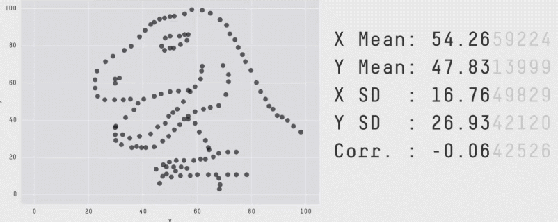

# Week 2: Describing Data [^Adapted2]
>Far better an approximate answer to the right question, which is often vague, than an exact answer to the wrong question, which can always be made precise.
>---John W. Tukey

[^Adapted2]: Chapter by Matthew Crump

This chapter is about **descriptive statistics**. These are tools for describing data. Some things to keep in mind as we go along are:

  1. There are lots of different ways to describe data
  2. There is more than one "correct" way, and you get to choose the most "useful" way for the data that you are describing
  3. It is possible to invent new ways of describing data
  4. Describing data is necessary because there is usually too much of it, so it doesn't make any sense by itself.

Before we start with describing data, we need to introduce you to the concept of measurement scales.


## Scales of measurement
Remember last week when we talked about [measurement](#thoughts-measurement)? To reiterate: the outcome of a measurement is called a variable. But not all variables are of the same qualitative type, and it’s very useful to understand what types there are. A very useful concept for distinguishing between different types of variables is what’s known as **scales of measurement**.

### Nominal scale
A **nominal scale** variable (also referred to as a **categorical** variable) is one in which there is no particular relationship between the different possibilities: for these kinds of variables it doesn’t make any sense to say that one of them is \`\`bigger’ or “better” than any other one, and it absolutely doesn’t make any sense to average them. The classic example for this is “eye colour”. Eyes can be blue, green and brown, among other possibilities, but none of them is any “better” than any other one. As a result, it would feel really weird to talk about an “average eye colour”. Similarly, gender is nominal too: male isn’t better or worse than female, neither does it make sense to try to talk about an “average gender”. In short, nominal scale variables are those for which the only thing you can say about the different possibilities is that they are different. That’s it.

Let’s take a slightly closer look at this. Suppose I was doing research on how people commute to and from work. One variable I would have to measure would be what kind of transportation people use to get to work. This “transport type” variable could have quite a few possible values, including: “train”, “bus”, “car”, “bicycle”, etc. For now, let’s suppose that these four are the only possibilities, and suppose that when I ask 100 people how they got to work today, and I get this:

<!-- This table and tables that follow in this section updated from https://github.com/ekothe/rbook/blob/master/bookdown/01.02-studydesign.Rmd -->
|Transportation|Number of people|
|:-:|:-:|
| (1) Train | 12|
| (2) Bus | 30|
| (3) Car | 48|
| (4) Bicycle | 10|

So, what’s the average transportation type? Obviously, the answer here is that there isn’t one. It’s a silly question to ask. You can say that travel by car is the most popular method, and travel by train is the least popular method, but that’s about all. Similarly, notice that the order in which I list the options isn’t very interesting. I could have chosen to display the data like this and nothing really changes.

 |Transportation|Number of people|
|:-:|:-:|
| (3) Car | 48|
| (1) Train | 12|
| (4) Bicycle | 10|
| (2) Bus | 30|

### Ordinal scale
**Ordinal scale** variables have a bit more structure than nominal scale variables, but not by a lot. An ordinal scale variable is one in which there is a natural, meaningful way to order the different possibilities, but you can’t do anything else. The usual example given of an ordinal variable is “finishing position in a race”. You *can* say that the person who finished first was faster than the person who finished second, but you *don’t* know how much faster. As a consequence we know that 1st $>$ 2nd, and we know that 2nd $>$ 3rd, but the difference between 1st and 2nd might be much larger than the difference between 2nd and 3rd.

A more interesting example could be as follows. Suppose I’m interested in people’s attitudes to climate change, and I ask them to pick one of these four statements that most closely matches their beliefs:
<!-- Markdown doesn't support "reordered" lists, see: https://stackoverflow.com/questions/50642050/markdown-how-to-create-ordered-lists -->

> - (1) Temperatures are rising, because of human activity
> - (2) Temperatures are rising, but we don't know why
> - (3) Temperatures are rising, but not because of humans
> - (4) Temperatures are not rising

Notice that these four statements actually do have a natural ordering, in terms of “the extent to which they agree with the current science”. Statement 1 is a close match, statement 2 is a reasonable match, statement 3 isn’t a very good match, and statement 4 is in strong opposition to the science. So, in terms of the thing I’m interested in (the extent to which people endorse the science), I can order the items as $1 > 2 > 3 > 4$. Since this ordering exists, it would be very weird to list the options like this…

> - (3) Temperatures are rising, but not because of humans
> - (1) Temperatures are rising, because of human activity
> - (4) Temperatures are not rising
> - (2) Temperatures are rising, but we don't know why 

…because it seems to violate the natural “structure” to the question.

So, let’s suppose I asked 100 people these questions, and got the following answers:

|Response                                               | Number|
|--------                                               |:-----:|
|(1) Temperatures are rising, because of human activity | 51    |
|(2) Temperatures are rising, but we don't know why     | 20    |
|(3) Temperatures are rising, but not because of humans | 10    |
|(4) Temperatures are not rising                        | 19    |

When analysing these data, it seems quite reasonable to try to group (1), (2) and (3) together, and say that 81 of 100 people were willing to *at least partially* endorse the science. And it’s *also* quite reasonable to group (2), (3) and (4) together and say that 49 of 100 people registered *at least some disagreement* with the dominant scientific view. However, it would be entirely bizarre to try to group (1), (2) and (4) together and say that 90 of 100 people said…what? There’s nothing sensible that allows you to group those responses together at all.

That said, notice that while we *can* use the natural ordering of these items to construct sensible groupings, what we *can’t* do is average them. For instance, in my simple example here, the “average” response to the question is 1.97. If you can tell me what that means, I’d love to know. Because that sounds like gibberish to me!

### Interval scale
In contrast to nominal and ordinal scale variables, **interval scale** and ratio scale variables are variables for which the numerical value is genuinely meaningful. In the case of interval scale variables, the *differences* between the numbers are interpretable, but the variable doesn’t have a “natural” zero value. A good example of an interval scale variable is measuring temperature in degrees celsius. For instance, if it was 15$^\circ$ yesterday and 18$^\circ$ today, then the 3$^\circ$ difference between the two is genuinely meaningful. Moreover, that 3$^\circ$ difference is *exactly the same* as the 3$^\circ$ difference between $7^\circ$ and $10^\circ$. In short, addition and subtraction are meaningful for interval scale variables.

However, notice that the $0^\circ$ does not mean “no temperature at all”: it actually means “the temperature at which water freezes”, which is pretty arbitrary. As a consequence, it becomes pointless to try to multiply and divide temperatures. It is wrong to say that $20^\circ$ is *twice as hot* as $10^\circ$, just as it is weird and meaningless to try to claim that $20^\circ$ is negative two times as hot as $-10^\circ$.

Let's look at a different example. Suppose I’m interested in looking at how the attitudes of first-year university students have changed over time. Obviously, I’m going to want to record the year in which each student started. This is an interval scale variable. A student who started in 2003 did arrive 5 years before a student who started in 2008. However, it would be completely insane for me to divide 2008 by 2003 and say that the second student started “1.0024 times later” than the first one. That doesn’t make any sense at all.

### Ratio scale
The fourth and final type of variable to consider is a **ratio scale** variable, in which zero really means zero, and it’s okay to multiply and divide. A good example of a ratio scale variable is response time (RT). In a lot of tasks it’s very common to record the amount of time somebody takes to solve a problem or answer a question, because it’s an indicator of how difficult the task is. Suppose that Alan takes 2.3 seconds to respond to a question, whereas Ben takes 3.1 seconds. As with an interval scale variable, addition and subtraction are both meaningful here. Ben really did take $3.1 - 2.3 = 0.8$ seconds longer than Alan did. However, notice that multiplication and division also make sense here too: Ben took $3.1 / 2.3 = 1.35$ times as long as Alan did to answer the question. And the reason why you can do this is that, for a ratio scale variable such as RT, “zero seconds” really does mean “no time at all”.

### Continuous versus discrete variables
There’s a second kind of distinction that you need to be aware of, regarding what types of variables you can run into. This is the distinction between continuous variables and discrete variables. The difference between these is as follows:

-   A **continuous variable** is one in which, for any two values that you can think of, it’s always logically possible to have another value in between.

-   A **discrete variable** is, in effect, a variable that isn’t continuous. For a discrete variable, it’s sometimes the case that there’s nothing in the middle.

These definitions probably seem a bit abstract, but they’re pretty simple once you see some examples. For instance, response time is continuous. If Alan takes 3.1 seconds and Ben takes 2.3 seconds to respond to a question, then it’s possible for Cameron’s response time to lie in between, by taking 3.0 seconds. And of course it would also be possible for David to take 3.031 seconds to respond, meaning that his RT would lie in between Cameron’s and Alan’s. And while in practice it might be impossible to measure RT that precisely, it’s certainly possible in principle. Because we can always find a new value for RT in between any two other ones, we say that RT is continuous.

Discrete variables occur when this rule is violated. For example, nominal scale variables are always discrete: there isn’t a type of transportation that falls “in between” trains and bicycles, not in the strict mathematical way that 2.3 falls in between 2 and 3. So transportation type is discrete. Similarly, ordinal scale variables are always discrete: although “2nd place” does fall between “1st place” and “3rd place”, there’s nothing that can logically fall in between “1st place” and “2nd place”. Interval scale and ratio scale variables can go either way. As we saw above, response time (a ratio scale variable) is continuous. Temperature in degrees celsius (an interval scale variable) is also continuous. However, the year you went to school (an interval scale variable) is discrete. There’s no year in between 2002 and 2003. The number of questions you get right on a true-or-false test (a ratio scale variable) is also discrete: since a true-or-false question doesn’t allow you to be “partially correct”, there’s nothing in between 5/10 and 6/10. The following table summarizes the relationship between the scales of measurement and the discrete/continuity distinction. Cells with a tick mark correspond to things that are possible. I’m trying to hammer this point home, because (a) some textbooks get this wrong, and (b) people very often say things like “discrete variable” when they mean “nominal scale variable”. It’s very unfortunate.

```{r scalescont, tidy=FALSE, echo=FALSE}
knitr::kable(
  rbind(c("", "continuous", "discrete"),
        c("nominal", "", "$\\checkmark$"),
        c("ordinal", "", "$\\checkmark$"),
        c("interval", "$\\checkmark$", "$\\checkmark$"),
        c("ratio", "$\\checkmark$", "$\\checkmark$")
    
  )
  , caption = 'The relationship between the scales of measurement and the discrete/continuity distinction. Cells with a tick mark correspond to things that are possible.', align="lcc",
  booktabs = TRUE
)
```

### Some complexities
Okay, I know you’re going to be shocked to hear this, but …the real world is much messier than this little classification scheme suggests. Very few variables in real life actually fall into these nice neat categories, so you need to be kind of careful not to treat the scales of measurement as if they were hard and fast rules. It doesn’t work like that: they’re guidelines, intended to help you think about the situations in which you should treat different variables differently. Nothing more.

So let’s take a classic example, maybe *the* classic example, of a psychological measurement tool: the **Likert scale**. The humble Likert scale is the bread and butter tool of all survey design. You yourself have filled out hundreds, maybe thousands of them, and odds are you’ve even used one yourself. Suppose we have a survey question that looks like this:

> Which of the following best describes your opinion of the statement that “all pirates are freaking awesome” …

and then the options presented to the participant are these:

> \(1) Strongly disagree\
> (2) Disagree\
> (3) Neither agree nor disagree\
> (4) Agree\
> (5) Strongly agree

This set of items is an example of a 5-point Likert scale: people are asked to choose among one of several (in this case 5) clearly ordered possibilities, generally with a verbal descriptor given in each case. However, it’s not necessary that all items be explicitly described. This is a perfectly good example of a 5-point Likert scale too:

> \(1) Strongly disagree\
> (2)\
> (3)\
> (4)\
> (5) Strongly agree

Likert scales are very handy, if somewhat limited, tools. The question is, what kind of variable are they? They’re obviously discrete, since you can’t give a response of 2.5. They’re obviously not nominal scale, since the items are ordered; and they’re not ratio scale either, since there’s no natural zero.

But are they ordinal scale or interval scale? One argument says that we can’t really prove that the difference between “strongly agree” and “agree” is of the same size as the difference between “agree” and “neither agree nor disagree”. In fact, in everyday life it’s pretty obvious that they’re not the same at all. So this suggests that we ought to treat Likert scales as ordinal variables. On the other hand, in practice most participants do seem to take the whole “on a scale from 1 to 5” part fairly seriously, and they tend to act as if the differences between the five response options were fairly similar to one another. As a consequence, a lot of researchers treat Likert scale data as if it were interval scale. It’s not interval scale, but in practice it’s close enough that we usually think of it as being **quasi-interval scale**.

## This is what too many numbers looks like {#toomanynumbers}
With that out of the way, we can start looking at some actual measurements. Let's say you want to know how happy people are. So, you ask 500 people on the street how happy they are. You let them pick any number they want from negative infinity to positive infinity and record all the numbers in a continuous interval variable.

We could look at the numbers and see if that helps determine anything about how happy people are. Perhaps it would look something like this:

```{r echo=T,eval=F,tidy=TRUE}
# From now on, whenever it makes sense, I will show the R code used to generate the examples. That way you can follow along in your own R session and learn from the examples given. 

# The following line of code generates a variable called "happiness" with 500 pretend happiness ratings. This is of course not the same as actually conducting a study, as we ask R to generate 500 random values, but is very helpful for illustrative purposes.
happiness<-rnorm(500,100,500) 

```

```{r 2toomany,echo=F}
set.seed(7)
happiness<-rnorm(500,100,500)
knitr::kable(matrix(round(happiness,digits=2),ncol=10,nrow=50))
```

When you deal with data, you will often encounter so many numbers to you that you will be overwhelmed by them. That is why we need ways to describe the data in a more manageable fashion. 

The complete description of the data is the data itself. **Descriptive statistics** and other tools for describing data go one step further to summarize aspects of the data. Summaries are a way to compress the important bits of a thing down to a useful and manageable tidbit. It's like telling your friends why they should watch a movie: you don't replay the entire movie for them, instead you tell them the general highlights. Summarizing the data is just like a movie preview, only for data.

## Describing data using graphs
So, we  tried one way of looking at the numbers (just printing all of them in a large table) which wasn't particularly useful. Let's look at the numbers using graphs. 

### Scatterplot
Let's turn all of the numbers into dots, then show them in a graph. This type of graph is called a scatterplot. Note, when we do this, we have not yet summarized anything about the data. Instead, we just look at all of the data in a visual format, rather than looking at the numbers themselves. 

```{r 2happyPlot, echo=T, fig.cap="Pretend happiness ratings from 500 people"}
plot(happiness,ylim=c(-1500,1500),las=1)
```

Figure \@ref(fig:2happyPlot) shows 500 measurements of happiness. The graph has two axes. The horizontal **x-axis**, going from left to right is labeled "Index". The vertical **y-axis**, going up and down, is labeled "happiness". Each dot represents one measurement of every person's happiness from our pretend study. Before we talk about what we can see about the data, it is worth mentioning that the way you plot the data will make some things easier to see and some things harder to see. 

So, what can we now see about the data? Firstly, there are lots of dots everywhere. It looks like there are 500 of them because the index on the x-axis goes to 500. It looks like some dots go as high as +1500 and as low as -1500. It looks like there are more dots in the middle-ish area of the plot, sort of spread around 0. The dots are kind of all over the place, so different people have different levels of happiness, which is not so surprising. But we could now also start to answer questions about the data. Are there any trends? Are more people happy than unhappy, or vice-versa?

>Take home message: we can visualize our variables by putting them in a plot, which is easier and more helpful than looking at the raw numbers.

### Histogram
Making a histogram will be our first act of officially summarizing the data. We will no longer look at the individual bits of data, instead we will see how the numbers group together. Let's look at a histogram of the happiness data, and then explain it.

```{r 2happyHist, echo=T, fig.cap="A histogram of the happiness ratings"}
hist(happiness,breaks=6,ylim=c(0,200), xlim=(c(-1500,1500)))
```
The dots have disappeared and instead we have some bars. Each bar is a summary of the dots, representing the number of dots (frequency count) inside a particular range of happiness, also called **bins**. For example, how many people gave a happiness rating between 0 and 500? The fourth bar, the one between 0 and 500 on the x-axis, tells you how many. The height is shown on the y-axis, which provides a frequency count (the number of dots or data points). It looks like around 180 people said their happiness was between 0-500.

More generally, we see there are 6 bins on the x-axis. We have divided the data into bins of 500. Bin \#1 goes from -1500 to -1000, bin \#2 goes from -1000 to -500, and so on until the last bin. To make the histogram, we just count up the number of data points falling inside each bin, then plot those frequency counts as a function of the bins. Voila, a histogram.

What does the histogram help us see about the data? First, we can see the **shape** of data. The shape of the histogram refers to how it goes up and down. The shape tells us where the data is. For example, when the bars are low we know there isn't much data there. When the bars are high, we know there is more data there. So, where is most of the data? It looks like it's mostly in the middle two bins, between -500 and 500. We can also see the **range** of the data. This tells us the minimums and the maximums of the data. Most of the data is between -1500 and +1500, so no infinite sadness or infinite happiness in our data-set.

When you make a histogram you get to choose how wide each bar will be. For example, below are four different histograms of the very same happiness data. What changes is the width of the bins. 


```{r 2manyhistbin, fig.cap="Four histograms of the same data using different bin widths",tidy=TRUE,echo=TRUE}

par(mfrow=c(2,2),mar=c(2,2,2,2))
g1 <- hist(happiness,breaks=6,ylim=c(0,200),xlim=(c(-1500,1500)))
g2 <- hist(happiness,breaks=12,ylim=c(0,100),xlim=(c(-1500,1500)))
g3 <- hist(happiness,breaks=24,ylim=c(0,50),xlim=(c(-1500,1500)))
g4 <- hist(happiness,breaks=48,ylim=c(0,25),xlim=(c(-1500,1500)))

```

All of the histograms have roughly the same overall shape: From left to right, the bars start off small, then go up, then get small again. In other words, as the numbers get closer to zero, they start to occur more frequently. We see this general trend across all the histograms. But, some aspects of the trend fall apart when the bars get really narrow. For example, although the bars generally get taller when moving from -1000 to 0, there are some exceptions and the bars seem to fluctuate a little bit. When the bars are wider, there are less exceptions to the general trend. How wide or narrow should your histogram be? It's a Goldilocks question. Make it just right for your data.

### Other graphs
There are many other graphs to describe your data in addition to scatterplots and histograms, but they will be introduced to you as we continue this course. For now it's important to know that your data can be visualized using a graph and different types of graphs can show you different things about your data. 

## Describing data using numbers
Let's introduce three important terms that we will use a lot in descriptive statistics: **distribution**, **central tendency**, and **variance**. These terms are similar to their everyday meanings (although I suspect most people don't say central tendency very often).

**Distribution.** "To distribute" is to spread something. Notice, the data in the histogram is distributed, or spread across the bins. We can also talk about a distribution as a noun. The histogram is a distribution of the frequency counts across the bins. Distributions are **very, very, very, very, very** important. They can have many different shapes. They can describe data, like in the histogram above. And as we will learn in later chapters, distributions can also **produce** data. Many times we will be asking questions about where our data came from, and this usually means asking what kind of distribution could have created our data (more on that later).

**Central tendency** is all about sameness: What is common about some numbers? For example, is there anything similar about all of the numbers in the histogram? Yes, we can say that most of them are near 0. There is a tendency for most of the numbers to be centered near 0. Notice we are being cautious about our generalization about the numbers. We are not saying they are all 0. We are saying there is a tendency for many of them to be near zero. There are lots of ways to talk about the central tendency of some numbers. There can even be more than one kind of tendency. For example, if lots of the numbers were around -1000, and a similar large amount of numbers were grouped around 1000, we could say there was two tendencies.

**Variance** is all about "differentness". The variance in the numbers refers to how the numbers are different. There are many ways to summarize the amount of variance in the numbers, and we will discuss these very soon.

## Measures of central tendency (sameness)
We've seen that we can get a sense of data by plotting dots in a graph and by making a histogram. These tools show us what the numbers look like, approximately how big and small they are, and how similar and different they are from another. It is good to get a feeling about the numbers in this way. But, these visual sensitudes are not very precise. In addition to summarizing numbers with graphs, we can summarize numbers using numbers.

Measures of central tendency have one important summary goal: to reduce a pile of numbers to a single number that we can look at. We already know that looking at thousands of numbers is hopeless. Wouldn't it be nice if we could just look at one number instead? It turns out there are lots of ways to do this. 

### Mode
The **mode** is the most frequently occurring number in your measurement. That is it. How do you find it? You have to count the number of times each number appears in your measure, then whichever one occurs the most, is the mode.

> Example: 1 1 1 2 3 4 5 6

The mode of the above set is 1, which occurs three times. Every other number only occurs once.

OK fine. What happens here:

> Example: 1 1 1 2 2 2 3 4 5 6

Hmm, now 1 and 2 both occur three times each. What do we do? We say there are two modes, 1 and 2, and call the distribution of numbers **bimodal**.

Why is the mode a measure of central tendency? Well, when we ask, "what are my numbers like", we can say, "most of the number are, like a 1 (or whatever the mode is)".

Is the mode a good measure of central tendency? That depends on your numbers. For example, consider these numbers

> 1 1 2 3 4 5 6 7 8 9

Here, the mode is 1 again, because there are two 1s and all of the other numbers occur once. But, most numbers are not 1s, so you can argue whether the mode is a good summary of the set of numbers in this case.

"Argh, so should I or should I not use the mode? I thought this class was supposed to tell me what to do?". There is no telling you what to do. Every time you use a tool in statistics you have to think about what you are doing and justify if and why what you are doing makes sense. Sorry.

### Median
The **median** is the exact middle of the data. After all, we are asking about central tendency, so why not go to the center of the data and see where it lies. Let's have a look at the following numbers:

> 1 5 4 3 6 7 9

Umm, OK. So, three is in the middle and therefore the median? That seems kind of arbitrary and it is. Before we compute the median, we need to order the numbers from smallest to largest.

> 1 3 4 **5** 6 7 9

Now, 5 is in the middle. There are three numbers to the left of 5, and three numbers to the right.

What happens when there aren't an even number of numbers? Then the middle will be missing right? Let's see:

> 1 2 3 4 5 6

There is no number between 3 and 4 in the data, the middle is empty. In this case, we compute the median by figuring out the number in between 3 and 4. So, the median would be 3.5.

Is the median a good measure of central tendency? Sure, it is often very useful. One property of the median is that it stays in the middle even when some of the other numbers get really weird. For example, consider these numbers:

> 1 2 3 4 4 4 **5** 6 6 6 7 7 1000

Most of these numbers are smallish, but the 1000 is a big weird number, very different from the rest. The median is still 5, because it is in the middle of these ordered numbers. We can also see that five is pretty similar to most of the numbers (except for 1000). So, the median does a pretty good job of representing most of the numbers in the set, and it does so even if one or two of the numbers are very different from the others.

Finally, **outlier** is a term will we use to describe numbers that appear in data that are very different from the rest. 1000 is an outlier, because it lies way out there on the number line compared to the other numbers. What to do with outliers is another topic we discuss sometimes throughout this course.

### Mean
Have you noticed this is a textbook about statistics that hasn't used a formula yet? That is about to change, but for those of you with formula anxiety, don't worry, we will do our best to explain them.

The **mean** is also called the average. And, we're guessing you might already now what the average of a bunch of numbers is. It's the sum of the numbers, divided by the number of numbers right? We express that idea in a formula just like this:

$\text{Mean} = \bar{X} = \frac{\sum_{i=1}^{N} X_{i}}{N}$

The $\sum$ symbol is called **sigma**, and it stands for the operation of summing. The little "i" on the bottom, and the "N" on the top refers to all of the numbers in the set, from the first number "i" to the last number "N". The $X_{i}$ refers to individual numbers in the set. We sum up all of the numbers, then divide the sum by $N$, which is the total number of numbers. Sometimes you will see $\bar{X}$ (say: ex-bar) to refer to the mean of a set of numbers.

In plain English, the formula looks like:

$\text{Mean} = \frac{\text{Sum of my numbers}}{\text{Count of my numbers}}$

Let's compute the mean for these five numbers:

> 3 7 9 2 6

Add em up:

> 3+7+9+2+6 = 27

Count em up:

> $i_{1}$ = 3, $i_{2}$ = 7, $i_{3}$ = 9, $i_{4}$ = 2, $i_{5}$ = 6; N=5, because $i$ went from 1 to 5

Divide em:

> mean = 27 / 5 = 5.4

Or, to put the numbers in the formula, it looks like this:

$\text{Mean} = \bar{X} = \frac{\sum_{i=1}^{N} X_{i}}{N} = \frac{3+7+9+2+6}{5} = \frac{27}{5} = 5.4$

Is the mean a good measure of central tendency? By now, you can guess: it depends. 

### What does the mean mean? {#whatmeanmean}
It is not enough to know the formula for the mean, or to be able to use the formula to compute a mean for a set of numbers. We believe in your ability to add and divide numbers. What you really need to know is what the mean really "means". This requires that you know what the mean does, and not just how to do it. Puzzled? Let's explain.

Let's think about the following questions: What happens when you divide a sum of numbers by the number of numbers? What are the consequences of doing this? What is the formula doing? What kind of properties does the result give us? 

Of course, the key word here is divide. We literally carve the number up top in the numerator into pieces. How many times do we split the top number? That depends on the bottom number in the denominator. Watch:

$\frac{12}{3} = 4$

So, we know the answer is 4. But, what is really going on here is that we are slicing and dicing up 12 into three parts. It turns out the size of those three parts is 4. So, now we are thinking of 12 as three different pieces $12 = 4 + 4 + 4$. I know this will be obvious, but what kind of properties do our pieces have? Well, obviously they are all fours. The pieces are all the same size. They are all equal. So, division equalizes the numerator by the denominator...

"Umm, I think I learned this in elementary school, what does this have to do with the mean?". The number on top of the formula for the mean is just another numerator being divided by a denominator. In this case, the numerator is a sum of all the values in your data. What if it was the sum of all of the 500 happiness ratings? The sum of all of them would just be a single number adding up all the different ratings. If we split the sum up into equal parts representing one part for each person's happiness we would get 500 identical and equal numbers for each person. It would be like taking all of the happiness in the world, then dividing it up equally, then to be fair, giving back the same equal amount of happiness to everyone in the world. This would make some people more happy than they were before, and some people less happy right. Of course, that's because it would be equalizing the distribution of happiness for everybody. This process of equalization by dividing something into equal parts is what the **mean** does. See, it's more than just a formula. It's an idea. This is just the beginning of thinking about these kinds of ideas. We will come back to this idea about the mean, and other ideas, in later chapters.

> Take home: the mean is the one and only number that can take the place of every number in the data, such that when you add up all the equal parts, you get back the original sum of the data.

### All together now
Just to remind ourselves of the mode, median, and mean, take a look at the next histogram of our happiness data set. We have overlaid the location of the mode (blue), median (green), and mean (red). The location of the mode, median and mean are pretty similar. 

```{r 2meanmodemedhap, fig.cap="A histogram of happiness with the mode (blue), median (green), and mean (red)", eval=TRUE,echo=FALSE}
library(ggplot2)

dens_mode <- function(x) {
    den <- density(x, kernel=c("gaussian"))
        ( den$x[den$y==max(den$y)] )   
}  

df_hap <- data.frame(happiness)
ggplot(df_hap, aes(x = happiness)) + geom_histogram(binwidth = 500,color="black", fill="lightgrey") +
    geom_vline(xintercept=mean(happiness), color="red", size=1)+
  geom_vline(xintercept=median(happiness), color="green", size=1)+
  geom_vline(xintercept=dens_mode(happiness), color="blue", size=1)+
  expand_limits(x = c(-1500, 1500)) +
  theme_classic() 

```
But that's not always the case. Suppose I collect data on the length of phone calls to an IT call center. Most phone calls are dealt with quickly and are relatively short, but there are some people with difficult questions that require much more assistance than other callers. For this data set, the three measures of central tendency all give different answers. The mean has the largest value, because it is influenced by large numbers (the few very long phone calls), even if they occur rarely. The median is less sensitive to large numbers that occur infrequently, so the value of the median is smaller. The mode is not affected by the infrequent large numbers at all. 

```{r 2meanmodemed, fig.cap="A histogram of phone call length with the mode (blue), median (green), and mean (red)"}

x_mode <- function(x) {
  ux <- unique(x)
  ux[which.max(tabulate(match(x, ux)))]
}

call_length <-round(rexp(1000,.1),digits=0)

# translated from qplot to ggplot so bins line up
df_call = data.frame(call_length)
ggplot(df_call, aes(x = call_length)) + geom_histogram(binwidth = 1,color="black", fill="lightgrey") +
    geom_vline(xintercept=mean(call_length), color="red", size=1)+
  geom_vline(xintercept=median(call_length), color="green", size=1)+
  geom_vline(xintercept=x_mode(call_length), color="blue", size=1)+
  theme_classic()

```


## Measures of variation (differentness)
Writing a book report in high school probably meant you were comparing and contrasting things. When you summarize data, you do the same thing. Measures of central tendency give us something like comparing does, they tell us about what is the same. Measures of variation give us something like contrasting does, they tell us about what is different.

First, we note that whenever you see a bunch of numbers that aren't the same, you already know there are some differences. This means the numbers vary, and there is variation in the size of the numbers.

### The range
Consider these 10 numbers, that I already ordered from smallest to largest for you:

> 1 3 4 5 5 6 7 8 9 24

The numbers have variation, because they are not all the same. We can use the range to describe the width of the variation. The range refers to the **minimum** (smallest value) and **maximum** (largest value) in the set. So, the range would be 1 and 24.

The range is a good way to quickly summarize the boundaries of your data in just two numbers. By computing the range we know that none of the data is larger or smaller than the range. And, it can alert you to outliers. For example, if you are expecting your numbers to be between 1 and 7, but you find the range is 1 - 3405, then you know you have at least one big number that shouldn't be there, and you can try to figure out why that occurred (and potentially remove it and other outliers).

### Difference scores
It would be nice to summarize the amount of differentness in the data. Here's why: if you thought that raw data (lots of numbers) is too big to look at, then you will be frightened to contemplate how many differences there are to look at. For example, these 10 numbers are easy to look at:

> 1 3 4 5 5 6 7 8 9 24

But, what about the difference between the numbers, what do those look like? We can compute the difference scores between each number, then put them in a matrix like the one below:

```{r 2diffscores,echo=F}
numbers<-c(1, 3, 4, 5, 5, 6, 7, 8, 9, 24)
mat<-matrix(rep(numbers,10),ncol=10)
differences<-t(mat)-numbers
row.names(differences)<-numbers
colnames(differences)<-numbers
knitr::kable(differences,row.names=T)

```

We are looking at all of the possible differences between each number and every other number. So, in the top left, the difference between 1 and itself is 0. One column over to the right, the difference between 3 and 1 (3-1) is 2, etc. As you can see, this is a 10x10 matrix, which means there are 100 differences to look at. Not too bad, but if we had 500 numbers, then we would have 500*500 = 250,000 differences to look at (go for it if you like looking at that sort of thing). 

For a moment, let's think about what this matrix look like if all of the 10 numbers in our data were the same number? It should look like a bunch of 0s right? In that case, we could easily see that the numbers have no variation.

But, when the numbers are different, it's not so easy to see what the variation of our data set is. However, we could ask something like, what is the average difference that we have? For example, we could  take all of our differences and compute the mean difference. What do you think would happen if we did that?

Let's try it out on these three numbers:

> 1 2 3

```{r 2diffscoreSmall,echo=F}
numbers<-c(1, 2,3)
mat<-matrix(rep(numbers,3),ncol=3)
differences<-t(mat)-numbers
row.names(differences)<-numbers
colnames(differences)<-numbers
knitr::kable(differences, row.names=T)
```

Let's compute the mean:

$\text{mean of difference scores} = \frac{0+1+2-1+0+1-2-1+0}{9} = \frac{0}{9} = 0$

Uh oh, we get zero for the mean of the difference scores. This will always happen whenever you take the mean of the difference scores. We can see that there are some differences between the numbers, so using 0 as the summary value for the variation in the numbers doesn't make much sense.

Furthermore, you might also notice that the matrices of difference scores are redundant. The diagonal is always zero, and numbers on one side of the diagonal are the same as the numbers on the other side, except their signs are reversed. These are problems that can be solved by computing the **variance** and the **standard deviation**. For now, the standard deviation is a just a trick that we use to avoid getting a zero. But, later we will see it has properties that are important for other reasons.

### The variance {#var-form}
Variability, variation, variance, vary, variable, varying, variety. Confused yet? Before we describe **the variance**, we want to you be OK with how this word is used. First, don't forget the big picture. We know that variability and variation refers to the big idea of differences between numbers. We can even use the word variance in the same way. When numbers are different, they have variance.

The word **variance** also refers to a specific summary statistic: the sum of the squared deviations from the mean. Hold on what? In plain English: the variance is the sum of the squared difference scores, where the difference scores are computed between each number in the data set and the mean. Let's see the formula first[^Formulas]:

$\frac{{\sum_{i=1}^N} (X_i - \bar{X})^2}{N}$, or in English: $\text{Variance} = \frac{\text{Sum of squared difference scores}}{\text{Number of Scores}}$

[^Formulas]:The formulas for variance and standard deviation depend on whether you think your data represents an entire population of numbers, or is sample from the population. We discuss this issue later on. For now, we divide by N (the number of observations), later we discuss why you will often divide by N-1 instead.

#### Deviations from the mean {#devmean}
We got a little bit complicated before when we computed the difference scores between **all** of the numbers in the data. Let's do it again, but in a more manageable way. This time, we calculate the difference between each score and the **mean**. The idea here is:

1. We figure out how similar our scores are by computing the mean
2. Then we figure out how different our scores are from the mean

This could tell us something about whether our scores are really all very close to the mean (which could help us know if the mean is good representative number of the data), and something about how much differences there are in the numbers.

Take a look at this table:

```{r 2deviations,echo=F, message=F,warning=F}
library(dplyr)
scores<-1:6
values<-c(1,6,4,2,6,8)
mean_scores<-mean(values)
difference_from_mean<-values-mean_scores
the_df<-data.frame(scores,values,mean=rep(mean_scores,6),difference_from_mean)

the_df <- the_df %>%
  rbind(c("Sums",colSums(the_df[1:6,2:4]))) %>%
  rbind(c("Means",colMeans(the_df[1:6,2:4])))
knitr::kable(the_df)

```

The first column shows we have 6 scores in the data set, and the `value` columns shows each individual score. The sum of the values and the mean are presented on the last two rows. The sum and the mean were obtained by:

$\frac{1+6+4+2+6+8}{6} = \frac{27}{6} = 4.5$. 

The third column `mean`, appears a bit silly. We are just listing the mean once for every score. If you think back to our discussion about the meaning of the mean, then you will remember that it equally distributes the total sum across each data point. We can see that here, if we treat each score as the mean, then every score is a 4.5. We can also see that adding up all of the means for each score gives us back 27, which is the sum of the original values. Also, we see that if we find the mean of the mean scores, we get back the mean (4.5 again).

All of the action is occurring in the fourth column, `difference_from_mean`. Here, we are showing the difference scores from the mean, using $X_{i}-\bar{X}$. In other words, we subtracted the mean ($\bar{X}$) from each individual score ($X_{i}$). So, the first score, 1, is -3.5 from the mean, the second score, 6, is +1.5 from the mean, and so on.

Now, we can look at our original scores and we can look at their differences from the mean. Notice, we don't have a matrix of raw difference scores, so it is much easier to look at. But, we still have a problem:

We can see that there are non-zero values in the difference scores, so we know there are a differences in the data. But, when we add them all up, we still get zero, which makes it seem like there are a total of zero differences in the data...

#### The squared deviations

Some devious someone divined a solution to the fact that differences scores from the mean always add to zero. The devious solution is to square the numbers. Squaring numbers converts all the negative numbers to positive numbers. For example, $2^2 = 4$, and $-2^2 = 4$. We use the term **squared deviations** to refer to differences scores that have been squared. Deviations are things that move away from something. The difference scores move away from the mean, so we also call them **deviations**.

Let's look at our table again, but add the squared deviations.

```{r 2deviationssquared,echo=F}
scores<-1:6
values<-c(1,6,4,2,6,8)
mean_scores<-mean(values)
difference_from_mean<-values-mean_scores
squared_deviations <- difference_from_mean^2
the_df<-data.frame(scores,values,mean=rep(mean_scores,6),difference_from_mean,squared_deviations)

the_df <- the_df %>%
  rbind(c("Sums",colSums(the_df[1:6,2:5]))) %>%
  rbind(c("Means",colMeans(the_df[1:6,2:5])))
knitr::kable(the_df)

```

OK, now we have a new column called `squared_deviations`. These are just the difference scores squared. So, $-3.5^2 = 12.25$, etc. You can confirm this for yourself with your calculator.

Now that all of the squared deviations are positive, we can add them up. When we do this we create something very special called the sum of squares (SS), also known as the sum of the squared deviations from the mean.

#### Finally, the variance

Guess what, we already computed the variance. It already happened, and maybe you didn't notice. First, see if you can remember what we are trying to do here. Take a pause, and see if you can tell yourself what problem we are trying solve.

> pause

Without further ado, we are trying to get a summary of the differences in our data. There are just as many difference scores from the mean as there are data points, which can be a lot, so it would be nice to have a single number to look at, something like a mean, that would tell us about the **average** differences in the data.

If you look at the table, you can see we already computed the mean of the squared deviations. First, we found the sum of squares (SS), then below that we calculated the mean of the sum of squares = 5.916 repeating. This is **the variance**. The variance is the mean of the sum of the squared deviations:

$\text{variance} = \frac{SS}{N}$, where SS is the sum of the squared deviations, and N is the number of observations.

OK, now what. What do I do with the variance? What does this number mean? Good question. The variance is often an unhelpful number to look at, because it is not in the same scale as the original data. This is because we squared the difference scores before taking the mean. Squaring produces large numbers. For example, we see a 12.25 in there. That's a big difference, bigger than any difference between any two original values. How can we bring the numbers back down to their original unsquared size? That's easy: we can always unsquare anything by taking the square root. So, let's do that to 5.916: $\sqrt{5.916} =$ `r sqrt(5.916)`.

### The standard deviation

Oops, we did it again. We already computed the standard deviation, and we didn't tell you. The standard deviation is the square root of the variance...At least, it is right now, until we complicate matters for you in later chapters.

Here is the formula for the standard deviation:

$\text{standard deviation} = \sqrt{\text{variance}} = \sqrt{\frac{SS}{N}}$.

We could also expand this to say:

$\text{standard deviation} = \sqrt{\frac{\sum_{i=1}^{N}({X_{i}-\bar{X})^2}}{N}}$


Don't let those big square root signs put you off. You know what they are doing there: they are just bringing our measure of the variance back down to the original size of the data. Let's look at our table again:

```{r,echo=F}
scores<-1:6
values<-c(1,6,4,2,6,8)
mean_scores<-mean(values)
difference_from_mean<-values-mean_scores
squared_deviations <- difference_from_mean^2
the_df<-data.frame(scores,values,mean=rep(mean_scores,6),difference_from_mean,squared_deviations)

the_df <- the_df %>%
  rbind(c("Sums",colSums(the_df[1:6,2:5]))) %>%
  rbind(c("Means",colMeans(the_df[1:6,2:5])))
knitr::kable(the_df)

```

We measured the standard deviation as `r sqrt(5.916)`. Notice this number fits right in the with differences scores from the mean. All of the scores are kind of in and around + or - `r sqrt(5.916)`. Whereas, if we looked at the variance, 5.916 is just too big, it doesn't summarize the actual differences very well.

What does all this mean? Well, if someone told they had some number with a mean of 4.5 (like the values in our table), and a standard deviation of `r sqrt(5.916)`, you would get a pretty good summary of the numbers. You would know that many of the numbers are around 4.5, and you would know that not all of the numbers are 4.5. You would know that the numbers spread around 4.5. You also know that the spread isn't super huge, it's only + or - `r sqrt(5.916)` on average. That's a good starting point for describing numbers. 

If you had loads of numbers, you could reduce them down to the mean and the standard deviation, and still be pretty well off in terms of getting a sense of those numbers.

### Closing thoughts on measures of variation

We spent many paragraphs talking about variation in numbers, and how to use the **variance** and **standard deviation** to summarize the average differences between numbers in a data set. The basic process was to 1) calculate some measure of the differences, then 2) average the differences to create a summary. We found that we couldn't average the raw difference scores, because we would always get a zero. So, we squared the differences from the mean, then averaged the squared differences differences. Finally, we square rooted our measure to bring the summary back down to the scale of the original numbers. 

Perhaps you were thinking that the problem of summing difference scores (so that they don't equal zero), can be solved in more than one way. How about just taking the absolute value of the difference scores? [^Abs] 

[^Abs]: For a discussion on why we tend to use squared deviations in statistics instead of absolute deviations see [here](https://stats.stackexchange.com/questions/118/why-square-the-difference-instead-of-taking-the-absolute-value-in-standard-devia)

Many things are possible. The important aspect to any of this is to have a reason for what you are doing, and to choose a method that works for the data-analysis problem you are trying to solve. Note also, we bring up this general discussion because we want you to understand that statistics is a creative exercise. We invent things when we need them, and we use things that have already been invented when they work for the problem at hand.

## Remember to look at your data

Using numbers to describe data is great and we will use it a lot during this course, but you may suspect these descriptive statistics also have some short-comings. They are compressed summaries of large piles of numbers and will almost always be unable to represent all of the numbers fairly. There are also different kinds of descriptive statistics that you could use and it sometimes not clear which one's you should use. 

Perhaps the most important thing you can do when describing data is to use both graphs and numbers. This can help you see whether or not your descriptive statistics are doing a good job of representing the data.

### Anscombe's Quartet

To hit this point home, and to get you thinking about the issues we discuss in the next chapter, check out the following. It's called Anscombe's Quartet, because these interesting graphs and numbers were produced by @Anscombe1973. You are looking at several scatterplots of different measurements and each of the plots look very different, right? 

```{r}
library(data.table)
ac <- fread("data/anscombe.txt")
ac<-as.data.frame(ac)

ac_long<-data.frame(x=c(ac[,1],
                        ac[,3],
                        ac[,5],
                        ac[,7]),
                    y=c(ac[,2],
                        ac[,4],
                        ac[,6],
                        ac[,8]),
                    quartet = as.factor(rep(1:4,each=11))
                        )

ggplot(ac_long, aes(x=x, y=y, color=quartet))+
  geom_point()+
  theme_classic()+
  facet_wrap(~quartet)


```


It is maybe surprising to learn that the descriptive statistics for the numbers in these graphs are (almost) exactly the same. In the table below I present the mean and variance for the x-values in each graph, and the mean and the variance for the y-values in each graph.


```{r}
library(dplyr)

ac_long_summary <- ac_long %>%
                    dplyr::group_by(quartet) %>%
                    dplyr::summarise(mean_x = mean(x),
                              var_x = var(x),
                              mean_y = mean(y),
                              var_y = var(y))

knitr::kable(ac_long_summary)

```
Anscombe put these special numbers together to illustrate the point of visualizing your numbers. If you only look at your descriptive statistics, you don't know what patterns in the data they are hiding. If you look at your descriptive statistics in combination with a graph, then you can get a better understanding.

### Datasaurus Dozen
If you thought that Anscombe's quartet was neat, you should take a look at the [Datasaurus Dozen](https://www.autodeskresearch.com/publications/samestats) [@matejka2017same]. The scatterplots show many different patterns, including dinosaurs! What's amazing is that all of the scatterplots have very nearly the same descriptive statistics. Just another reminder to look at your data, it might look like a dinosaur!

```{r 2Datasaurus, fig.cap="Datasaurus: different scatterplots with nearly identical descriptive statistics", echo=F}

if (knitr:::is_latex_output()) {
  
} else {
  knitr::include_graphics("figures/gifs/Datasaurus.gif")
}

```

## That's it for this week
That's it for the readings of the second week. During the lab you will learn about graphing and generating descriptive statistics in R. Additional practice materials for this week can be found on [SOWISO](https://cloud.sowiso.nl). The practice materials are by no means mandatory, are ideally made after the lab, and are a bit more advanced, but they can help you further understand descriptive statistics in R. Finally, if you haven't done so already, make sure you've [signed up for an assignment group](https://canvas.eur.nl/courses/31825/assignments/118509). 


