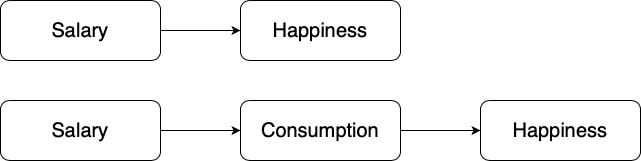
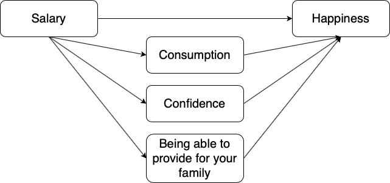
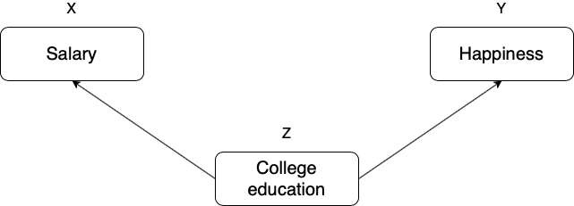
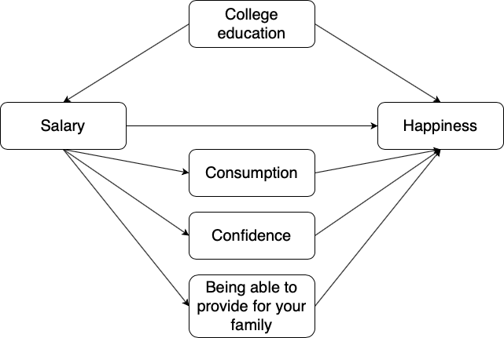

# Week 3: Correlation and Causation [^Adapted3] {#chcorrelationandcaus}

>Correlation does not equal causation
>---Every Statistics and Research Methods Instructor Ever

[^Adapted3]: Original chapter by Matthew Crump. Extended with our own materials about causation. Materials about validity from Chapter 2 of Learning Statistics with R by Danielle Navarro. 

Last week we explored [fake human happiness data](#toomanynumbers). We imagined that we asked a bunch of people to tell us how happy they were, then we looked at the numbers they gave us. There were too many numbers to look at directly, but we could summarize happiness using graphs and their central tendencies (sameness) and variability (differentness). 

Before moving on, you should be skeptical of what the numbers might mean. For example, if you force people to give a number to rate their happiness, does this number truly reflect how happy they are? Does how the question is phrased affect the answers? Is happiness even a real thing?  These are all good questions about the **validity** of the construct (happiness itself) and the **measure** (numbers) you are using to quantify it. For now, though, we will side-step those very important questions until later in this chapter.

OK, after we have measured some happiness, I bet you can think of some interesting questions. For example: what causes happiness to go up or down? If you knew the causes of happiness you could increase your own happiness; or, help people who are unhappy; or, better appreciate why Eeyore from Winnie the Pooh is unhappy; or, present valid scientific arguments that argue against incorrect claims about what causes happiness. A causal theory and understanding of happiness could be used for all of those things, so how can we get there?

## If something caused something else to change, what would that look like?
Before we go around determining the causes of happiness, we should prepare ourselves with some analytical tools so that we could identify what causation looks like. If we don't prepare ourselves for what we might find, then we won't know how to interpret our own data. Instead, we need to anticipate what the data could look like. Specifically, we need to know what data would look like when one thing does not cause another thing, and what data would look like when one thing does cause another thing. This chapter does some of this preparation. Fair warning: we will find out some tricky things. For example, we can find patterns that look like one thing is causing another, even when that one thing DOES NOT CAUSE the other thing. Hang in there.

### Charlie and the chocolate factory
Let's imagine that a person's supply of chocolate has a causal influence on their level of happiness. Let's further imagine that, like Charlie, the more chocolate you have the more happy you will be, and the less chocolate you have, the less happy you will be. Finally, because we suspect happiness is caused by lots of other things in a person's life, we anticipate that the relationship between chocolate supply and happiness won't be perfect. What do these assumptions mean for how the data should look?

Our first step is to collect some imaginary data from 100 people. We walk around and ask the first 100 people we meet to answer two questions: 

1. how much chocolate do you have, and 
2. how happy are you. 

For convenience, both the scales will go from 0 to 100. For the chocolate scale, 0 means no chocolate, 100 means lifetime supply of chocolate. Any other number is somewhere in between. For the happiness scale, 0 means no happiness, 100 means all of the happiness, and in between means some amount in between.

Below is how the data was generated in R and in the table you can find the sample data from the first 10 imaginary subjects. Again, note this is simulated data  (using the `runif()` function), we didn't actually go around asking people about their happiness and chocolate consumption. 

```{r 3chocHappyEcho,echo=TRUE,eval=FALSE,tidy=TRUE}

# uniform dist to generate pretend happiness and chocolate variables
chocolate <- round(1:100*runif(100,.5,1)) 
happiness <- round(1:100*runif(100,.5,1))

# create subject column (numbers 1 to 100)
subject <- seq(1,100,1)

# put all variables in a dataframe
df_charlie <- data.frame(subject,chocolate,happiness)

```

```{r 3chocHappy,echo=FALSE,eval=TRUE}

chocolate<-round(1:100*runif(100,.5,1))
happiness<-round(1:100*runif(100,.5,1))
subject<-seq(1,100,1)

df_charlie<-data.frame(subject,chocolate,happiness)
df_charlie_short<-df_charlie[1:10,]

knitr::kable(df_charlie_short)
```

We asked each subject two questions so there are two scores for each subject, one for their chocolate supply, and one for their level of happiness. You might already notice some relationships between amount of chocolate and level of happiness in the table. To make those relationships even more clear, let's plot all of the data in a graph.

When you have two variables worth of data, you can turn the data into a scatterplot where you get to choose which variable goes on which axis. Let's put chocolate supply on the x-axis, and happiness level on the y-axis.

```{r 3scatter1, fig.cap="Imaginary data showing a positive relationship between amount of chocolate and amount happiness", echo=TRUE,tidy=F}
library(tidyverse)
ggplot(df_charlie, aes(x = chocolate, y = happiness))+
  geom_point() +
  theme_classic()

```

What do the dots mean? Each dot has two coordinates, an x-coordinate for chocolate, and a y-coordinate for happiness. The first dot, all the way on the bottom left is the first subject in the table, who had close to 0 chocolate and close to zero happiness. You can look at any dot and draw a straight line down to the x-axis: that will tell you how much chocolate that subject has. When you draw a straight line left to the y-axis for the same dot it will tell you how much happiness that particular subject has.

Now that we are looking at the scatterplot, we can clearly see that the dots show a relationship between chocolate supply and happiness. Happiness is lower for people with smaller supplies of chocolate, and higher for people with larger supplies of chocolate. It looks like the more chocolate you have the happier you will be, and vice-versa. This kind of relationship is called a positive relationship or **positive correlation**. 

### Positive, negative or no correlation
Seeing as we are in the business of imagining data, let's imagine some more. We've already seen what data looks like if larger chocolate supplies increase happiness. What do you imagine the scatterplot would look like if the relationship was reversed, and larger chocolate supplies decreased happiness? Or, what do you imagine the scatter plot would look like if there was no relationship, and the amount of chocolate that you have doesn't do anything to your happiness? 

Let's look at the following graph showing exactly that:

```{r 3posnegrand, fig.cap="Three scatterplots showing positive, negative, and zero correlation", echo=F}

subject_x<-1:100
chocolate_x<-round(1:100*runif(100,.5,1))
happiness_x<-round(1:100*runif(100,.5,1))

df_positive<-data.frame(subject_x,chocolate_x,happiness_x)

subject_x<-1:100
chocolate_x<-round(1:100*runif(100,.5,1))
happiness_x<-round(100:1*runif(100,.5,1))

df_negative<-data.frame(subject_x,chocolate_x,happiness_x)

subject_x<-1:100
chocolate_x<-round(runif(100,0,100))
happiness_x<-round(runif(100,0,100))

df_random<-data.frame(subject_x,chocolate_x,happiness_x)

all_data<-rbind(df_positive,df_negative,df_random)
all_data<-cbind(all_data,correlation=rep(c("positive","negative","random"),each=100))
all_data$corr_f <- factor(all_data$correlation, levels=c("positive","negative","random"))

ggplot(all_data,aes(x=chocolate_x,y=happiness_x))+
  geom_point()+
  theme_classic()+
  facet_wrap(~corr_f)+
  xlab("chocolate supply")+
  ylab("happiness")

```

The first panel shows a **positive correlation**, like in Figure \@ref(fig:3scatter1): happiness goes up as chocolate as chocolate supply increases. The second panel shows a **negative correlation**. Negative correlations occur when one thing goes up and the other thing goes down; or, when more of X is less of Y, and vice-versa. The third panel shows **no correlation**. Here, there doesn't appear to be any obvious relationship between chocolate supply and happiness. The dots are scattered all over the place, the "truest of the scatterplots"[^Corr]. 

[^Corr]: We are wading into the idea that measures of two things can be related, or correlated with one another. It is possible for the relationships to be more complicated than just going up, or going down. For example, we could have a relationship that where the dots go up for the first half of X, and then go down for the second half.

## Pearson's $r$ {#pears-r}
If Beyoncé was a statistician, she might look at these scatterplots and want to "put a number on it". We think this is a good idea too. We've already learned how to create descriptive statistics for a single measure, like chocolate, or happiness (i.e., means, variances, etc.). A descriptive statistic that summarizes the relationship between two measures, all in one number, was invented by Karl Pearson[^Stories]. Everyone now calls it: "Pearson's $r$". 

[^Stories]:The stories about the invention of various statistics are very interesting, you can read more about them in the book, "The Lady Tasting Tea" [@salsburg2001lady]

>Karl Pearson was a big-wig editor at Biometrika in the 1930s and all around horrible person. He took a hating to another big-wig statistician, Sir Ronald Fisher (who we learn about later, but was also generally a horrible person), and they had some fights about statistics... Seen as the founding fathers of modern statistics, both Pearson and Fisher held deeply racist views and actively contributed to the field of eugenics. You can read more about the troubled history of modern statistics in [many](https://statmodeling.stat.columbia.edu/2020/08/01/ra-fisher-and-the-science-of-hatred/), [many](https://www.bayesianspectacles.org/karl-pearsons-worst-quotation/) different [places](https://njoselson.github.io/Fisher-Pearson/). For now, we will focus about how different statistics work and how to use statistics (for good, hopefully), but it's important to keep this troubled history in mind. 

How does Pearson's $r$ work? Let's look again at the first 10 subjects in our fake experiment:

```{r 3chocHappyB,echo=F}
library(dplyr)

df_charlie_short <- df_charlie_short %>%
  rbind(c("Sums",colSums(df_charlie_short[1:10,2:3]))) %>%
  rbind(c("Means",colMeans(df_charlie_short[1:10,2:3])))
knitr::kable(df_charlie_short)

```

What could we do to these numbers to produce a single summary value that represents the relationship between the chocolate supply and happiness?

### The idea of covariance
Remember: variance tells us something about the differentness of a measure. In this example, we can see that there is variance in chocolate supply across the 10 subjects and that there is variance in happiness across the 10 subjects. In the scatterplot we saw that as happiness increases, chocolate supply increases (a positive relationship). In other words: the two measures vary together. When we have two measures that vary together, they are like a happy couple who share their variance. This is what **covariance** refers to: the idea that the pattern of varying numbers in one measure is shared by the pattern of varying numbers in another measure. 

**Covariance** is very important. We suspect that the word covariance is initially confusing, especially if you are not yet fully comfortable with the meaning of variance for a single measure. Nevertheless, we must proceed and use the idea of covariance to firmly implant it into your statistical mind. 

> Note: A [three-legged race](https://en.wikipedia.org/wiki/Three-legged_race) can be seen as a metaphor for covariance. Two people tie one leg to each other, then try to walk. It works when they co-vary their legs together (positive relationship). They can also co-vary in an unhelpful way, when one person tries to move forward exactly when the other person tries to move backward. This is still covariance (negative relationship). Funny random walking happens when there is no covariance. This means one person does whatever they want, and so does the other person. There is a lot of variance, but the variance is shared randomly, so it's just a bunch of legs moving around accomplishing nothing.

> Note #2: Succesfully playing [pattycake](https://en.wikipedia.org/wiki/Pat-a-cake,_pat-a-cake,_baker%27s_man#Game) occurs when two people coordinate their actions so they have postively shared covariance.

### A measure of covariance

"OK, so you are saying that covariance is just another word for the association or relationship between two measures. I suppose we could use some way to measure that." 

Yes! Back to our table...notice anything new?

```{r 3chochappyCOV,echo=F}
the_df_temp<-data.frame(subject,chocolate,happiness,chocolate_X_happiness=chocolate*happiness)

df_charlie_short<-the_df_temp[1:10,]

df_charlie_short <- df_charlie_short %>%
  rbind(c("Sums",colSums(df_charlie_short[1:10,2:4]))) %>%
  rbind(c("Means",colMeans(df_charlie_short[1:10,2:4])))
knitr::kable(df_charlie_short)

```

We've added a new column called "chocolate_X_happiness", which stands for chocolate scores multiplied by happiness scores. Each row in the new column is the product, or multiplication, of the chocolate and happiness score for that row. Why would we want to do this?

Last chapter we took you back to elementary school and had you [think about division](#whatmeanmean). Now it's time to do the same thing with multiplication. One number times another, means taking the first number, and adding it as many times as the second says to do: 

$2*2= 2+2=4$ 

$2*6= 2+2+2+2+2+2 = 12$, or $6+6=12$, same thing. 

You know all that. All we have to think about next are the consequences of multiplying sets of numbers together. For example, what happens when you multiply two small numbers together, compared to multiplying two big numbers together? The first product should be smaller than the second product right? How about things like multiplying a small number by a big number? Those products should be in between, right?

The next step is to think about how the products of two measures sum together, depending on how they line up. Let's look at another table:

```{r 3chocHappyCOVb}
df_charlie_short<-data.frame(scores=1:10,X=1:10, Y=1:10, A=1:10, B=10:1, XY = 1:10*1:10, AB=1:10*10:1)

df_charlie_short <- df_charlie_short %>%
  rbind(c("Sums",colSums(df_charlie_short[1:10,2:7]))) %>%
  rbind(c("Means",colMeans(df_charlie_short[1:10,2:7])))
knitr::kable(df_charlie_short)
```


Look at the $X$ and $Y$ column. The scores for $X$ and $Y$ perfectly co-vary. When $X$ is 1, $Y$ is 1; when $X$ is 2, $Y$ is 2, etc. They are perfectly aligned. The scores for $A$ and $B$ also perfectly co-vary, just in the opposite manner. When $A$ is 1, $B$ is 10; when $A$ is 2, $B$ is 9, etc. $B$ is a reversed copy of $A$.

Now, look at the column $XY$. These are the products we get when we multiply the values of $X$ across with the values of Y. Also, look at the column $AB$. These are the products we get when we multiply the values of $A$ across with the values of $B$. So far so good.

Next, look at the `Sums` for the $XY$ and $AB$ columns. They are not the same. The sum of the $XY$ products is 385, and the sum of the $AB$ products is 220. For this specific set of data, the numbers 385 and 220 are very important. They represent the biggest possible sum of products (385), and the smallest possible sum of products (220). There is no way of re-ordering the numbers 1 to 10 for $X$, and the numbers 1 to 10 for $Y$, that would ever produce larger or smaller numbers. Check this out:

```{r 3simsum}
simulated_sums<-length(0)
for(sim in 1:1000){
  X<-sample(1:10)
  Y<-sample(1:10)
  simulated_sums[sim]<-sum(X*Y)
}

sim_df<-data.frame(sims=1:1000,simulated_sums)
ggplot(sim_df,aes(x=sims,y=simulated_sums))+
  geom_point()+
  theme_classic()+
  geom_hline(yintercept = 385, color='red',linetype=2)+
  geom_hline(yintercept = 220, color='red',linetype=2)

```

The above graph shows 1000 computer simulations. I convinced my computer to randomly order the numbers 1 to 10 for $X$, and randomly order the numbers 1 to 10 for $Y$.
Then, I multiplied $X$ and $Y$, and added the products together. I did this 1000 times. The dots show the sum of the products for each simulation. The two red lines show the maximum possible sum (385), and the minimum possible sum (220), for this set of numbers. Notice, how all of the dots are in between the maximum and minimum possible values. 

"Who cares?" Well, for these numbers, we have found a way to summarize the covariance between two measures. We know that when the sum of the products is 385, we have found a perfect, positive relationship. We also know that when the sum of the products is 220, we have found a perfect negative relationship. What about the numbers in between? What could we conclude about the relationship if we found the sum of the products to be 350? Well, it's likely going to be positive, because it's close to 385, which is perfectly positive. If the sum of the products was 240, the relationship is likely going to be negative, because it's close to the perfectly negative 220. What about no relationship? Well, that's going to be in the middle between 220 and 385.

We have just come up with a data-specific summary measure for the relationship between the numbers 1 to 10 in $X$, and the numbers 1 to 10 in $Y$: it's the sum of the products. We know the maximum (385) and minimum values (220), so we can now interpret any product sum for this kind of data with respect to that scale.

> Note: when the relationship between two measures increases in the positive direction, the sum of their products increases to its maximum possible value. This is because the bigger numbers in $X$ will tend to line up with the bigger numbers in $Y$, creating the biggest possible sum of products. When the relationship between two measures increases in the negative direction, the sum of their products decreases to its minimum possible value. This is because the bigger numbers in $X$ will tend to line up with the smaller numbers in $Y$, creating the smallest possible sum of products. When there is no correlation, the big numbers in X will be randomly lined up with the big and small numbers in $Y$, making the sum of the products somewhere in the middle.

### Covariance formalized

We took some time to see what happens when you multiply sets of numbers together. We found that $\text{big*big = bigger}$ and $\text{small*small=still small}$, and $\text{big*small=in the middle}$. The purpose of this was to give you some conceptual idea of how the covariance between two measures is reflected in the sum of their products. We did something very straightforward. We just multiplied $X$ with $Y$, and looked at how the product sums get big and small, as $X$ and $Y$ co-vary in different ways. 

Now, we can get a little bit more formal. In statistics, **covariance** is not just the straight multiplication of values in $X$ and $Y$. Instead, it's the multiplication of the deviations in $X$ from the mean of $X$, and the deviation in $Y$ from the mean of $Y$. Remember those [difference scores from the mean](#devmean) we talked about last chapter? They're coming back to haunt you now, but in a good way, like Casper the friendly ghost.

Let's see what this look like in a table:

```{r 3cov,echo=F}
the_df<-df_charlie

df_charlie_short<-the_df[1:10,]

df_charlie_short<-cbind(df_charlie_short,
                    c_d = round((chocolate[1:10]-mean(chocolate[1:10])),digits=2),
                    h_d = round((happiness[1:10]-mean(happiness[1:10])),digits=2),
                    cd_X_hd = round(((chocolate[1:10]-mean(chocolate[1:10]))* (happiness[1:10]-mean(happiness[1:10]))),digits=2))

df_charlie_short <- df_charlie_short %>%
  rbind(c("Sums",round(colSums(df_charlie_short[1:10,2:6])),digits=2)) %>%
  rbind(c("Means",round(colMeans(df_charlie_short[1:10,2:6]),digits=2)))

knitr::kable(df_charlie_short)

```


We have computed the deviations from the mean for the chocolate scores (column `c_d`), and the deviations from the mean for the happiness scores (column `h_d`). Then, we multiplied them together (last column). Finally, you can see the mean of the products listed in the bottom right corner of the table, **the covariance**.

The formula for the covariance is:

$cov(X,Y) = \frac{\sum_{i}^{n}(x_{i}-\bar{X})(y_{i}-\bar{Y})}{n}$

These are simply the steps we just took, but in the form of a formula. 

OK, so now we have a formal single number to calculate the relationship between two variables. This is great, it's what we've been looking for. However, there is still a problem. Remember when we learned how to compute just the plain old **variance**. We looked at that number, and we didn't know what to make of it. It was squared, it wasn't in the same scale as the original data. So, we square rooted the **variance** to produce the **standard deviation**, which gave us a more interpretable number in the range of our data. The **covariance** has a similar problem. When you calculate the covariance as we just did, we don't know immediately know its scale. Is a 3 big? is a 6 big? is a 100 big? How big or small is this thing?

From our prelude discussion on the idea of covariance, we learned the sum of products between two measures ranges between a maximum and minimum value. The same is true of the covariance. For a given set of data, there is a maximum possible positive value for the covariance (which occurs when there is perfect positive relationship). And, there is a minimum possible negative value for the covariance (which occurs when there is a perfect negative relationship). When there is zero co-variation: zeroes. So, at the very least, when we look at a co-variation statistic, we can see what direction it points, positive or negative. But, we don't know how big or small it is compared to the maximum or minimum possible value, so we don't know the relative size, which means we can't say how strong the relationship is. What to do?

### $r$ we there yet? {#corrform}

Yes, we are here now. Wouldn't it be nice if we could force our measure of co-variation to be between -1 and +1? 

-1 would be the minimum possible value for a perfect negative association. +1 would be the maximum possible value for a perfect positive association. 0 would mean no association. Everything in between 0 and -1 would be increasingly large negative associations. Everything between 0 and +1 would be increasingly large positive associations. It would be a fantastic, sensible, easy to interpret system. If only we could force the co-variation number to be between -1 and 1. Fortunately, Pearson's $r$ does precisely this wonderful thing.

Let's take a look at a formula:

$r = \frac{cov(X,Y)}{\sigma_{X}\sigma_{Y}} = \frac{cov(X,Y)}{SD_{X}SD_{Y}}$

We see the symbol $\sigma$ here, that's more Greek for you. $\sigma$ is often used as a symbol for the standard deviation (SD). If we read out the formula in English, we see that $r$ is the covariance of $X$ and $Y$, divided by the product of the standard deviation of $X$ and the standard deviation of $Y$. Dividing the covariance by the product of the standard deviations has the effect of **normalizing** the covariance into the range -1 to 1. 

For now, we will call this mathematical magic[^Cov]. It works, but we don't have space to tell you why it works right now.

[^Cov]: Brief explanation here is that dividing each measure by its standard deviation ensures that the values in each measure are in the same range as one another. 

> Note: it's worth saying that there are loads of different formulas for computing Pearson's $r$. You can find them by Googling them. However, they all give you the same answer. And, they are all not as pretty as each other. Some of them might even look scary. In other statistics textbook you will often find formulas that are easier to use for calculation purposes. For example, if you only had a pen and paper, you might use one or another formula because it helps you compute the answer faster by hand. To be honest, we are not very interested in teaching you how to plug numbers into formulas. Nowadays you have a computer that you should use for this kind of stuff. So, we are more interested in teaching you what the calculations mean, rather than how to do them. Of course, every week we are showing you how to do the calculations in the labs using computers.

Does Pearson's $r$ really stay between -1 and 1 no matter what? It's true, take a look at the following simulation. Here I randomly ordered the numbers 1 to 10 for an $X$ measure, and did the same for a $Y$ measure. Then, I computed Pearson's $r$, and repeated this process 1000 times. As you can see all of the dots are between -1 and 1. Neat huh.

```{r 3onethousandr, fig.cap="A simulation of 1000 correlations. Each dot represents the $r$-value for the correlation between an $X$ and $Y$ variable that each contain the numbers 1 to 10 in random orders."}
simulated_sums <- length(0)
for(sim in 1:1000){
  X <- sample(1:10)
  Y <- sample(1:10)
  simulated_sums[sim] <- cor(X,Y)
}

sim_df <- data.frame(sims=1:1000,simulated_sums)

ggplot(sim_df, aes(x = sims, y = simulated_sums))+
  geom_point()+
  theme_classic()+
  geom_hline(yintercept = -1, color = 'red', linetype = 2)+
  geom_hline(yintercept = 1, color = 'red', linetype = 2)+
  ggtitle("Simulation of 1000 r values")

```

## Examples of $r$ with data

During the labs you will be shown how to compute correlations in real datasets using software. To give you a brief preview, let's look at some data from the [world happiness report](http://worldhappiness.report) (2018).

This report measured various attitudes across people from different countries over the time period 2006-2017. For example, one question asked about how much freedom people thought they had to make life choices. Another question asked how confident people were in their national government. Here is a scatterplot showing the relationship between these two measures and how to generate that plot in R. Each dot represents a different country in 2017.

```{r 3hsrdataecho,fig.cap="Relationship between freedom to make life choices and confidence in national government. Data for the year 2017 from the world happiness report for 2018.",echo=TRUE,eval=FALSE}

# import the data
whr_data <- read_csv('https://raw.githubusercontent.com/thomashulst/quantrma/master/data/WHR2018.csv')

# select the relevant variables and filter missing data (NA)
smaller_df <- whr_data %>%
              select(country,
                      `Freedom to make life choices`,
                      `Confidence in national government`,
                      `year`) %>%
              filter(`year` == 2017) %>%
              filter(!is.na(`Freedom to make life choices`),
                      !is.na(`Confidence in national government`))

# plot the data with best fit line
ggplot(smaller_df, aes(x=`Freedom to make life choices`,
                     y=`Confidence in national government`))+
  geom_point(alpha=.5)+
  geom_smooth(method=lm, se=FALSE)+
  theme_classic()

```

```{r 3hsrdata,fig.cap="Relationship between freedom to make life choices and confidence in national government. Data for the year 2017 from the world happiness report for 2018.",echo=FALSE,eval=TRUE}
library(data.table)
library(dplyr)

# import the data
whr_data <- fread('data/WHR2018.csv')

# select the relevant variables and filter missing data (NA)
smaller_df <- whr_data %>%
              select(country,
                      `Freedom to make life choices`,
                      `Confidence in national government`,
                      `year`) %>%
              filter(`year` == 2017) %>%
              filter(!is.na(`Freedom to make life choices`),
                      !is.na(`Confidence in national government`))

# plot the data with best fit line
ggplot(smaller_df, aes(x=`Freedom to make life choices`,
                     y=`Confidence in national government`))+
  geom_point(alpha=.5)+
  geom_smooth(method=lm, se=FALSE)+
  theme_classic()

```

We put a blue line on the scatterplot to visualize the positive relationship. It appears that as "freedom to make life choices goes up", so to does confidence in national government. It's a positive correlation.

The actual correlation, as measured by Pearson's $r$ is:

```{r, echo=TRUE,eval=TRUE}
# calculate correlation
cor(smaller_df$`Freedom to make life choices`,
    smaller_df$`Confidence in national government`)
```

You will do a lot more of this kind of thing during the lab. Looking at the graph and the value of the correlation, you might start to wonder: does freedom to make life choices cause changes how confident people are in their national government? Our does it work the other way? Does being confident in your national government give you a greater sense of freedom to make life choices? Or, is this just a random relationship that doesn't mean anything? The correlation does not provide an answer to these questions other than suggesting a possible relationship. How to interpret a correlation is the topic of the next section.

## Interpreting correlations
What does the presence or the absence of a correlation between two measures mean? How should correlations be interpreted? What kind of inferences can be drawn from correlations? These are all very good questions. A first piece of advice is to use caution when interpreting correlations.

Perhaps you have heard that correlation does not equal causation. There are lots of reasons why not. However, before listing some of the reasons, let's start with a case where we would expect a causal connection between two measurements. 

Consider buying a [snake plant](https://en.wikipedia.org/wiki/Dracaena_trifasciata) for your home. Snake plants are supposed to be easy to take care of because you can mostly ignore them. Like most plants, snake plants need some water to stay alive. However, they also need just the right amount of water. Imagine an experiment where 1000 snake plants were grown in a house. Each snake plant is given a different amount of water per day, from zero teaspoons of water per day to 1000 teaspoons of water per day. We will assume that water is part of the causal process that allows snake plants to grow. The amount of water given to each snake plant per day is our first measure. Imagine further that every week the experimenter measures snake plant growth, which will be the second measurement. Now, can you imagine for yourself what a scatter plot of weekly snake plant growth by tablespoons of water would look like?

### Causation without correlation {#caus-without-corr}
The first plant given no water at all would have a very hard time and eventually die. It should have the least amount of weekly growth. How about the plants given only a few teaspoons of water per day. This could be just enough water to keep the plants alive, so they will grow a little bit but not a lot. If you are imagining a scatter plot, with each dot being a snake plant, then you should imagine some dots starting in the bottom left hand corner (no water & no plant growth), moving up and to the right (a bit of water, and a bit of growth). As we look at snake plants getting more and more water, we should see more and more plant growth, right? But only up to a point... There's a likely positive correlation with increasing plant growth as amount of water per day increases. But, what happens when you give snake plants too much water? From personal experience, they tend to die. So, at some point, the dots in the scatter plot will start moving back down again. Snake plants that get way too much water will not grow very well.

The imaginary scatter plot you should be envisioning could have an upside U shape. Going from left to right, the dot's go up, they reach a maximum, then they go down again reaching a minimum. Computing Pearson's $r$ for data like this gives you $r$ values close to zero, while the scatter plot could look something like this:

```{r 3snakeplant, fig.cap="Illustration of a possible relationship between amount of water and snake plant growth. Growth goes up with water, but eventually goes back down as too much water makes snake plants die."}
water<-seq(0,999,1)
growth<-c(seq(0,10,(10/499)),seq(10,0,-(10/499)))
noise<-runif(1000,-2,2)
growth<-growth+noise
snake_df<-data.frame(growth,water)

ggplot(snake_df, aes(x=water,y=growth))+
  geom_point()+
  theme_classic()+
  xlab("Water (teaspoons)")+
  geom_smooth(method=lm, se=FALSE)+
  ggtitle("Imaginary snake plant growth \n as a function of water")

```

Granted this looks more like an inverted V, than an inverted U, but you get the picture right? There is clearly a relationship between watering and snake plant growth. But, the relationship isn't in one direction. As a result, when we compute the correlation in terms of Pearson's r, we get a value very close to 0, suggesting no relationship.

```{r,echo=T}
cor(growth,water)
```

This example illustrates some conundrums in interpreting correlations. We already know that water is needed for plants to grow, so we are rightly expecting there to be a relationship between our measure of amount of water and plant growth. If we look at the first half of the data we see a positive correlation, if we look at the last half of the data we see a negative correlation, and if we look at all of the data we see no correlation. Yikes. So, even when there is a causal connection between two measures, we won't necessarily obtain clear evidence of the connection just by computing a correlation coefficient. 

> Note: This is one reason why plotting your data is so important. If you see an upside U shape pattern, then a correlation is probably not the best way of analyzing your data.

### Third variables {#third-var}

Anybody can correlate any two things that can be quantified and measured. For example, we could find a hundred people, ask them all sorts of questions like:

  1. how happy are you
  2. how old are you
  3. how tall are you
  4. how much money do you make per year
  5. how long are your eyelashes
  6. how many books have you read in your life
  7. how loud is your inner voice
  
Let's say we found a positive correlation between yearly salary and happiness. Would you be willing to infer that yearly salary causes happiness? Perhaps it does play a part. But, something like happiness probably has a lot of contributing causes. Money could directly cause some people to be happy. But, more likely, money buys people access to all sorts of things, and some of those things might contribute happiness. These "other" things are called **third variables**. For example, perhaps people living in nicer places in more expensive houses are more happy than people in worse places in cheaper houses. In this scenario, money isn't causing happiness, it's the places and houses that money buys. But, even is this were true, people can still be more or less happy in lots of different situations.

A more absurd example comes from the (seemingly) very strong correlation between ice cream sales and shark attacks:

```{r 3ice-shark, fig.cap="A relationship between ice cream sales and shark attacks? Data obtained [here](https://bookdown.org/animestina/R_Manchester/#data-sets).", echo=F,eval=T}
library(ggplot2)
df_sharks <- fread("data/shark_attacks.csv")

df <- df_sharks %>%
  dplyr::filter(Year==2008)

ggplot(df,aes(x=Month))+
  geom_smooth(aes(y=SharkAttacks/max(SharkAttacks),color="Shark attacks"),size=2,se=FALSE)+
  geom_smooth(aes(y=IceCreamSales/max(IceCreamSales),color="Icecream sales"),size=2,se=FALSE)+
  scale_color_manual(values = c("Shark attacks" = "red", "Icecream sales" = "green"))+
  labs(color="")+
  scale_x_continuous(name="Month",breaks=seq(1,12,1),labels=c("January", "February", "March", "April", "May", "June", "July", "August", "September", "October", "November", "December"))+
  theme_classic()+
  theme(legend.position = "top",  axis.text.y = element_blank(),axis.text.x=element_text(angle=45,hjust=1))+
  ylab("")
  

```
If you were to calculate the correlation between ice cream sales and shark attacks you would find a value close to 1. In fact, that's what I did and I found a correlation of 0.79, indicating a very strong positive relationship between the two variables. Are sharks allergic to ice cream and taking out their frustration on random swimmers-by? Should we ban ice cream in beach towns for public safety reasons? What is going on? Here, as well, the relationship is better explained by a third variable that wasn't measured: during hot weather people are more likely to buy ice cream and also more likely to go swimming, increasing the overall likelihood of being attacked by a shark. 

The lesson here is that a correlation can occur between two measures because of a third variable that is not directly measured. So, just because we find a correlation, does not mean we can conclude anything about a causal connection between two measurements.

## Relationships between variables
These ideas lie at the core of empirical research. To enhance our understanding, we will develop an analytical framework which will help us see the various ways three variables might be related to each other.  

Causal relationships can occur either directly or indirectly. As the names suggest, a direct causal relationship refers to the un-intervening impact of one variable on another, whereas an indirect causal relationship refers to the intervening impact of one variable on another. For example, the direct causal relationship between salary and happiness can be understood as the intrinsic value of money in one’s level of happiness. In contrast, if it turns out that a salary increase makes people happier because they can consume more, the causal relationship is indirect, since consumption lies in-between [the independent and dependent variable](#variables). In other words, consumption is an intervening variable. The figures below visualize this idea:


```{r 3intervening, fig.cap="Direct and indirect relationships between salary and happiness.", echo=F,out.width="75%"}



```

However, things might not be as simple as the figures above suggest. In fact, researchers are usually confronted with a multitude of associations operating at the same time. Think of the example above. What would be the most accurate representation of the association between salary and happiness? Could a direct and indirect effect operate simultaneously? Most likely yes! Could there be several indirect effects operating simultaneously? Again, most likely yes! 

```{r 3directandindirect, fig.cap="Simultaneous direct and multiple indirect effects between salary and happiness.", echo=F,out.width="75%"}



```

Direct and indirect relationships only partially describe what is going on behind the scenes when researchers evaluate hypotheses. In some of your previous courses, you might have encountered the term **alternative explanations**. An alternative explanation is an explanation not accounted for by the researcher (hence alternative) and can bias the conclusions of the study. We will use the term **confounder** to refer to variables that generate alternative explanations.

To better understand the function of confounders and how they differ from intervening variables, we will visualize a simple analytical framework that will allow us to understand the various ways three (or more) variables might be related to each other. We start with the example above and then generalize. What could potentially bias our efforts to estimate the causal relationship between salary and happiness? In other words, what could be a confounder? Let’s think about one’s level of education. If you attend college, you will likely end up with a higher salary. At the same time, the experience of attending college can help you develop certain personality traits, such as resilience and confidence, which in turn might affect happiness. Let’s visualize what we just said:

```{r 3confounder, fig.cap="College education as a confounder of salary and happiness.", echo=F,out.width="75%"}



```

Notice the difference between the role of college education in this example and the role of consumption in the example prior (Figure \@ref(fig:3intervening)). We should always pay attention to how a third variable $Z$ might relate to the independent variable $X$ (salary) and the dependent variable $Y$ (happiness): if $X$ affects $Z$ which in turn affects $Y$, $Z$ is an intervening variable and the whole path can be described as an indirect causal relationship. If $X$ and $Y$ are affected by $Z$, $Z$ is a confounder and the path can be described as a spurious relationship. Why spurious? Because, if the researcher does not consider whether an individual has attended college education or not, they will mistakenly interpret the observed correlation between salary and happiness as evidence suggesting a causal relationship between the two, where in fact both are driven by something else. Let’s put everything we have discussed so far in an example together. The following diagram represents a direct and indirect causal relationship with a spurious component. 

```{r 3together, fig.cap="Simultaneous direct and multiple indirect effects between salary and happiness with college education as a confounder.", echo=F,out.width="75%"}



```
As you may have guessed, the more variables we end up including in our conceptual representation of our research, the more complex our diagrams will be. However, the following key ideas remain the same as the researcher should always try to specify:

1.	whether relationships between variables are presumed to be causal or spurious;
2.	whether causal relationships are expected to be direct or indirect;
3.	the mechanisms (i.e. intervening variables) underlying any indirect causal relationship.  

Any relationship between two variables will consist of two components: a causal component (the one we try to uncover) and a spurious component (the one we try to eliminate). The value of this exercise rests on our ability to articulate our research question and the most plausible line of explanation: the more accurate our understanding of empirical reality, the more likely it will be to get closer to the true causal relationship between $X$ and $Y$. 

## Establishing causal relationships
We will further explore how to establish causal relationships using research design techniques with a motivating example from economics. Economists have long theorized about the importance of human capital on productivity. The widely held belief is that investments in human capital result in productivity growth [@becker2009human]. Suppose we would like to establish this relationship with an empirical study using quantitative methods. Where do we start? 

Let's first unpack the theory posed by economists: "investments in human capital result in productivity growth". What is meant by human capital? Human capital are basically all personality traits and individual characteristics embodied in the ability to perform labor that produces economic value. For example: your habits, knowledge, social skills, analytical skills, creativity and many more individual characteristics. Then, what is meant by productivity? Productivity reflects the amount of output one unit of input can produce. Since we are talking about humans, productivity can be thought of as labor productivity, or the output of one hour of work. 

So far, so good. Since we want to conduct an empirical study on the relationship between human capital and productivity, we need to [operationalize](#operationalize) these concepts to enable measurement of them. Suppose we operationalize human capital with education and productivity with hourly wage. Now, we could investigate an observation like: college graduates enjoy high hourly wages. Can we use this observation to claim a causal relationship between having a college degree (human capital) and hourly wages (productivity)? Clearly not, the observation itself provides no evidence in support of the claim. As long as we do not have a comparative framework in place, we are not able to eliminate alternative explanations of the apparent relationship between having a college degree and earning a high hourly wage.

### A frame of reference
It becomes clear that unless we look at hourly wages of both college and non-college graduates we are not able to say anything about the association between the two: it is the difference in the hourly wages between the two groups that provides evidence regarding the alleged effect of college education on hourly wages. 

But we can probably do better than comparing just the two groups. Perhaps, the *type* of education might portray our effect of interest more accurately. For instance, we could compare hourly wages across college graduates of economics, political science, law, life science and non-college graduates. Our research design will look as follows:

|$X$                  |$Y$            |
|:--------------------|:--------------|
|Economics            |Hourly wage    |    
|Political science    |Hourly wage    | 
|Law                  |Hourly wage    | 
|Life science         |Hourly wage    | 
|Non-college          |Hourly wage    | 

We can take this further by looking at productivity growth for different college and non-college graduates. If we understand productivity growth as the rate at which productivity grows over time, or in our example the rate at which hourly wages increase over time, we could track the rate at which hourly wages increase for economics, political science, law, and life science college graduates and compare them with non-college graduates:

|$X$                  |$Y_1$            |$Y_2$            |$Y_3$             
|:--------------------|:---------------|:---------------|:---------------|
|Economics            |Hourly wage     |Hourly wage     |Hourly wage     |
|Political science    |Hourly wage     |Hourly wage     |Hourly wage     |
|Law                  |Hourly wage     |Hourly wage     |Hourly wage     |
|Life science         |Hourly wage     |Hourly wage     |Hourly wage     |
|Non-college          |Hourly wage     |Hourly wage     |Hourly wage     |

Note that time might as well appear in our research design in a slightly different flavor. What if we look at how much the hourly wage of non-college graduates changed after attending college education? In other words, we can compare the hourly wages of the *same individuals* before and after attending college. 

At this point we need to introduce some additional terminology. Let us name the measurement of hourly wages before college education as **pre-test**, the measurement of hourly wages after college education as **post-test** and the act of attending college education as the **intervention**. Our research design will look as follows:


|                         | Pre-test ($Y_1$) | Intervention ($X$)| Post-test ($Y_2$)|
|-------------------------|:-----------------|:------------------|:-----------------|
| Group of individuals    | Hourly wage      | College education | Hourly wage      |

Of course, we could do the same thing and also keeping track of the type of education. The research design will look as follows:

|                         | Pre-test ($Y_1$) | Intervention ($X$)| Post-test ($Y_2$)|
|-------------------------|:-----------------|:------------------|:-----------------|
| Economics               | Hourly wage      | College education | Hourly wage      |
| Political science       | Hourly wage      | College education | Hourly wage      |
| Law                     | Hourly wage      | College education | Hourly wage      |
| Life science            | Hourly wage      | College education | Hourly wage      |
| Non-college             | Hourly wage      | College education | Hourly wage      |

It is of course possible to expand on this and make even larger and more complicated research designs that will allow you to uncover a more detailed effect. Nevertheless, it will always be the case that you have to compare some groups with some other groups. This raises our next important question: under what conditions are comparisons meaningful?

## Meaningful comparisons
Making meaningful comparisons is central to any research design. We must ensure that any comparison allows us to estimate the true causal effect of the relationship that we are interested in. We already know the general condition that would allow for this: alternative explanations must be eliminated. 

Alternative explanations are grounded on confounders which are variables affecting both $X$ and $Y$ (Figure \@ref(fig:3confounder)). In our example: a confounder could have both an impact on an individual's choice to attend college education (or the type of college education) **and** on the hourly wage. Perhaps, intrinsic motivation for success in life is a driving force behind the decision to enroll in college **and** one’s performance in the labor market (thereby one’s hourly wage). What about family background? It is plausible that well educated parents can support their children financially and through networking opportunities, thereby affecting both enrollment in college education **and** compensation in the labor market. We will discuss two strategies for maximizing the comparability of groups below and they both rely on the same key principle: making sure confounders are not systematically different across groups. 

### Randomization {#random}
The simplest and most effective way to ensure the comparability of the groups is to randomly allocate people to different groups. Random assignment of individuals to different groups means that differences with respect to individual background characteristics are random and not systematic. Therefore, if groups are large enough, they should be comparable on both known and unknown factors. For instance, in the binary classification of college and non-college education, random assignment would produce two groups with very similar intrinsic motivation, family background, innate ability and any other factor that might be related to our study. But… can we do such a thing in this particular example? Is random assignment to different educational groups possible? No, it is not! Education is a **choice variable**, thereby it almost by definition correlates with individual characteristics which are by themselves important in the labor market. In fact, it is precisely for this reason that it has proven to be notoriously difficult to estimate the true causal effect of education on hourly wages [@de2011human; @kampelmann2018does]. Economists have spent years developing advanced econometric techniques allowing them to overcome the fact that people are not randomly allocated in different educational groups. 

Before we discuss research design techniques for making meaningful comparisons when randomization is not possible, let us first look at an example where randomization is possible. Pharmaceutical companies need to test their products before administering them to the population. They also want to measure the effectiveness and side effects of various types of treatments. In this particular case it is easy, at least from a practical point of view, to randomly allocate people in various groups. The researcher is in full control and can actively manipulate the levels of the independent variable. For example, we could administer treatment A to group A, treatment B to group B and nothing to group C and random allocation will ensure that groups A, B and C are, on average, similar in terms of background characteristics that might have an impact on the effectiveness of the treatment. Therefore, through random allocation, we make sure that group differences in the dependent variable $Y$ can be attributed to the treatment and not confounders. 

### Matching
How can we meaningfully compare groups when allocation is a matter of individual choice? Through a procedure that by convention is called matching, researchers can deliberately match the characteristics of individuals in one group with those of individuals in another group. For example, we would like to compare hourly wages of college and non-college graduates with similar intrinsic motivation and family backgrounds, if we believe that these two factors are important determinants of hourly wages. Perhaps you can already see why this procedure is inferior to randomization. Even though we might be able to accurately operationalize family background through parents’ income and educational level, it is hard to measure intrinsic motivation. In addition, matching can only eliminate alternative explanations rooted in the confounders that are known to us, but it leaves the door open to confounders not known to us. 

## Taxonomy of research design
The discussion so far has identified six core elements of research design. In fact, any research design, no matter how simple or complex, will always be some mix of these elements. So, let us summarize what we have seen so far by listing the six dimensions of research design:

1.	*The number of groups in the design*: designs vary from those with only 2 groups, to those with more. In principle, there is no upper limit to the number of groups a design might contain. However, one should not be willing to increase the level of complexity at the expense of interpretability: the simpler the design, the clearer the interpretation of the results. 
2.	*The number of pre-test measurement phases*: designs vary from those with no pre-test (i.e. when measurements are obtained only once) to those with a series of pre-tests aiming to establish pre-existing differences between the groups that are being compared against each other.
3.	*The number of post-tests measurements*: designs need to have at least one post-test (i.e. when measurements are obtained only once) to those with a series of post-tests aiming to distinguish between short- and long-term effects.
4.	*The method of allocation to groups*: designs might employ randomization or matching. 
5.	*The nature of the intervention*: in research design language, the terms intervention and independent variable refer to the same thing: the variable that is presumed to be causing changes in the outcome (dependent) variable[^intervention]. Interventions can be either active or passive. A pharmaceutical company interested in the effectiveness of a newly developed drug employs an **active intervention**, since they can decide who gets what variation of treatment and randomly allocate people to different groups. A **passive (or naturally occurring) intervention** is when the researcher does not actively control the intervention. For example: the retirement of an individual when we want to study the effect of retirement on depression, or when a local government issues a new policy reform and we want to study its effect on employment rates. Finally, levels of the independent variable can also be (relatively) **fixed attributes**, such as income, education, age or sex. 
6.	*The number of interventions*: designs with an intervention can have either one or more interventions. Multiple interventions can be used to elicit the cumulative effect of various treatments. 

[^intervention]: The term intervention is often used to refer to **categorical** independent variables.

## Range of research design
Now that we have summarized the six building blocks of research design, it is time to explore the combinations of the possibilities created by combining these building blocks. We will focus on three of the most fundamental types of research design: experimental, longitudinal and cross-sectional designs. They are the foundation of more elaborate and complex research designs. They also help us understand the importance and relevance of the six core principles identified before[^ACC]. 

[^ACC]: During the next ACC skills course (the basestone project) we will explore these designs in more detail.

### Experimental designs
The classic version of the experimental design satisfies the following:

1.	One pre-test measurement of the outcome variable.
2.	Two groups: one group is exposed to the intervention (usually called the experimental group) and one that is not exposed to the intervention (usually called the control group). E.g. the group receiving a new drug is the experimental group.
3.	Random allocation to groups before the pre-test: this implies that only active interventions can be tested through an experimental design.
4.	One intervention (test/treatment).
5.	One post-test measure of the outcome variable.

The key feature of experimental research is that the researcher controls all aspects of the study, especially what participants experience during the study. In particular, the researcher manipulates or varies something ($X$), and then allows the outcome variable ($Y$) to vary naturally. The idea here is to deliberately vary the something in the world to see if it has any causal effects on the outcome. Moreover, in order to ensure that there’s no chance that something other than the manipulated variable is causing the outcome, everything else is kept constant or in some other way “balanced” to ensure no effect on the results. In practice, it’s almost impossible to think of everything that might have an influence on the outcome of an experiment, much less keep it constant. As we have seen already, the standard solution to this is [randomization](#random): that is, we randomly assign people to different groups, and then give each group a different treatment (i.e., assign them different values of the independent variables). Randomization minimizes, but does not eliminate, the possibility of systematic differences between treatment groups.

Let’s consider a very simple, completely unrealistic and grossly unethical example. Suppose you wanted to find out if smoking causes lung cancer. One way to do this would be to find people who smoke and people who don’t smoke and look to see if smokers have a higher rate of lung cancer. This is not a proper experiment, since the researcher doesn’t have a lot of control over who is and isn’t a smoker. And this really matters: for instance, it might be that people who choose to smoke cigarettes also tend to have poor diets, or maybe they tend to work in asbestos mines, or whatever. The point here is that the groups (smokers and non-smokers) actually differ on lots of things, not just smoking. So, it might be that the higher incidence of lung cancer among smokers is caused by something else, not by smoking per se. In research design terms, these other things (e.g. diet) are confounders. 

In the meantime, let’s now consider what a proper experiment might look like. Recall that our concern was that smokers and non-smokers might differ in lots of ways. The solution, as long as you have no ethics, is to control who smokes and who doesn’t. Specifically, if we randomly divide participants into two groups, and force half of them to become smokers, it’s very unlikely that the groups will differ in any respect other than the fact that half of them smoke. That way, if our smoking group gets cancer at a higher rate than the non-smoking group, we can feel pretty confident that (a) smoking does cause cancer and (b) we’re murderers.

| Allocation | Group        | Pre-test         | Intervention ($X$)           | Post-test         | Effect                          |
|:---------- |:------------ |:---------------- |:---------------------------- |:----------------- |:------------------------------- |
| Random     | Experimental | $Y\text{e}_1$  	 | "Treatment" (smoking)        | $Y\text{e}_2$     | E = $Y\text{e}_2 - Y\text{e}_1$ |
| Random     | Control      | $Y\text{c}_1$ 	 | "No treatment" (not smoking) | $Y\text{c}_2$     | C = $Y\text{c}_2 - Y\text{c}_1$ |
|            |              |                  |                              |                   | T = E - C                       |

Data obtained from this experimental design can be analyzed by taking the difference between post-test and pre-test measure in both the experimental and control group. Then, we subtract the rate of change in the control group (C) from the rate of change in the experimental group (E) to calculate the total effect of the intervention (T). If the change in the experimental group is greater than the change in the control group the researcher can attribute this to the impact of the "treatment", to the extent that randomization was successful and alternative explanations were successfully eliminated.

### Longitudinal designs
The most basic form of the longitudinal design looks as follows:

1.	One group
2.	One pre-test measurement of the outcome variable
3.	One intervention where everyone receives the treatment (hence one group only)
4.	One post-test measurement of the outcome variable (though normally you see more than one)

| Allocation |  Pre-test        | Intervention ($X$)  | Post-test         | Effect                          |
|:---------- |:---------------- |:------------------- |:----------------- |:------------------------------- |
| Random     | $Y\text{pre}$  	| "Treatment"         | $Y\text{post}$    | $Y\text{post} - Y\text{pre}$    |

This design is similar to the classic experimental design without a control group. Data obtained from such a design is analyzed by looking at the difference between post-test and pre-test measurements. The implicit assumption here is that any difference between $Y\text{post}$ and $Y\text{pre}$ is attributed to the treatment. However, the absence of a randomized control group makes it difficult to rule out the possibility that a similar difference would have been observed in the absence of a treatment. 

### Cross-sectional designs
The most basic form of the cross-sectional design satisfies the following:

1.	There is no intervention, in the sense that variation in the independent variable relies on existing differences between groups.
2.	There is at least one independent variable with at least two categories
3.	The outcome variable is measured only once
4.	There is no random allocation to groups

| Allocation  | Group        | Pre-test    | Intervention ($X$) | Post-test    | Effect            |
|:----------- |:------------ |:----------- |:------------------ |:------------ |:----------------- |
| Non-random  | Experimental | none 	     | "Treatment"        | $Ye_{post}$  | E = $Ye_{post}$   |
| Non-random  | Control      | none	       | "No treatment"     | $Yc_{post}$  | C = $Yc_{post}$   |
|             |              |             |                    |              | T = E - C         |

This research design resembles a classic experimental design without a pre-test, and individuals are not randomly allocated to groups. Data are collected at one point in time only and analyzed by measuring to what extent variation in the independent variable matches the variation in the outcome variable. The absence of random allocation poses certain limitations to our efforts to interpret this association as evidence of causality. To overcome this difficulty, researchers employ a technique called **statistical controls** whereby associations between $X$ and $Y$ are measured by keeping the values of some other relevant factor constant, eliminating it as a source of alternative explanations. Statistical controls, thus, work in a way similar to matching, but are implemented after data have been collected as long as we have access to the necessary information. 

The most common example of a cross-sectional design is data obtained through surveys where, for example, individual preferences on certain topics are measured at one point in time. There are many such databases publicly available on the internet and you can easily download the data they provide. The European Social Survey or the General Social Survey in the US are examples of cross-sectional designs. These surveys measure individual preferences on a wide range of sociopolitical values. So, one might be able to estimate the association between gender and political preferences. Since these surveys include questions on education, income and occupation the researcher is also able to statistically control for such factors in their efforts to get closer to the true causal effect of interest. 

## The validity of your study 
More than any other thing, a scientist wants their research to be “valid”. We explored validity before, when it referred to the [**validity of our measurement**](#reliab-valid-measurement). Here, we discuss **the validity of a study** or **experimental validity**. The conceptual idea behind experimental validity is very simple: can you trust the results of your study? If not, the study is invalid. However, while it’s easy to state, in practice it’s much harder to check. And in all honesty, there’s no precise, clearly agreed upon notion of what experimental validity actually is. In fact, there’s lots of different kinds of validity, each of which raises it’s own issues, and not all forms of validity are relevant to all studies. 

I’m going to talk about three different types:

- Internal validity
- External validity
- Construct validity

Internal and external validity are really important, since they tie directly to the fundamental question of whether your study really works. Construct validity asks whether you’re measuring what you think you are.

### Internal validity
**Internal validity** refers to the extent to which you are able draw the correct conclusions about the causal relationships between variables. It’s called “internal” because it refers to the relationships between things “inside” the study. Let’s illustrate the concept with a simple example. Suppose you’re interested in finding out whether a university education makes you write better. To do so, you get a group of first year students, ask them to write a 1000 word essay, and count the number of spelling and grammatical errors they make. Then you find some third-year students, who obviously have had more of a university education than the first-years, and repeat the exercise. And let’s suppose it turns out that the third-year students produce fewer errors. And so you conclude that a university education improves writing skills. Right? Except… the big problem that you have with this experiment is that the third-year students are older, and they’ve had more experience with writing things. So it’s hard to know for sure what the causal relationship is: do older people write better? Or people who have had more writing experience? Or people who have had more education? Which of the above is the true cause of the superior performance of the third-years? Age? Experience? Education? You can’t tell. This is an example of a failure of internal validity, because your study doesn’t properly tease apart the causal relationships between the different variables.

### External validity
**External validity** relates to the **generalizability** of your findings. That is, to what extent do you expect to see the same pattern of results in “real life” as you saw in your study. To put it a bit more precisely, any study that you do in psychology will involve a fairly specific set of questions or tasks, will occur in a specific environment, and will involve participants that are drawn from a particular subgroup. So, if it turns out that the results don’t actually generalize to people and situations beyond the ones that you studied, then what you’ve got is a lack of external validity.

The classic example of this issue is the fact that a very large proportion of studies in psychology will use undergraduate psychology students as the participants. Obviously, however, the researchers don’t care only about psychology students; they care about people in general. Given that, a study that uses only psych students as participants always carries a risk of lacking external validity. That is, if there’s something “special” about psychology students that makes them different to the general populace in some *relevant* respect, then we may start worrying about a lack of external validity.

That said, it is absolutely critical to realize that a study that uses only psychology students does not necessarily have a problem with external validity. I’ll talk about this again later, but it’s such a common mistake that I’m going to mention it here. The external validity is threatened by the choice of population if (a) the population from which you sample your participants is very narrow (e.g., psych students), and (b) the narrow population that you sampled from is systematically different from the general population, *in some respect that is relevant to the psychological phenomenon that you intend to study*. The italicized part is the bit that lots of people forget: it is true that psychology undergraduates differ from the general population in lots of ways, and so a study that uses only psych students *may* have problems with external validity. However, if those differences aren’t very relevant to the phenomenon that you’re studying, then there’s nothing to worry about. To make this a bit more concrete, here’s two extreme examples:

- You want to measure “attitudes of the general public towards psychotherapy”, but all of your participants are psychology students. This study would almost certainly have a problem with external validity.
- You want to measure the effectiveness of a visual illusion, and your participants are all psychology students. This study is very unlikely to have a problem with external validity.

Having just spent the last couple of paragraphs focusing on the choice of participants (since that’s the big issue that everyone tends to worry most about), it’s worth remembering that external validity is a broader concept. The following are also examples of things that might pose a threat to external validity, depending on what kind of study you’re doing:

- People might answer a “psychology questionnaire” in a manner that doesn’t reflect what they would do in real life.
- Your lab experiment on (say) “human learning” has a different structure to the learning problems people face in real life.

### Construct validity
**Construct validity** is basically a question of whether you’re measuring what you want to be measuring. A measurement has good construct validity if it is actually measuring the correct theoretical construct, and bad construct validity if it doesn’t. To give very simple (if ridiculous) example, suppose I’m trying to investigate the rates with which university students cheat on their exams. And the way I attempt to measure it is by asking the cheating students to stand up in the lecture theatre so that I can count them. When I do this with a class of 300 students, 0 people claim to be cheaters. So I therefore conclude that the proportion of cheaters in my class is 0%. Clearly this is a bit ridiculous. But the point here is not that this is a very deep methodological example, but rather to explain what construct validity is. The problem with my measure is that while I’m trying to measure “the proportion of people who cheat” what I’m actually measuring is “the proportion of people stupid enough to own up to cheating, or bloody minded enough to pretend that they do”. Obviously, these aren’t the same thing! So my study has gone wrong, because my measurement has very poor construct validity.

## Threats to experimental validity 
If we look at the issue of validity in the most general fashion, the two biggest worries that we have are *confounds* and *artifacts*. We have already discussed confounds but let us summarize what we have seen by examining their relationship with artifacts. These two terms are defined in the following way:

- **Confound**: A confound is an additional, often unmeasured variable that turns out to be related to both the predictors and the outcomes. The existence of confounds threatens the internal validity of the study because you can’t tell whether the predictor causes the outcome, or if the confounding variable causes it, etc.
- **Artifact**: A result is said to be “artifactual” if it only holds in the special situation that you happened to test in your study. The possibility that your result is an artifact describes a threat to your external validity, because it raises the possibility that you can’t generalize your results to the actual population that you care about.

As a general rule confounds are a bigger concern for non-experimental studies, precisely because they’re not proper experiments: by definition, you’re leaving lots of things uncontrolled, so there’s a lot of scope for confounds working their way into your study. Experimental research tends to be much less vulnerable to confounds: the more control you have over what happens during the study, the more you can prevent confounds from appearing.

However, there’s always swings and roundabouts, and when we start thinking about artifacts rather than confounds, the shoe is very firmly on the other foot. For the most part, artifactual results tend to be a concern for experimental studies than for non-experimental studies. To see this, it helps to realize that the reason that a lot of studies are non-experimental is precisely because what the researcher is trying to do is examine human behaviour in a more naturalistic context. By working in a more real-world context, you lose experimental control (making yourself vulnerable to confounds) but because you tend to be studying human psychology “in the wild” you reduce the chances of getting an artifactual result. Or, to put it another way, when you take psychology out of the wild and bring it into the lab (which we usually have to do to gain our experimental control), you always run the risk of accidentally studying something different than you wanted to study: which is more or less the definition of an artifact. So, normally there is a tradeoff between internal and external validity: maximizing one comes at the expense of the other. 

Be warned though: the above is a rough guide only. It’s absolutely possible to have confounds in an experiment, and to get artifactual results with non-experimental studies. This can happen for all sorts of reasons, not least of which is researcher error. In practice, it’s really hard to think everything through ahead of time, and even very good researchers make mistakes. But other times it’s unavoidable, simply because the researcher has ethics (e.g., see [differential attrition](#diffatt) below).

Okay. There’s a sense in which almost any threat to validity can be characterized as a confound or an artifact: they’re pretty vague concepts. So let’s have a look at some of the most common examples…

### History effects
*History effects* refer to the possibility that specific events may occur during the study itself that might influence the outcomes. For instance, something might happen in between a pre-test and a post-test. Or, in between testing participant 23 and participant 24. Alternatively, it might be that you’re looking at an older study, which was perfectly valid for its time, but the world has changed enough since then that the conclusions are no longer trustworthy. Examples of things that would count as history effects:

- You’re interested in how people think about risk and uncertainty. You started your data collection in December 2010. But finding participants and collecting data takes time, so you’re still finding new people in February 2011. Unfortunately for you (and even more unfortunately for others), the Queensland (Australia) floods occurred in January 2011, causing billions of dollars of damage and killing many people. Not surprisingly, the people tested in February 2011 express quite different beliefs about handling risk than the people tested in December 2010. Which (if any) of these reflects the “true” beliefs of participants? I think the answer is probably both: the Queensland floods genuinely changed the beliefs of the Australian public, though possibly only temporarily. The key thing here is that the “history” of the people tested in February is quite different to people tested in December.
- You’re testing the psychological effects of a new anti-anxiety drug. So what you do is measure anxiety before administering the drug (e.g., by self-report, and taking physiological measures, let’s say), then you administer the drug, and then you take the same measures afterwards. In the middle, however, because your labs are in Los Angeles, there’s an earthquake, which increases the anxiety of the participants.

### Maturation effects
As with history effects, **maturational effects** are fundamentally about change over time. However, maturation effects aren’t in response to specific events. Rather, they relate to how people change on their own over time: we get older, we get tired, we get bored, etc. Some examples of maturation effects:

- When doing developmental psychology research, you need to be aware that children grow up quite rapidly. So, suppose that you want to find out whether some educational trick helps with vocabulary size among 3 year olds. One thing that you need to be aware of is that the vocabulary size of children that age is growing at an incredible rate (multiple words per day), all on its own. If you design your study without taking this maturational effect into account, then you won’t be able to tell if your educational trick works.
- When running a very long experiment in the lab (say, something that goes for 3 hours), it’s very likely that people will begin to get bored and tired, and that this maturational effect will cause performance to decline, regardless of anything else going on in the experiment.

### Repeated testing effects
An important type of history effect is the effect of **repeated testing**. Suppose I want to take two measurements of some psychological construct (e.g., anxiety). One thing I might be worried about is if the first measurement has an effect on the second measurement. In other words, this is a history effect in which the “event” that influences the second measurement is the first measurement itself! This is not at all uncommon. Examples of this include:

- *Learning and practice*: e.g., “intelligence” at time 2 might appear to go up relative to time 1 because participants learned the general rules of how to solve “intelligence-test-style” questions during the first testing session.
- *Familiarity with the testing situation*: e.g., if people are nervous at time 1, this might make performance go down; after sitting through the first testing situation, they might calm down a lot precisely because they’ve seen what the testing looks like.
- *Auxiliary changes caused by testing*: e.g., if a questionnaire assessing mood is boring, then mood at measurement at time 2 is more likely to become “bored”, precisely because of the boring measurement made at time 1.

### Selection bias
**Selection bias** is a pretty broad term. Suppose that you’re running an experiment with two groups of participants, where each group gets a different “treatment”, and you want to see if the different treatments lead to different outcomes. However, suppose that, despite your best efforts, you’ve ended up with a gender imbalance across groups (say, group A has 80% females and group B has 50% females). It might sound like this could never happen, but trust me, it can. This is an example of a selection bias, in which the people “selected into” the two groups have different characteristics. If any of those characteristics turns out to be relevant (say, your treatment works better on females than males) then you’re in a lot of trouble.

Another good example of selection bias is the one we discussed earlier on education and hourly wages. Education is a choice variable since people allocate themselves in different educational groups: the alternative explanation originates to the extent to which factors driving people’s educational choices correlate with their competitiveness in the labor market.

### Differential attrition {#diffatt}
One quite subtle danger to be aware of is called **differential attrition**, which is a kind of selection bias that is caused by the study itself. Suppose that, for the first time ever in the history of psychology, I manage to find the perfectly balanced and representative sample of people. I start running “Thomas’s incredibly long and tedious experiment” on my perfect sample, but then, because my study is incredibly long and tedious, lots of people start dropping out. I can’t stop this: participants absolutely have the right to stop doing any experiment, any time, for whatever reason they feel like, and as researchers we are morally (and professionally) obliged to remind people that they do have this right. So, suppose that “Thomas’s incredibly long and tedious experiment” has a very high drop out rate. What do you suppose the odds are that this drop out is random? Answer: zero. Almost certainly, the people who remain are more conscientious, more tolerant of boredom etc than those that leave. To the extent that (say) conscientiousness is relevant to the psychological phenomenon that I care about, this attrition can decrease the validity of my results.

When thinking about the effects of differential attrition, it is sometimes helpful to distinguish between two different types. The first is **homogeneous attrition**, in which the attrition effect is the same for all groups, treatments or conditions. In the example I gave above, the differential attrition would be homogeneous if (and only if) the easily bored participants are dropping out of all of the conditions in my experiment at about the same rate. In general, the main effect of homogeneous attrition is likely to be that it makes your sample unrepresentative. As such, the biggest worry that you’ll have is that the generalisability of the results decreases: in other words, you lose external validity.

The second type of differential attrition is **heterogeneous attrition**, in which the attrition effect is different for different groups. This is a much bigger problem: not only do you have to worry about your external validity, you also have to worry about your internal validity too. To see why this is the case, let’s consider a very dumb study in which I want to see if insulting people makes them act in a more obedient way. Why anyone would actually want to study that I don’t know, but let’s suppose I really, deeply cared about this. So, I design my experiment with two conditions. In the “treatment” condition, the experimenter insults the participant and then gives them a questionnaire designed to measure obedience. In the “control” condition, the experimenter engages in a bit of pointless chitchat and then gives them the questionnaire. Leaving aside the questionable scientific merits and dubious ethics of such a study, let’s have a think about what might go wrong here. As a general rule, when someone insults me to my face, I tend to get much less co-operative. So, there’s a pretty good chance that a lot more people are going to drop out of the treatment condition than the control condition. And this drop out isn’t going to be random. The people most likely to drop out would probably be the people who don’t care all that much about the importance of obediently sitting through the experiment. Since the most bloody minded and disobedient people all left the treatment group but not the control group, we’ve introduced a confound: the people who actually took the questionnaire in the treatment group were *already* more likely to be dutiful and obedient than the people in the control group. In short, in this study insulting people doesn’t make them more obedient: it makes the more disobedient people leave the experiment! The internal validity of this experiment is completely shot.

### Non-response bias
**Non-response bias** is closely related to selection bias and to differential attrition. The simplest version of the problem goes like this. You mail out a survey to 1000 people, and only 300 of them reply. The 300 people who replied are almost certainly not a random subsample. People who respond to surveys are systematically different to people who don’t. This introduces a problem when trying to generalize from those 300 people who replied, to the population at large; since you now have a very non-random sample. The issue of non-response bias is more general than this, though. Among the (say) 300 people that did respond to the survey, you might find that not everyone answers every question. If (say) 80 people chose not to answer one of your questions, does this introduce problems? As always, the answer is maybe. If the question that wasn’t answered was on the last page of the questionnaire, and those 80 surveys were returned with the last page missing, there’s a good chance that the missing data isn’t a big deal: probably the pages just fell off. However, if the question that 80 people didn’t answer was the most confrontational or invasive personal question in the questionnaire, then almost certainly you’ve got a problem. In essence, what you’re dealing with here is what’s called the problem of **missing data**. If the data that is missing was “lost” randomly, then it’s not a big problem. If it’s missing systematically, then it can be a big problem.

### Regression to the mean
**Regression to the mean** is a curious variation on selection bias. It refers to any situation where you select data based on an extreme value on some measure. Because the measure has natural variation, it almost certainly means that when you take a subsequent measurement, that later measurement will be less extreme than the first one, purely by chance.

Here’s an example. Suppose I’m interested in whether a psychology education has an adverse effect on very smart kids. To do this, I find the 20 psych I students with the best high school grades and look at how well they’re doing at university. It turns out that they’re doing a lot better than average, but they’re not topping the class at university, even though they did top their classes at high school. What’s going on? The natural first thought is that this must mean that the psychology classes must be having an adverse effect on those students. However, while that might very well be the explanation, it’s more likely that what you’re seeing is an example of “regression to the mean”. To see how it works, let’s take a moment to think about what is required to get the best mark in a class, regardless of whether that class be at high school or at university. When you’ve got a big class, there are going to be lots of very smart people enrolled. To get the best mark you have to be very smart, work very hard, and be a bit lucky. The exam has to ask just the right questions for your idiosyncratic skills, and you have to not make any dumb mistakes (we all do that sometimes) when answering them. And that’s the thing: intelligence and hard work are transferrable from one class to the next. Luck isn’t. The people who got lucky in high school won’t be the same as the people who get lucky at university. That’s the very definition of “luck”. The consequence of this is that, when you select people at the very extreme values of one measurement (the top 20 students), you’re selecting for hard work, skill and luck. But because the luck doesn’t transfer to the second measurement (only the skill and work), these people will all be expected to drop a little bit when you measure them a second time (at university). So their scores fall back a little bit, back towards everyone else. This is regression to the mean.

Regression to the mean is surprisingly common. For instance, if two very tall people have kids, their children will tend to be taller than average, but not as tall as the parents. The reverse happens with very short parents: two very short parents will tend to have short children, but nevertheless those kids will tend to be taller than the parents. It can also be extremely subtle. For instance, there have been studies done that suggested that people learn better from negative feedback than from positive feedback. However, the way that people tried to show this was to give people positive reinforcement whenever they did good, and negative reinforcement when they did bad. And what you see is that after the positive reinforcement, people tended to do worse; but after the negative reinforcement they tended to do better. But! Notice that there’s a selection bias here: when people do very well, you’re selecting for “high” values, and so you should expect (because of regression to the mean) that performance on the next trial should be worse, regardless of whether reinforcement is given. Similarly, after a bad trial, people will tend to improve all on their own. The apparent superiority of negative feedback is an artifact caused by regression to the mean [@Kahneman1973]. 

### Experimenter bias
Experimenter bias can come in multiple forms. The basic idea is that the experimenter, despite the best of intentions, can accidentally end up influencing the results of the experiment by subtly communicating the “right answer” or the “desired behaviour” to the participants. Typically, this occurs because the experimenter has special knowledge that the participant does not – either the right answer to the questions being asked, or knowledge of the expected pattern of performance for the condition that the participant is in, and so on. The classic example of this happening is the case study of “Clever Hans”, which dates back to 1907 [@Pfungst1911;@Hothersall2004]. Clever Hans was a horse that apparently was able to read and count, and perform other human like feats of intelligence. After Clever Hans became famous, psychologists started examining his behaviour more closely. It turned out that – not surprisingly – Hans didn’t know how to do maths. Rather, Hans was responding to the human observers around him. Because they did know how to count, and the horse had learned to change its behaviour when people changed theirs.

The general solution to the problem of experimenter bias is to engage in double blind studies, where neither the experimenter nor the participant knows which condition the participant is in, or knows what the desired behaviour is. This provides a very good solution to the problem, but it’s important to recognize that it’s not quite ideal, and hard to pull off perfectly. For instance, the obvious way that I could try to construct a double blind study is to have one of my Ph.D. students (one who doesn’t know anything about the experiment) run the study. That feels like it should be enough. The only person (me) who knows all the details (e.g., correct answers to the questions, assignments of participants to conditions) has no interaction with the participants, and the person who does all the talking to people (the Ph.D. student) doesn’t know anything. Except, that last part is very unlikely to be true. In order for the Ph.D. student to run the study effectively, they need to have been briefed by me, the researcher. And, as it happens, the Ph.D. student also knows me, and knows a bit about my general beliefs about people and psychology (e.g., I tend to think humans are much smarter than psychologists give them credit for). As a result of all this, it’s almost impossible for the experimenter to avoid knowing a little bit about what expectations I have. And even a little bit of knowledge can have an effect: suppose the experimenter accidentally conveys the fact that the participants are expected to do well in this task. Well, there’s a thing called the “Pygmalion effect”: if you expect great things of people, they’ll rise to the occasion; but if you expect them to fail, they’ll do that too. In other words, the expectations become a self-fulfilling prophecy.

### Demand effects and reactivity
When talking about experimenter bias, the worry is that the experimenter’s knowledge or desires for the experiment are communicated to the participants, and that these affect people’s behaviour [@Rosenthal1966]. However, even if you manage to stop this from happening, it’s almost impossible to stop people from knowing that they’re part of a psychological study. And the mere fact of knowing that someone is watching/studying you can have a pretty big effect on behaviour. This is generally referred to as **reactivity** or **demand effects**. The basic idea is captured by the Hawthorne effect: people alter their performance because of the attention that the study focuses on them. The effect takes its name from a the “Hawthorne Works” factory outside of Chicago [@Adair1984]. A study done in the 1920s looking at the effects of lighting on worker productivity at the factory turned out to be an effect of the fact that the workers knew they were being studied, rather than the lighting.

To get a bit more specific about some of the ways in which the mere fact of being in a study can change how people behave, it helps to think like a social psychologist and look at some of the roles that people might adopt during an experiment, but might not adopt if the corresponding events were occurring in the real world:

- The *good participant* tries to be too helpful to the researcher: he or she seeks to figure out the experimenter’s hypotheses and confirm them.
- The *negative participant* does the exact opposite of the good participant: he or she seeks to break or destroy the study or the hypothesis in some way.
- The *faithful participant* is unnaturally obedient: he or she seeks to follow instructions perfectly, regardless of what might have happened in a more realistic setting.
- The *apprehensive participant* gets nervous about being tested or studied, so much so that his or her behaviour becomes highly unnatural, or overly socially desirable.

### Placebo effects
The **placebo effect** is a specific type of demand effect that we worry a lot about. It refers to the situation where the mere fact of being treated causes an improvement in outcomes. The classic example comes from clinical trials: if you give people a completely chemically inert drug and tell them that it’s a cure for a disease, they will tend to get better faster than people who aren’t treated at all. In other words, it is people’s belief that they are being treated that causes the improved outcomes, not the drug.

## That's it for this week
Whew. That's it for the readings of the third week. It is perfectly normal if you feel that all this information is overwhelming and perhaps to some extent redundant. However, discussing all these threats allows us to explore different flavors of the same key principles, hoping that the examples of different manifestations will make it easier for you to identify various threats in yours’ or others’ studies. Practice materials for this week can be found on [SOWISO](https://cloud.sowiso.nl). The practice materials are not mandatory, but give you the opportunity to refine your critical skills by reading some mini case-studies and trying to identify, if any, relevant threats to internal validity.


