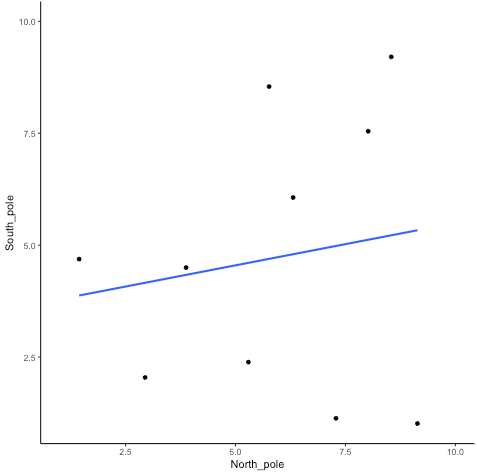
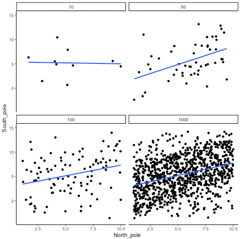
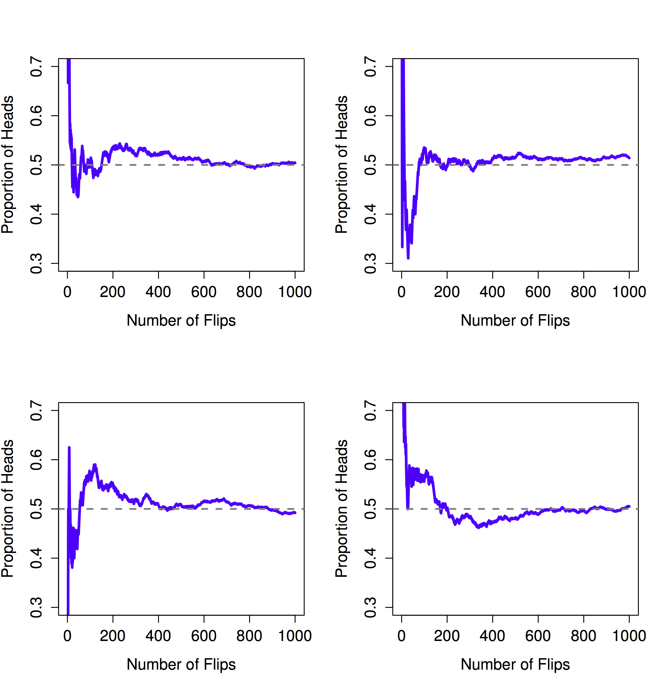
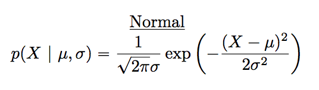

# Week 4: Chance and Probability Theory^[Mix of Matthew Crump & Danielle Navarro] {#chance}

>I have studied many languages-French, Spanish and a little Italian, but no one told me that statistics was a foreign language.
>---Charmaine J. Forde

Up to this point in the book, we've discussed some of the key ideas in research design, and we've talked a little about how you can summarize a data set. To a lot of people, this is all there is to statistics: it's about calculating averages, collecting all the numbers, drawing graphs, and putting them all in a report somewhere. Kind of like stamp collecting, but with numbers. However, statistics covers much more than that. In fact, descriptive statistics is only a small part of statistics. Another, very useful, part of statistics is that it provides tools **that let you make inferences about data**.

Once you start thinking about statistics in these terms – that statistics is there to help us draw inferences from data – you start seeing examples of it everywhere. For instance, here's a tiny extract from a newspaper article in the Sydney Morning Herald (30 Oct 2010):

> "I have a tough job" the Premier said in response to a poll which found her government is now the most unpopular Labor administration in polling history, with a primary vote of just 23 per cent.

This kind of remark is entirely unremarkable in the papers or in everyday life, but let's have a think about what it entails. A polling company has conducted a survey, usually a pretty big one because they can afford it. I'm too lazy to track down the original survey, so let's just imagine that they called 1000 voters at random, and 230 (23%) of those claimed that they intended to vote for the party. For the 2010 Federal election, the Australian Electoral Commission reported 4,610,795 enrolled voters in New South Whales; so the opinions of the remaining 4,609,795 voters (about 99.98% of voters) remain unknown to us. Even assuming that no-one lied to the polling company the only thing we can say with confidence is that the true primary vote is somewhere between 230/4610795 (about 0.005%) and 4610025/4610795 (about 99.83%). So, on what basis is it legitimate for the polling company, the newspaper, and the readership to conclude that the Australian Labor Party (ALP) primary vote is about 23%?

The answer to the question is pretty obvious: if I call 1000 people **at random**, and 230 of them say they intend to vote for the ALP, then it seems very unlikely that these are the **only** 230 people out of the entire voting public who actually intend to do so. In other words, we assume that the data collected by the polling company is representative of the population at large. But how representative? Would we be surprised to discover that the true ALP primary vote is actually 24%? 29%? 37%? At this point everyday intuition starts to break down a bit. No-one would be surprised by 24%, and everybody would be surprised by 37%, but it's a bit hard to say whether 29% is plausible. We need some more powerful tools than just looking at the numbers and guessing. **Inferential statistics** provide the tools that we need to answer these sorts of questions and will be the topic of the remainder of this course.

This week, we start with our journey into inferential statistics by looking at how correlations are affected by random chance to build some intuitions about inference. Then, we will look more formally at an important building block of inferential statistics: probability theory. Next week will focus on another building block of inferential statistics: estimation and sampling theory.

## Correlation and random chance
Last week, we discussed several ways in which correlation did not mean causation. For example, we looked at [causation without correlation](#caus-without-corr) and the [third varible problem](#third-var). However, there is another important important aspect of correlations and that is the fact that they can be produced by random chance. This means that you can find a positive or negative correlation between two measures, when they have absolutely nothing to do with one another. You might have hoped to find zero correlation when two measures are totally unrelated to each other. Although this certainly happens, unrelated measures can produce spurious correlations, just by chance alone. 

Let's demonstrate how correlations can occur by chance when there is no causal connection between two measures. Imagine two participants. One is at the North pole with a lottery machine full of balls with numbers from 1 to 10. The other is at the South pole with a different lottery machine full of balls with numbers from 1 to 10. There are an endless supply of balls in the machine, so every number could be picked for any ball. Each participant randomly chooses 10 balls, then records the number on the ball. In this situation we will assume that there is no possible way that balls chosen by the first participant could causally influence the balls chosen by the second participant. They are on the other side of the world.

Here is what the numbers on each ball could look like for each participant:

```{r 3northsouth}
set.seed(456)
ball<-1:10
north_pole<-round(round(runif(10,1,10)))
south_pole<-round(round(runif(10,1,10)))

df_balls<-data.frame(ball,north_pole,south_pole)

knitr::kable(df_balls)

```
In this one case, if we computed Pearson's $r$, we would find that $r =$ `r round(cor(north_pole,south_pole),2)`. But, we already know that this value does not tell us anything about the relationship between the balls chosen on the North and South pole. We know that the relationship is completely random, because that is how we set up the game.

The better question here is to ask what can random chance do? For example, if we ran our game over and over again thousands of times, each time choosing new balls, and each time computing the correlation, what would we find? The $r$ value will sometimes be positive, sometimes be negative, sometimes be big and sometimes be small. Let's look at what this random fluctuations would look like. This will give us a window into the kinds of correlations that chance alone can produce.

### Monte-carlo simulation of random correlations
It is possible to use a computer to simulate our game as many times as we want. This process is termed a [**monte-carlo simulation**](https://en.wikipedia.org/wiki/Monte_Carlo_method), after the code name for the procedure developped during the [Manhattan project](https://www.degruyter.com/view/journals/mcma/22/1/article-p73.xml).

Below is a script written for R^[We did something [similar last week](#corrform), but I didn't show the code.]. We won't go into the details of the code here, you will do more of this during the labs, but let's briefly explain what is going on. Notice, the part that says `for(sim in 1:1000)`. This creates a loop that repeats our game 1000 times. Inside the loop there are variables named `north_pole` and `south_pole`. During each simulation, we sample 10 random numbers (between 1 to 10) using `runif(10,1,10)` into each variable. These random numbers stand for the numbers that would have been on the balls from the lottery machine. Once we have 10 random numbers for each, we compute the correlation using `cor(north_pole,south_pole)`. Then, we save the correlation value and move on to the next simulation. At the end, we will have 1000 individual Pearson $r$ values.

```{r 3anotherthousand, fig.cap="Figure showing a range of r-values that can be obtained by chance",echo=TRUE}
library(ggplot2)
simulated_correlations <- c() # create empty vector 
set.seed(123)
for(sim in 1:1000){
  # pick 10 random numbers between 1 and 10 and round the result to the nearest integer
  north_pole <- round(runif(10,1,10)) 
  south_pole <- round(runif(10,1,10))
  # save each calculated correlation in the vector
  simulated_correlations[sim] <- cor(north_pole,south_pole) 
}

# Generate a scatterplot with the simulated correlations
sim_df <- data.frame(sims=1:1000,simulated_correlations)
ggplot(sim_df, aes(x = sims, y = simulated_correlations))+
  geom_point()+
  theme_classic()+
  geom_hline(yintercept = -1, color="red", linetype = 2)+
  geom_hline(yintercept = 1, color="red", linetype = 2)+
  ggtitle("Simulation of 1000 r values")
```

Each dot in the scatter plot shows the Pearson $r$ for each simulation from 1 to 1000. As you can see the dots are all over of the place, in between the range -1 to 1. The important lesson here is that random chance produced all of these correlations. This means we can find "correlations" in the data that are completely meaningless, and do not reflect any causal relationship between one measure and another.

Let's illustrate the idea of finding "random" correlations one more time, with an animation. This time, we will show you a scatter plot of the random values sampled for the balls chosen from the North and South pole. If there is no relationship we should see dots going everywhere. If there happens to be a positive relationship (purely by chance), we should see the dots going from the bottom left to the top right. If there happens to be a negative relationship (purely by chance), we should see the dots going from the top left down to the bottom right.

On more thing to prepare you for the animation. There are three scatter plots below, showing negative, positive, and zero correlations between two variables. You've already seen these types of graphs before. We are just reminding you that the blue lines are helpful for seeing the correlation. Negative correlations occur when a line goes down from the top left to bottom right. Positive correlations occur when a line goes up from the bottom left to the top right. Zero correlations occur when the line is flat (doesn't go up or down).

```{r 3reminder, fig.cap="A reminder of what positive, negative, and zero correlation looks like", echo=F}
set.seed(999)
subject_x<-1:100
chocolate_x<-round(1:100*runif(100,.5,1))
happiness_x<-round(1:100*runif(100,.5,1))

df_positive<-data.frame(subject_x,chocolate_x,happiness_x)

subject_x<-1:100
chocolate_x<-round(1:100*runif(100,.5,1))
happiness_x<-round(100:1*runif(100,.5,1))

df_negative<-data.frame(subject_x,chocolate_x,happiness_x)

subject_x<-1:100
chocolate_x<-round(runif(100,0,100))
happiness_x<-round(runif(100,0,100))

df_random<-data.frame(subject_x,chocolate_x,happiness_x)

all_data<-rbind(df_positive,df_negative,df_random)
all_data<-cbind(all_data,correlation=rep(c("positive","negative","random"),each=100))

ggplot(all_data,aes(x=chocolate_x,y=happiness_x))+
  geom_point()+
  geom_smooth(method=lm,se=FALSE)+
  theme_classic()+
  facet_wrap(~correlation)+
  xlab("x")+
  ylab("y")

```

OK, now we are ready for the animation. You are looking at the process of sampling two sets of numbers randomly, one for the X variable (north_pole), and one for the Y variable (south_pole). Each time we sample 10 numbers for each, plot them, then draw a line through them. Remember, these numbers are all completely random, so we should expect, on average that there should be no correlation between the numbers. However, this is not what happens. You can the line going all over the place. Sometimes we find a negative correlation (line goes down), sometimes we see a positive correlation (line goes up), and sometimes it looks like zero correlation (line is more flat). 

```{r 3randcor10gif, fig.cap="Completely random data points drawn from a uniform distribution with a small sample-size of 10. The blue line twirls around sometimes showing large correlations that are produced by chance", echo=F}

if (knitr:::is_latex_output()) {
  
} else {
  knitr::include_graphics("figures/gifs/corUnifn10-1.gif")
}

```

You might be thinking this is kind of disturbing. If we know that there should be no correlation between two random variables, how come we are finding correlations? This is a big problem right? I mean, if someone showed me a correlation between two things, and then claimed one thing was related to another, how could know I if it was true? After all, it could be chance!

Fortunately, all is not lost. We can look at our simulated data in another way, using a histogram. Remember, just before the animation, we simulated 1000 different correlations using random numbers. By, putting all of those $r$ values into a histogram, we can get a better sense of how chance behaves. We can see  what kind of correlations chance is likely or unlikely to produce. Here is a histogram of the simulated $r$ values.

```{r 3histrandcor, fig.cap="A histogram showing the frequency distribution of r-values for completely random values between an X and Y variable (sample-size=10). A full range of r-values can be obtained by chance alone. Larger r-values are less common than smaller r-values"}

ggplot(sim_df,aes(x=simulated_correlations))+
  geom_histogram(bins=40, color="white") +
  xlim(-1,1) +
  theme_classic()
```


Notice that this histogram is not flat. Most of the simulated $r$ values are close to zero. Notice, also that the bars get smaller as you move away from zero in the positive or negative direction. The general take home here is that chance can produce a wide range of correlations. However, not all correlations happen very often. For example, the bars for -1 and 1 are very small. Chance does not produce nearly perfect correlations very often. The bars around -.5 and .5 are smaller than the bars around zero, as medium correlations do not occur as often as small correlations by chance alone.

You can think of this histogram as the window of chance. It shows what chance often does, and what it often does not do. If you found a correlation under these very same circumstances (e.g., measured the correlation between two sets of 10 random numbers), then you could consult this window. What should you ask the window? How about, could my observed correlation (the one that you found in your data) have come from this window? 

Let's say you found a correlation of $r = .1$. Could a .1 have come from the histogram? Well, look at the histogram around where the .1 mark on the x-axis is. Is there a big bar there? If so, this means that chance produces this value fairly often. You might be comfortable with the inference: Yes, this .1 could have been produced by chance, because it is well inside the window of chance. 
How about $r = .5$? The bar is much smaller here, you might think, "well, I can see that chance does produce .5 some times, so chance could have produced my .5. Did it? Maybe, maybe not, not sure". Here, your confidence in a strong inference about the role of chance might start getting a bit shakier. 

How about an $r = .95$?. You might see that the bar for .95 is very very small, perhaps too small to see. What does this tell you? It tells you that chance does not produce .95 very often, hardly if at all, pretty much never. So, if you found a .95 in your data, what would you infer? Perhaps you would be comfortable inferring that chance did not produce your .95, after all, .95 is mostly outside the window of chance.

### Increasing sample-size decreases the opportunity for spurious correlations
Before moving on, let's do one more thing with correlations. In our pretend lottery game, each participant only sampled 10 balls each. We found that this could lead to a range of correlations between the numbers randomly drawn from either sides of the pole. Indeed, we even found some correlations that were medium to large in size. If you were a researcher who found such correlations, you might be tempted to believe there was a relationship between your measurements. However, we know in our little game, that those correlations would be spurious, just a product of random sampling[^Spur].

[^Spur]:See [this website](https://www.tylervigen.com/spurious-correlations) by Tyler Vigen for some interesting spurious correlations. You can even use his website to [discover a spurious correlation](https://tylervigen.com/discover) of your own!

The good news is that, as a researcher, you get to make the rules of the game. You get to determine how chance can play. This is all still a little bit metaphorical, so let's make it concrete.

Let's see what happens in four different scenarios. First, we will repeat what we already did. Each participant will draw 10 balls, then we compute the correlation, and do this over 1000 times and look at a histogram. Second, we will change the game so each participant draws 50 balls each, and then repeat our simulation. Third, and fourth, we will change the game so each participant draws 100 balls each, and then 1000 balls each, and repeat etc.

The graph below shows four different histograms of the Pearson $r$ values in each of the different scenarios. Each scenario involves a different sample-size, from, 10, 50, 100 to 1000.

```{r 3corrandN, fig.cap="Four histograms showing the frequency distributions of r-values between completely random X and Y variables as a function of sample-size. The width of the distributions shrink as sample-size increases. Smaller sample-sizes are more likely to produce a wider range of r-values by chance. Larger sample-sizes always produce a narrower range of small r-values"}
all_df<-data.frame()
set.seed(123)
for(s_size in  c(10,50,100,1000)){
  simulated_correlations <- length(0)
  for(sim in 1:1000){
    north_pole <- runif(s_size,1,10)
    south_pole <- runif(s_size,1,10)
    simulated_correlations[sim] <- cor(north_pole,south_pole)
  }
sim_df <- data.frame(sample_size=rep(s_size,1000),sims=1:1000,simulated_correlations)
all_df<-rbind(all_df,sim_df)
}


ggplot(all_df,aes(x=simulated_correlations))+
  geom_histogram(bins=40, color="white")+
  facet_wrap(~sample_size,scales = "free_y")+
  theme_classic()

```
By inspecting the four histograms you should notice a clear pattern. The width or range of each histogram shrinks as the sample-size increases. What is going on here? Well, we already know that we can think of these histograms as windows of chance. They tell us which $r$ values occur fairly often, which do not. When our sample-size is 10, lots of different $r$ values happen. That histogram is very flat and spread out. However, as the sample-size increases, we see that the window of chance gets pulled in. For example, by the time we get to 1000 balls each, almost all of the Pearson $r$ values are very close to 0.

One take home here, is that increasing sample-size narrows the window of chance. So, for example, if you ran a study involving 1000 samples of two measures, and you found a correlation of .5, then you can clearly see in the bottom right histogram that .5 does not occur very often by chance alone. In fact, there is no bar, because it didn't happen even once in the simulation. As a result, when you have a large sample size like n = 1000, you might be more confident that your observed correlation (say of .5) was not a spurious correlation. If chance is not producing your result, then something else is.

Finally, notice how your confidence about whether or not chance is mucking about with your results depends on your sample size. If you only obtained 10 samples per measurement, and found $r = .5$, you should not be as confident that your correlation reflects a real relationship. Instead, you can see that $r$'s of .5 happen fairly often by chance alone. 

> Pro tip: when you run an experiment, under ideal circumstances, you get to decide how many samples you will collect. This means narrowing the window of chance.

Let's ingrain these ideas with some more animations. When our sample-size is small (referred to as "n is small"), sampling error can cause all sorts of "patterns" in the data. This makes it possible, and indeed common, for "correlations" to occur between two sets of numbers. When we increase the sample-size, sampling error is reduced, making it less possible for correlations to occur just by chance alone.

### Animation of no relationship between variables
Below we randomly sample numbers for two variables, plot them, and show the correlation using a line. There are four panels, each showing the number of observations in the samples, from 10, 50, 100, to 1000 in each sample.

Remember, because we are randomly sampling numbers, there should be no relationship between the X and Y variables. But, as we have been discussing, we can sometimes observe a correlation due to chance. The important thing to watch is how the line behaves across the four panels. The line twirls around in all directions when the sample size is 10. It is also moves around quite a bit when the sample size is 50 or 100. It still moves a bit when the sample size is 1000, but much less. In all cases we expect the line to be flat, but sometimes the line shows us a pseudo relationship.

```{r 3corRandfour, fig.cap="Animation of how correlation behaves for completely random X and Y variables as a function of sample size. The best fit line is not very stable for small sample-sizes, but becomes more reliably flat as sample-size increases", echo=F,eval=T}

if (knitr:::is_latex_output()) {
  
} else {
  knitr::include_graphics("figures/gifs/corUnifFourNs-1.gif")
}

```

```{r, eval=F}
# this creates the pictures for the animation above, but does not evaluate currently
library(gganimate)
all_df<-data.frame()
for(sim in 1:10){
  for(n in c(10,50,100,1000)){
  north_pole <- runif(n,1,10)
  south_pole <- runif(n,1,10)
  t_df<-data.frame(nsize=rep(n,n),
                   simulation=rep(sim,n),
                                  north_pole,
                                  south_pole)
  all_df<-rbind(all_df,t_df)
  }
}


ggplot(all_df,aes(x=north_pole,y=south_pole))+
  geom_point()+
  geom_smooth(method=lm, se=FALSE)+
  theme_classic()+
  facet_wrap(~nsize)+
  transition_states(
    simulation,
    transition_length = 2,
    state_length = 1
  )+enter_fade() + 
  exit_shrink() +
  ease_aes('sine-in-out')
  
```

Which line should you trust? Well, hopefully you can see that the line for 1000 samples is the most stable. It tends to be very flat every time, and it does not depend so much on the particular sample. The line with 10 observations per sample goes all over the place. The take home here, is that if someone told you that they found a correlation, you should want to know how many observations they had in their sample. If they only had 10 observations, how could you trust the claim that there was a correlation? Not now that you know samples that are that small can do all sorts of things by chance alone. If instead, you found out the sample was very large, then you might trust that finding a little bit more. For example, in the above animation you can see that when there are 1000 samples, we never see a strong or even weak correlation; the line is almost always completely flat. This is because chance almost never produces strong correlations when the sample size is very large. 

Let's look at an animation when there actually is a correlation between variables.

### Animation with a relationship between variables
Sometimes there are correlations between two variables that are not caused by chance. Below, we get to watch an animation of four scatter plots. Each shows the correlation between two variables. Again, we change the sample-size in steps of 10, 50 100, and 1000. The data have been **programmed to contain a real positive correlation**. So, we should expect that the line will be going up from the bottom left to the top right. However, there is still variability in the data. So this time, sampling error due to chance will fuzz the correlation. We know it is there, but sometimes chance will cause the correlation to be eliminated.

Notice that in the top left panel (sample-size 10), the line is twirling around much more than the other panels. Every new set of samples produces different correlations. Sometimes, the line even goes flat or downward. However, as we increase sample-size, we can see that the line doesn't change very much, it is always going up showing a positive correlation.

```{r 3realcorFour, fig.cap="How correlation behaves as a function of sample-size when there is a true correlation between X and Y variables", echo=F,eval=T}

if (knitr:::is_latex_output()) {
  
} else {
  knitr::include_graphics("figures/gifs/corRealgif-1.gif")
}

```

The main takeaway here is that even when there is a positive correlation between two things, you might not be able to see it if your sample size is small. For example, you might get unlucky with the one sample that you measured. Your sample could show a negative correlation, even when the actual correlation is positive! Unfortunately, in the real world we usually only have the sample that we collected, so we always have to wonder if we got lucky or unlucky. If you want to remove luck, you need to collect larger samples. Then you will be much more likely to observe the real pattern, rather the a pattern that can be introduced by chance.

This concludes the first part of this chapter: building an intuition about inferential statistics by seeing how random chance underlies our observations. Now, we move on to the second part of this chapter: probability theory. 

## How are probability and statistics different?
Before we start talking about probability theory in more detail, it's helpful to spend a moment thinking about the relationship between probability and statistics. The two disciplines are closely related but they're not identical. Probability theory is "the doctrine of chances". It's a branch of mathematics that tells you how often different kinds of events will happen. For example, all of these questions are things you can answer using probability theory:

-   What are the chances of a fair coin coming up heads 10 times in a row?
-   If I roll two six sided dice, how likely is it that I'll roll two sixes?
-   How likely is it that five cards drawn from a perfectly shuffled deck will all be hearts?
-   What are the chances that I'll win the lottery?

Notice that all of these questions have something in common. In each case the "truth of the world" is known, and my question relates to the "what kind of events" will happen. In the first question I **know** that the coin is fair, so there's a 50% chance that any individual coin flip will come up heads. In the second question, I **know** that the chance of rolling a 6 on a single die is 1 in 6. In the third question I **know** that the deck is shuffled properly. And in the fourth question, I **know** that the lottery follows specific rules. You get the idea. The critical point is that probabilistic questions start with a known *model* of the world, and we use that model to do some calculations. 

The underlying model can be quite simple. For instance, in the coin flipping example, we can write down the model like this: 

$P(\mbox{heads}) = 0.5$

which you can read as "the probability of heads is 0.5". As we'll see later, in the same way that percentages are numbers that range from 0% to 100%, probabilities are just numbers that range from 0 to 1. When using this probability model to answer the first question, I don't actually know exactly what's going to happen. Maybe I'll get 10 heads, like the question says. But maybe I'll get three heads. That's the key thing: in probability theory, the **model** is known, but the **data** are not.

So that's probability. What about statistics? Statistical questions work the other way around. In statistics, we do not know the truth about the world. All we have is the data, and it is from the data that we want to **learn** the truth about the world. Statistical questions tend to look more like these:

-   If my friend flips a coin 10 times and gets 10 heads, are they playing a trick on me?
-   If five cards off the top of the deck are all hearts, how likely is it that the deck was shuffled?
-   If the lottery commissioner's spouse wins the lottery, how likely is it that the lottery was rigged?

This time around, the only thing we have are data. What I **know** is that I saw my friend flip the coin 10 times and it came up heads every time. And what I want to *infer* is whether or not I should conclude that what I just saw was actually a fair coin being flipped 10 times in a row, or whether I should suspect that my friend is playing a trick on me. The data I have looks like this:

    H H H H H H H H H H H

and what I'm trying to do is work out which "model of the world" I should put my trust in. If the coin is fair, then the model I should adopt is one that says that the probability of heads is 0.5; that is, $P(\mbox{heads}) = 0.5$. If the coin is not fair, then I should conclude that the probability of heads is **not** 0.5, which we would write as $P(\mbox{heads}) \neq 0.5$. In other words, the statistical inference problem is to figure out which of these probability models is right. Clearly, the statistical question isn't the same as the probability question, but they're deeply connected to one another. Because of this, a good introduction to statistical theory will start with a discussion of what probability is and how it works.

## What does probability mean? {#mean-prob}
Let's start with the first of these questions. What is "probability"? It might seem surprising to you, but while statisticians and mathematicians (mostly) agree on what the **rules** of probability are, there's much less of a consensus on what the word really **means**. It seems weird because we're all very comfortable using words like "chance", "likely", "possible" and "probable", and it doesn't seem like it should be a very difficult question to answer. If you had to explain "probability" to a five year old, you could do a pretty good job. But if you've ever had that experience in real life, you might walk away from the conversation feeling like you didn't quite get it right, and that (like many everyday concepts) it turns out that you don't **really** know what it's all about.

So I'll have a go at it. Let's suppose I want to bet on a soccer game between two teams of robots, **Arduino Arsenal** and **CPU Milan**. After thinking about it, I decide that there is an 80% probability that **Arduino Arsenal** wins. What do I mean by that? Here are three possibilities...

-   They're robot teams, so I can make them play over and over again, and if I did that, **Arduino Arsenal** would win 8 out of every 10 games on average.
-   For any given game, I would only agree that betting on this game is "fair" if a \$1 bet on **CPU Milan** gives a \$5 payoff (i.e. I get my \$1 back plus a \$4 reward for being correct), as would a \$4 bet on **Arduino Arsenal** (i.e., my \$4 bet plus a \$1 reward).
-   My subjective "belief" or "confidence" in an **Arduino Arsenal** victory is four times as strong as my belief in a **CPU Milan** victory.

Each of these seems sensible. However they're not identical, and not every statistician would endorse all of them. The reason is that there are different statistical ideologies (yes, really!) and depending on which one you subscribe to, you might say that some of those statements are meaningless or irrelevant. In this section, I give a brief introduction the two main approaches that exist in the literature. These are by no means the only approaches, but they're the two big ones.

### The frequentist view
The first of the two major approaches to probability, and the more dominant one in statistics, is referred to as the *frequentist view*, and it defines probability as a *long-run frequency*. Suppose we were to try flipping a fair coin, over and over again. By definition, this is a coin that has $P(H) = 0.5$. What might we observe? One possibility is that the first 20 flips might look like this:

    T,H,H,H,H,T,T,H,H,H,H,T,H,H,T,T,T,T,T,H

In this case 11 of these 20 coin flips (55%) came up heads. Now suppose that I'd been keeping a running tally of the number of heads (which I'll call $N_H$) that I've seen, across the first $N$ flips, and calculate the proportion of heads $N_H / N$ every time. Here's what I'd get (I did literally flip coins to produce this!):


  ----------------- ----- ----- ----- ----- ----- ----- ----- ----- ----- -----
  number of flips     1     2     3     4     5     6     7     8     9    10
  number of heads     0     1     2     3     4     4     4     5     6     7
  proportion         .00   .50   .67   .75   .80   .67   .57   .63   .67   .70
  ----------------- ----- ----- ----- ----- ----- ----- ----- ----- ----- -----


  ----------------- ----- ----- ----- ----- ----- ----- ----- ----- ----- -----
  number of flips    11    12    13    14    15    16    17    18    19    20
  number of heads     8     8     9    10    10    10    10    10    10    11
  proportion         .73   .67   .69   .71   .67   .63   .59   .56   .53   .55
  ----------------- ----- ----- ----- ----- ----- ----- ----- ----- ----- -----

Notice that at the start of the sequence, the **proportion** of heads fluctuates wildly, starting at .00 and rising as high as .80. Later on, one gets the impression that it dampens out a bit, with more and more of the values actually being pretty close to the "right" answer of .50. This is the frequentist definition of probability in a nutshell: flip a fair coin over and over again, and as $N$ grows large (approaches infinity, denoted $N\rightarrow \infty$), the proportion of heads will converge to 50%. There are some subtle technicalities that the mathematicians care about, but qualitatively speaking, that's how the frequentists define probability. 

Unfortunately, I don't have an infinite number of coins, or the infinite patience required to flip a coin an infinite number of times. However, I do have a computer, and computers excel at mindless repetitive tasks. So I asked my computer to simulate flipping a coin 1000 times, and then drew a picture of what happens to the proportion $N_H / N$ as $N$ increases. Actually, I did it four times, just to make sure it wasn't a fluke. The results are shown in Figure \@ref(fig:4FreqProb). As you can see, the **proportion of observed heads** eventually stops fluctuating, and settles down; when it does, the number at which it finally settles is (close to) the "true" probability of heads.

```{r 4FreqProb, fig.cap="An illustration of how frequentist probability works. If you flip a fair coin over and over again, the proportion of heads that you've seen eventually settles down, and converges to the true probability of 0.5. Each panel shows four different simulated experiments: in each case, we pretend we flipped a coin 1000 times, and kept track of the proportion of flips that were heads as we went along. Although none of these sequences actually ended up with an exact value of .5, if we'd extended the experiment for an infinite number of coin flips they would have."}

```


The frequentist definition of probability has some desirable characteristics. First, it is objective: the probability of an event is **necessarily** grounded in the world. The only way that probability statements can make sense is if they refer to (a sequence of) events that occur in the physical universe. Second, it is unambiguous: any two people watching the same sequence of events unfold, trying to calculate the probability of an event, must inevitably come up with the same answer. 

However, it also has undesirable characteristics. Infinite sequences don't exist in the physical world. For example, suppose you picked up a coin from your pocket and started to flip it. Every time it lands, it impacts on the ground. Each impact wears the coin down a bit; eventually, the coin will be destroyed. So, one might ask whether it really makes sense to pretend that an "infinite" sequence of coin flips is even a meaningful concept, or an objective one. We can't say that an "infinite sequence" of events is a real thing in the physical universe, because the physical universe doesn't allow infinite anything. 

More seriously, the frequentist definition has a narrow scope. There are lots of things out there that human beings are happy to assign probability to in everyday language, but cannot (even in theory) be mapped onto a hypothetical sequence of events. For instance, if a meteorologist comes on TV and says, "the probability of rain in Rotterdam on 2 November 2048 is 60%" we humans are happy to accept this. But it's not clear how to define this in frequentist terms. There's only one city of Rotterdam, and only one November 2, 2048. There's no infinite sequence of events here, just a once-off thing. Frequentist probability genuinely **forbids** us from making probability statements about a single event. From the frequentist perspective, it will either rain tomorrow or it will not; there is no "probability" that attaches to a single non-repeatable event. Now, it should be said that there are some very clever tricks that frequentists can use to get around this. One possibility is that what the meteorologist means is something like this: "There is a category of days for which I predict a 60% chance of rain; if we look only across those days for which I make this prediction, then on 60% of those days it will actually rain". It's very weird and counterintuitive to think of it this way, but you do see frequentists do this sometimes.

### The Bayesian view
The **Bayesian view** of probability is often called the subjectivist view, and it is a minority view among statisticians, but one that has been steadily gaining traction for the last several decades. There are many flavours of Bayesianism, making hard to say exactly what "the" Bayesian view is. The most common way of thinking about subjective probability is to define the probability of an event as the **degree of belief** that an intelligent and rational agent assigns to that truth of that event. From that perspective, probabilities don't exist in the world, but rather in the thoughts and assumptions of people and other intelligent beings. However, in order for this approach to work, we need some way of operationalising the "degree of belief". One way that you can do this is to formalise it in terms of "rational gambling", though there are many other ways. Suppose that I believe that there's a 60% probability of rain tomorrow. If someone offers me a bet: if it rains tomorrow, then I win \$5, but if it doesn't rain then I lose \$5. Clearly, from my perspective, this is a pretty good bet. On the other hand, if I think that the probability of rain is only 40%, then it's a bad bet to take. Thus, we can operationalise the notion of a "subjective probability" in terms of what bets I'm willing to accept.

What are the advantages and disadvantages to the Bayesian approach? The main advantage is that it allows you to assign probabilities to any event you want to. You don't need to be limited to those events that are repeatable. The main disadvantage (to many people) is that we can't be purely objective – specifying a probability requires us to specify an entity that has the relevant degree of belief. This entity might be a human, an alien, a robot, or even a statistician, but there has to be an intelligent agent out there that believes in things. To many people this is uncomfortable: it seems to make probability arbitrary. While the Bayesian approach does require that the agent in question be rational (i.e., obey the rules of probability), it does allow everyone to have their own beliefs; I can believe the coin is fair and you don't have to, even though we're both rational. The frequentist view doesn't allow any two observers to attribute different probabilities to the same event: when that happens, then at least one of them must be wrong. The Bayesian view does not prevent this from occurring. Two observers with different background knowledge can legitimately hold different beliefs about the same event. In short, where the frequentist view is sometimes considered to be too narrow (forbids lots of things that that we want to assign probabilities to), the Bayesian view is sometimes thought to be too broad (allows too many differences between observers).

### What's the difference? And who is right?
Now that you've seen each of these two views independently, it's useful to make sure you can compare the two. Go back to the hypothetical robot soccer game at the start of the section. What do you think a frequentist and a Bayesian would say about these three statements? Which statement would a frequentist say is the correct definition of probability? Which one would a Bayesian do? Would some of these statements be meaningless to a frequentist or a Bayesian? If you've understood the two perspectives, you should have some sense of how to answer those questions.

Okay, assuming you understand the difference, you might be wondering which of them is **right**? Honestly, I don't know that there is a right answer. As far as I can tell there's nothing mathematically incorrect about the way frequentists think about sequences of events, and there's nothing mathematically incorrect about the way that Bayesians define the beliefs of a rational agent. In fact, when you dig down into the details, Bayesians and frequentists actually agree about a lot of things. Many frequentist methods lead to decisions that Bayesians agree a rational agent would make. Many Bayesian methods have very good frequentist properties.

For the most part, I'm a pragmatist so I'll use any statistical method that I trust. As it turns out, that makes me prefer Bayesian methods, but I'm not fundamentally opposed to frequentist methods. Not everyone is quite so relaxed. For instance, consider Sir Ronald Fisher ([yes, that Fisher](#pears-r)), a vehement opponent to all things Bayesian, whose paper on the mathematical foundations of statistics referred to Bayesian probability as "an impenetrable jungle [that] arrests progress towards precision of statistical concepts" @fisher_interpretation_1922 [p. 311]. Or the psychologist Paul Meehl, who suggests that relying on frequentist methods could turn you into "a potent but sterile intellectual rake who leaves in his merry path a long train of ravished maidens but no viable scientific offspring" @meehl_theory_1967 [p. 114]. The history of statistics, as you might gather, is not devoid of entertainment.

## Basic probability theory
Ideological arguments between Bayesians and frequentists notwithstanding, it turns out that people mostly agree on the rules that probabilities should obey. There are lots of different ways of arriving at these rules. The most commonly used approach is based on the work of Andrey Kolmogorov, one of the great Soviet mathematicians of the 20th century. I won't go into a lot of detail, but I'll try to give you a bit of a sense of how it works. And in order to do so, I'm going to have to talk about my pants.

One of the disturbing truths about my life is that I only own 5 pairs of pants: three pairs of jeans, the bottom half of a suit, and a pair of tracksuit pants. Even sadder, I've given them names: I call them $X_1$, $X_2$, $X_3$, $X_4$ and $X_5$. I really do: that's why they call me Mister Imaginative. Now, on any given day, I pick out exactly one of pair of pants to wear. Not even I'm so stupid as to try to wear two pairs of pants, and thanks to years of training I never go outside without wearing pants anymore. If I were to describe this situation using the language of probability theory, I would refer to each pair of pants (i.e., each $X$) as an *elementary event*. The key characteristic of elementary events is that every time we make an observation (e.g., every time I put on a pair of pants), then the outcome will be one and only one of these events. Like I said, these days I always wear exactly one pair of pants, so my pants satisfy this constraint. Similarly, the set of all possible events is called a *sample space*. Granted, some people would call it a "wardrobe", but that's because they're refusing to think about my pants in probabilistic terms. Sad.

Okay, now that we have a sample space (a wardrobe), which is built from lots of possible elementary events (pants), what we want to do is assign a *probability* to one of these elementary events. For an event $X$, the probability of that event $P(X)$ is a number that lies between 0 and 1. The bigger the value of $P(X)$, the more likely the event is to occur. So, for example, if $P(X) = 0$, it means the event $X$ is impossible (i.e., I never wear those pants). On the other hand, if $P(X) = 1$ it means that event $X$ is certain to occur (i.e., I always wear those pants). For probability values in the middle, it means that I sometimes wear those pants. For instance, if $P(X) = 0.5$ it means that I wear those pants half of the time.

At this point, we're almost done. The last thing we need to recognise is that "something always happens". Every time I put on pants, I really do end up wearing pants (crazy, right?). What this somewhat trite statement means, in probabilistic terms, is that the probabilities of the elementary events need to add up to 1. This is known as the *law of total probability*, not that any of us really care. More importantly, if these requirements are satisfied, then what we have is a *probability distribution*. For example, this is an example of a probability distribution

  Which pants?      Label    Probability
  ---------------- ------- ----------------
  Blue jeans        $X_1$   $P(X_1) = .5$
  Grey jeans        $X_2$   $P(X_2) = .3$
  Black jeans       $X_3$   $P(X_3) = .1$
  Black suit        $X_4$   $P(X_4) = 0$
  Blue tracksuit    $X_5$   $P(X_5) = .1$

Each of the events has a probability that lies between 0 and 1, and if we add up the probability of all events, they sum to 1. Awesome. We can even draw a nice bar graph to visualise this distribution, as shown in Figure \@ref(fig:pantsprob). And at this point, we've all achieved something. You've learned what a probability distribution is, and I've finally managed to find a way to create a graph that focuses entirely on my pants. Everyone wins!

```{r pantsprob, fig.cap="A visual depiction of the \"pants\" probability distribution. There are five \"elementary events\", corresponding to the five pairs of pants that I own. Each event has some probability of occurring: this probability is a number between 0 to 1. The sum of these probabilities is 1.", echo=FALSE}

emphCol <- rgb(0,0,1)
emphColLight <- rgb(.5,.5,1)
emphGrey <- grey(.5)
eps <- TRUE
colour <- TRUE

probabilities <- c( .5, .3, .1, 0, .1)
	eventNames <- c( "Blue jeans", "Grey jeans", "Black jeans", 
					 "Black suit", "Blue track" )
	
	# draw the plot
	barplot( 
		height= probabilities, 
		xlab = "Event",
		ylab = "Probability of event",
		names.arg = eventNames,
		density = 10,
		col = ifelse(colour,emphCol,emphGrey)
	)
```

The only other thing that I need to point out is that probability theory allows you to talk about *non elementary events* as well as elementary ones. The easiest way to illustrate the concept is with an example. In the pants example, it's perfectly legitimate to refer to the probability that I wear jeans. In this scenario, the "Thomas wears jeans" event said to have happened as long as the elementary event that actually did occur is one of the appropriate ones; in this case "blue jeans", "black jeans" or "grey jeans". In mathematical terms, we defined the "jeans" event $E$ to correspond to the set of elementary events $(X_1, X_2, X_3)$. If any of these elementary events occurs, then $E$ is also said to have occurred. Having decided to write down the definition of the $E$ this way, it's pretty straightforward to state what the probability $P(E)$ is: we just add everything up. In this particular case $$P(E) = P(X_1) + P(X_2) + P(X_3)$$ and, since the probabilities of blue, grey and black jeans respectively are .5, .3 and .1, the probability that I wear jeans is equal to .9.

At this point you might be thinking that this is all terribly obvious and simple and you'd be right. All we've really done is wrap some basic mathematics around a few common sense intuitions. However, from these simple beginnings it's possible to construct some extremely powerful mathematical tools. I'm definitely not going to go into the details in this book, but what I will do is list some of the other rules that probabilities satisfy. These rules can be derived from the simple assumptions that I've outlined above, but since we don't actually use these rules for anything in this book, I won't do so here.

  English              Notation       Formula
  ------------- --------------- ----- -----------------------------
  not $A$           $P(\neg A)$  $=$  $1-P(A)$
  $A$ or $B$      $P(A \cup B)$  $=$  $P(A) + P(B) - P(A \cap B)$
  $A$ and $B$     $P(A \cap B)$  $=$  $P(A|B) \cdot P(B)$
  
You don't really need to know these rules in order to understand the analyses that we'll talk about later in the book, but they are important if you want to understand probability theory a bit more deeply.

## Probability distributions {#prob-dist}
You just saw your first probability distribution in Figure \@ref(fig:pantsprob). The concept of a probability distributions is hugely important for understanding inferential statistics. As you might imagine, probability distributions can vary enormously, and there's a large range of different distributions out there. However, not all probability distributions are equally important. In fact, the vast majority of the content in this book relies on one of three distributions: the binomial distribution, the normal distribution and the $t$ distribution. Given this, what I'll do over the next few sections is provide a brief introduction to these distributions, paying special attention to the binomial and the normal. I'll start with the binomial distribution, since it's the simplest of the three.

### The binomial distribution {#binomdist}
The theory of probability originated in the attempt to describe how games of chance work, so it seems fitting that our discussion of the **binomial distribution** should involve a discussion of rolling dice and flipping coins. Let's imagine a simple "experiment": in my hot little hand I'm holding 20 identical six-sided dice. On one face of each die there's a picture of a skull; the other five faces are all blank. If I proceed to roll all 20 dice, what's the probability that I'll get exactly 4 skulls? Assuming that the dice are fair, we know that the chance of any one die coming up skulls is 1 in 6; to say this another way, the skull probability for a single die is approximately $.167$. This is enough information to answer our question, so let's have a look at how it's done.

As usual, we have to introduce some names and some notation. We'll let $N$ denote the number of dice rolls in our experiment; which is often referred to as the *size parameter* of our binomial distribution. We'll also use $\theta$ (theta) to refer to the the probability that a single die comes up skulls, a quantity that is usually called the *success probability* of the binomial. Finally, we'll use $X$ to refer to the results of our experiment, namely the number of skulls I get when I roll the dice. Since the actual value of $X$ is due to chance, we refer to it as a *random variable*. In any case, now that we have all this terminology and notation, we can use it to state the problem a little more precisely. The quantity that we want to calculate is the probability that $X = 4$ given that we know that $\theta = .167$ and $N=20$. The general "form" of the thing I'm interested in calculating could be written as $$P(X \ | \ \theta, N)$$ (say: the probability of $X$ given $\theta$ and $N$) and we're interested in the special case where $X=4$, $\theta = .167$ and $N=20$. There's only one more piece of notation I want to refer to before moving on to discuss the solution to the problem. If I want to say that $X$ is generated randomly from a binomial distribution with parameters $\theta$ and $N$, the notation I would use is as follows: $$X \sim \mbox{Binomial}(\theta, N)$$

Yeah, yeah. I know what you're thinking: notation, notation, notation. Really, who cares? Very few readers of this book are here for the notation, so I should probably move on and talk about how to use the binomial distribution. To that end, Figure \@ref(fig:4binomial1) plots the binomial probabilities for all possible values of $X$ for our dice rolling experiment, from $X=0$ (no skulls) all the way up to $X=20$ (all skulls). Note that this is basically a bar chart, and is no different to the "pants probability" plot I drew in Figure \@ref(fig:pantsprob). On the horizontal axis we have all the possible events, and on the vertical axis we can read off the probability of each of those events. So, the probability of rolling 4 skulls out of 20 times is about 0.20 (the actual answer is 0.2022036, as we'll see in a moment). In other words, you'd expect that to happen about 20% of the times you repeated this experiment.

```{r 4binomial1, fig.cap="The binomial distribution with size parameter of N =20 and an underlying success probability of 1/6. Each vertical bar depicts the probability of one specific outcome (i.e., one possible value of X). Because this is a probability distribution, each of the probabilities must be a number between 0 and 1, and the heights of the bars must sum to 1 as well."}

knitr::include_graphics("figures/probability/binomSkulls20-eps-converted-to.png")
```

### Working with the binomial distribution in R
Although some people find it handy to know the formula [for calculating probabilities from a binomial distribution](https://en.wikipedia.org/wiki/Binomial_distribution#Probability_mass_function), most people just want to know how to use the distributions without worrying too much about the maths. To that end, R has a function called `dbinom()` that calculates binomial probabilities for us. 

The main arguments to the function are:

- `x`: a number, or vector of numbers, specifying the outcomes whose probability you're trying to calculate.
- `size`: a number telling  R the size of the experiment.
- `prob`: the success probability for any one trial in the experiment.

So, in order to calculate the probability of getting skulls, from an experiment of trials, in which the probability of getting a skull on any one trial is ... well, the command I would use is simply this:

```{r, echo=TRUE}
dbinom( x = 4, size = 20, prob = 1/6 )
```

To give you a feel for how the binomial distribution changes when we alter the values of $\theta$ and $N$, let's suppose that instead of rolling dice, I'm actually flipping coins. This time around, my experiment involves flipping a fair coin repeatedly, and the outcome that I'm interested in is the number of heads that I observe. In this scenario, the success probability is now $\theta = 1/2$. Suppose I were to flip the coin $N=20$ times. In this example, I've changed the success probability, but kept the size of the experiment the same. What does this do to our binomial distribution? 

```{r 4binomial2, fig.cap="Two binomial distributions, involving a scenario in which I'm flipping a fair coin, so the underlying success probability is 1/2. In panel (a), we assume I'm flipping the coin N = 20 times. In panel (b) we assume that the coin is flipped N = 100 times."}

knitr::include_graphics("figures/probability/Binomial2.png")
```

Well, as Figure \@ref(fig:4binomial2)a shows, the main effect of this is to shift the whole distribution, as you'd expect. Okay, what if we flipped a coin $N=100$ times? Well, in that case, we get Figure \@ref(fig:4binomial2)b. The distribution stays roughly in the middle, but there's a bit more variability in the possible outcomes.

At this point, I should probably explain the name of the  `dbinom` function. Obviously, the "binom" part comes from the fact that we're working with the binomial distribution, but the "d" prefix is probably a bit of a mystery. In this section I'll give a partial explanation: specifically, I'll explain why there is a prefix. As for why it's a "d" specifically, you'll have to wait until the next section. What's going on here is that R actually provides **four** functions in relation to the binomial distribution. These four functions are `dbinom`, `pbinom`, `rbinom` and `qbinom`, and each one calculates a different quantity of interest. Not only that, R does the same thing for **every** probability distribution that it implements. No matter what distribution you're talking about, there's a `d` function, a `p` function, `r` a function and a `q` function. 

Let's have a look at what all four functions do. Firstly, all four versions of the function require you to specify the `size` and `prob` arguments: no matter what you're trying to get R to calculate, it needs to know what the parameters are. However, they differ in terms of what the other argument is, and what the output is. So let's look at them one at a time.

-   The `d` form we've already seen: you specify a particular outcome `x`, and the output is the probability of obtaining exactly that outcome. (the "d" is short for *density*, but ignore that for now).
-   The `p` form calculates the *cumulative probability*. You specify a particular quantile `q` , and it tells you the probability of obtaining an outcome **smaller than or equal to** `q`.
-   The `q` form calculates the *quantiles* of the distribution. You specify a probability value `p`, and it gives you the corresponding quantile/percentile. That is, the value of the variable for which there's a probability `p` of obtaining an outcome lower than that value.
-   The `r` form is a *random number generator*: specifically, it generates `n` random outcomes from the distribution.

> Note: Probably you already know what a quantile is (they’re more commonly called percentiles), but if not: the 10th quantile/percentile of a data set is the smallest number $x$ such that 10% of the data is less than $x$. In fact, we’ve already come across the idea: the median of a data set is its 50th quantile / percentile!

This is a little abstract, so let's look at some concrete examples. Again, we've already covered `dbinom` so let's focus on the other three versions. We'll start with `pbinom`, and we'll go back to the skull-dice example. Again, I'm rolling 20 dice, and each die has a 1 in 6 chance of coming up skulls. Suppose, however, that I want to know the probability of rolling 4 **or fewer** skulls. If I wanted to, I could use the `dbinom` function to calculate the exact probability of rolling 0 skulls, 1 skull, 2 skulls, 3 skulls and 4 skulls and then add these up, but there's a faster way. Instead, I can calculate this using the `pbinom` function. Here's the command:

```{r, echo=TRUE}
pbinom(q= 4, size = 20, prob = 1/6)
```

In other words, there is a 76.9% chance that I will roll 4 or fewer skulls. Or, to put it another way, R is telling us that a value of 4 is actually the 76.9th percentile of this binomial distribution.

Next, let's consider the `qbinom` function. Let's say I want to calculate the 75th percentile of the binomial distribution. If we're sticking with our skulls example, I would use the following command to do this:

```{r, echo=TRUE}
qbinom(p = 0.75, size = 20, prob = 1/6 )
```

Hm. There's something odd going on here. Let's think this through. What the `qbinom` function appears to be telling us is that the 75th percentile of the binomial distribution is 4, even though we saw from the function that 4 is **actually** the 76.9th percentile. And it's definitely the `pbinom` function that is correct. I promise. The weirdness here comes from the fact that our binomial distribution doesn't really **have** a 75th percentile. Not really. Why not? Well, there's a 56.7% chance of rolling 3 or fewer skulls (you can type `pbinom(3, 20, 1/6)` to confirm this if you want), and a 76.9% chance of rolling 4 or fewer skulls. So there's a sense in which the 75th percentile should lie "in between" 3 and 4 skulls. But that makes no sense at all! You can't roll 20 dice and get 3.9 of them come up skulls. This issue can be handled in different ways: you could report an in between value (or **interpolated** value, to use the technical name) like 3.9, you could round down (to 3) or you could round up (to 4). 

The `qbinom` function rounds upwards: if you ask for a percentile that doesn't actually exist (like the 75th in this example), R finds the smallest value for which the the percentile rank is **at least** what you asked for. In this case, since the "true" 75th percentile (whatever that would mean) lies somewhere between 3 and 4 skulls,  R rounds up and gives you an answer of 4. This subtlety is tedious, I admit, but thankfully it's only an issue for discrete distributions like the binomial. The other distributions that I'll talk about (normal and $t$) are continuous, and so  R can always return an exact quantile whenever you ask for it.

Finally, we have the random number generator. To use the `rbinom` function, you specify how many times R should "simulate" the experiment using the `n` argument, and it will generate random outcomes from the binomial distribution. So, for instance, suppose I were to repeat my die rolling experiment 100 times. I could get R to simulate the results of these experiments by using the following command:

```{r, echo=TRUE}
rbinom(n = 100, size = 20, prob = 1/6 )
```

> Note: Since computers are deterministic machines, they can’t actually produce truly random behaviour. Instead, what they do is take advantage of various mathematical functions that share a lot of similarities with true randomness. What this means is that any random numbers generated on a computer are pseudorandom, and the quality of those numbers depends on the specific method used. By default R uses the “Mersenne twister” method. In any case, you can find out more by typing ?Random, but as usual the R help files are fairly dense.

As you can see, these numbers are pretty much what you'd expect given the distribution shown in Figure \@ref(fig:4binomial1). Most of the time I roll somewhere between 1 to 5 skulls. There are a lot of subtleties associated with random number generation using a computer, but for the purposes of this book we don't need to worry too much about them. 

### The normal distribution {#norm-dist}
While the binomial distribution is conceptually the simplest distribution to understand, it's not the most important one. That particular honour goes to the *normal distribution*, which is also referred to as "the bell curve" or a "Gaussian distribution".

```{r 4normal, fig.cap="The normal distribution with mean = 0 and standard deviation = 1. The x-axis corresponds to the value of some variable, and the y-axis tells us something about how likely we are to observe that value. However, notice that the y-axis is labelled Probability Density and not Probability. There is a subtle and somewhat frustrating characteristic of continuous distributions that makes the y axis behave a bit oddly: the height of the curve here isn't actually the probability of observing a particular x value. On the other hand, it is true that the heights of the curve tells you which x values are more likely (the higher ones!)."}

knitr::include_graphics("figures/probability/standardNormal-eps-converted-to.png")
```

A normal distribution is described using two parameters, the mean of the distribution $\mu$ and the standard deviation of the distribution $\sigma$. The notation that we sometimes use to say that a variable $X$ is normally distributed is as follows: $$X \sim \mbox{Normal}(\mu,\sigma)$$ Of course, that's just notation. It doesn't tell us anything interesting about the normal distribution itself. The mathematical formula for the normal distribution is:

```{r 4normalformula, fig.cap="Formula for the normal distribution"}

```

The formula is important enough that everyone who learns statistics should at least look at it, but since this is an introductory text I don't want to focus on it to much. Instead, we look at how R can be used to work with normal distributions. The R functions for the normal distribution are *dnorm()*, *pnorm()*, *qnorm()* and *rnorm()*. However, they behave in pretty much exactly the same way as the corresponding functions for the binomial distribution, so there's not a lot that you need to know. The only thing that I should point out is that the argument names for the parameters are *mean* and *sd*. In pretty much every other respect, there's nothing else to add.

Instead of focusing on the maths, let's try to get a sense for what it means for a variable to be normally distributed. To that end, have a look at Figure \@ref(fig:4normal), which plots a normal distribution with mean $\mu = 0$ and standard deviation $\sigma = 1$. You can see where the name "bell curve" comes from: it looks a bit like a bell. Notice that, unlike the plots that I drew to illustrate the binomial distribution, the picture of the normal distribution in Figure \@ref(fig:4normal) shows a smooth curve instead of "histogram-like" bars. This isn't an arbitrary choice: the normal distribution is continuous, whereas the binomial is discrete. For instance, in the die rolling example from the last section, it was possible to get 3 skulls or 4 skulls, but impossible to get 3.9 skulls.

With this in mind, let's see if we can get an intuition for how the normal distribution works. Firstly, let's have a look at what happens when we play around with the parameters of the distribution. One parameter we can change is the mean. This will shift the distribution to the right or left. The animation below shows a normal distribution with mean = 0, moving up and down from mean = 0 to mean = 5. Note, when you change the mean the whole shape of the distribution does not change, it just shifts from left to right. In the animation the normal distribution bounces up and down a little, but that's just a quirk of the animation (plus it looks fun that way).

```{r 4normalMeanShift, fig.cap="A normal distribution with a moving mean", echo=F,eval=T}
knitr::include_graphics(path="figures/gifs/normalMovingMean-1.gif")
```

In contrast, if we increase the standard deviation while keeping the mean constant, the peak of the distribution stays in the same place, but the distribution gets wider. The next animation shows what happens when you start with a small standard deviation (sd=0.5), and move to larger and larger standard deviation (up to sd =5). As you can see, the distribution spreads out and becomes wider as the standard deviation increases.

```{r 4normalSDShift, fig.cap="A normal distribution with a shifting sd", echo=F,eval=T}
knitr::include_graphics(path="figures/gifs/normalMovingSD-1.gif")
```

Notice, though, that when we widen the distribution, the height of the peak shrinks. This has to happen: in the same way that the heights of the bars that we used to draw a discrete binomial distribution have to *sum* to 1, the total *area under the curve* for the normal distribution must equal 1. Before moving on, I want to point out one important characteristic of the normal distribution. Irrespective of what the actual mean and standard deviation are, approximately 68% of the area falls within 1 standard deviation of the mean (68.3% to be exact). Similarly, approximately 95% of the distribution falls within 2 standard deviations of the mean (95.4% to be exact), and 99.7% of the distribution is within 3 standard deviations. This idea is illustrated in the figure below.

```{r sdnorm1a, fig.cap="The area under the curve tells you the probability that an observation falls within a particular range. The solid lines plot normal distributions with mean $\\mu=0$ and standard deviation $\\sigma=1$. The shaded areas illustrate \"areas under the curve\" for several cases. In the upper left panel we can see there is a 68.3% chance that an observation will fall within one standard deviation of the mean. Next to it we see that there is a 95.4% chance that an observation will fall within two standard deviations of the mean. On the bottom row two more examples of the \"area under the curve idea\" are given; there is a 15.9% chance that an observation is one standard deviation below the mean or smaller and a 34.1% chance that the observation is greater than one standard deviation below the mean but still below the mean. Notice that if you add these two numbers together you get $15.9 + 34.1 = 50$. For normally distributed data, there is a 50% chance that an observation falls below the mean. And of course that also implies that there is a 50% chance that it falls above the mean.", echo=FALSE,out.width="100%"}
plotOne <- function( a,b ) {
  plot.new()
  w<-4
  plot.window( xlim = c(-w,w), ylim = c(0,.4))
  xval <- seq( max(a,-w),min(b,w),.01)
  yval <- dnorm(xval,0,1)
  end <- length(xval)
  polygon( c(xval[1],xval,xval[end]), 
           c(0,yval,0),
           col="blue",
           density = 10 
  )
  xval <- seq(-w,w,.01)
  yval <- dnorm( xval, 0, 1)				
  lines( xval,yval, lwd=2, col="black" )
  axis( side=1, at=-w:w )
  area <- abs(pnorm(b,0,1)-pnorm(a,0,1))
  title( main= paste("Shaded Area = ",round(area*100,1),"%", sep=""), font.main=1 )
  
}

par(mfrow=c(2,2))
plotOne(-1,1)
plotOne(-2,2)
plotOne(-50,-1)
plotOne(-1,0)
```
### Probability density
There's something I've been trying to hide throughout my discussion of the normal distribution, something that some introductory textbooks omit completely. They might be right to do so: this "thing" that I'm hiding is weird and counterintuitive even by the admittedly distorted standards that apply in statistics. Fortunately, it's not something that you need to understand at a deep level in order to do basic statistics: rather, it's something that starts to become important later on when you move beyond the basics. So, if it doesn't make complete sense, don't worry: try to make sure that you follow the gist of it.

Throughout my discussion of the normal distribution, there's been one or two things that don't quite make sense. Perhaps you noticed that the $y$-axis in these figures is labelled "Probability Density" rather than density. Maybe you noticed that I used $p(X)$ instead of $P(X)$ when giving the formula for the normal distribution. Maybe you're wondering why  R uses the "d" prefix for functions like *dnorm()*. And maybe, just maybe, you've been playing around with the *dnorm()* function, and you accidentally typed in a command like this:

```{r, echo=TRUE}
dnorm( x = 1, mean = 1, sd = 0.1 )
```


And if you've done the last part, you're probably very confused. I've asked  R to calculate the probability that *x = 1*, for a normally distributed variable with *mean = 1* and standard deviation *sd = 0.1*; and it tells me that the probability is 3.99. But, as we discussed earlier, probabilities *can't* be larger than 1. So either I've made a mistake, or that's not a probability.

As it turns out, the second answer is correct. What we've calculated here isn't actually a probability: it's something else. To understand what that something is, you have to spend a little time thinking about what it really *means* to say that $X$ is a continuous variable. Let's say we're talking about the temperature outside. The thermometer tells me it's 23 degrees, but I know that's not really true. It's not *exactly* 23 degrees. Maybe it's 23.1 degrees, I think to myself. But I know that that's not really true either, because it might actually be 23.09 degrees. But, I know that... well, you get the idea. The tricky thing with genuinely continuous quantities is that you never really know exactly what they are.

Now think about what this implies when we talk about probabilities. Suppose that tomorrow's maximum temperature is sampled from a normal distribution with mean 23 and standard deviation 1. What's the probability that the temperature will be *exactly* 23 degrees? The answer is "zero", or possibly, "a number so close to zero that it might as well be zero". Why is this?

It's like trying to throw a dart at an infinitely small dart board: no matter how good your aim, you'll never hit it. In real life you'll never get a value of exactly 23. It'll always be something like 23.1 or 22.99998 or something. In other words, it's completely meaningless to talk about the probability that the temperature is exactly 23 degrees. However, in everyday language, if I told you that it was 23 degrees outside and it turned out to be 22.9998 degrees, you probably wouldn't call me a liar. Because in everyday language, "23 degrees" usually means something like "somewhere between 22.5 and 23.5 degrees". And while it doesn't feel very meaningful to ask about the probability that the temperature is exactly 23 degrees, it does seem sensible to ask about the probability that the temperature lies between 22.5 and 23.5, or between 20 and 30, or any other range of temperatures.

The point of this discussion is to make clear that, when we're talking about continuous distributions, it's not meaningful to talk about the probability of a specific value. However, what we *can* talk about is the **probability that the value lies within a particular range of values**. To find out the probability associated with a particular range, what you need to do is calculate the "area under the curve".

Okay, so that explains part of the story. I've explained a little bit about how continuous probability distributions should be interpreted (i.e., area under the curve is the key thing), but I haven't actually explained what the *dnorm()* function actually calculates. Equivalently, what does the formula for $p(x)$ that I described earlier actually mean? Obviously, $p(x)$ doesn't describe a probability, but what is it? The name for this quantity $p(x)$ is a *probability density*, and in terms of the plots we've been drawing, it corresponds to the *height* of the curve. The densities themselves aren't meaningful in and of themselves: but they're "rigged" to ensure that the *area* under the curve is always interpretable as genuine probabilities. To be honest, that's about as much as you really need to know for now.

### Other useful distributions {#other-dist}
The normal distribution is the distribution that statistics makes most use of (for reasons to be discussed shortly), and the binomial distribution is a very useful one for lots of purposes. But the world of statistics is filled with probability distributions (like the the $\chi^2$ distribution or the $F$ distribution), some of which we'll run into in passing. In particular, the $t$ distribution will appear later in this book. I won't give formulas for the $t$ distribution, or talk about it in too much detail, but I will show you a picture:

```{r tdist, fig.cap="A $t$ distribution with 3 degrees of freedom (solid line).", echo=FALSE}
xval <- seq(-5,5,.01)
	yval <- dt( xval, df=3)
	plot( 	xval, yval, lwd=3, ylab="Probability Density", xlab="Observed Value",
			frame.plot = FALSE, col="blue", type="l", ylim=c(0,.4)
	)
	lines( xval, dnorm(xval,0,1), lty=2, col="grey")
```

A $t$ distribution looks similar to a normal distribution, but it's not quite the same. For comparison purposes, I've plotted a standard normal distribution as the dashed line. Notice that the \"tails\" of the $t$ distribution are \"heavier\" (i.e., extend further outwards) than the tails of the normal distribution? That's the important difference between the two.

## z-scores {#zscore}
We are now in a position to combine some of things we've been talking about in this chapter, and introduce you to a new tool: **z-scores**. 

It turns out we won't use z-scores very much in this course. However, you can't take a class on statistics and not learn about z-scores. The idea behind a z-score is to express your raw data in terms of its standard deviation under the assumption that your data is normally distributed. In a [previous section](#norm-dist) I told you that, regardless of the actual mean and standard deviation of normally distributed data, approximately 68% of the area under a normal distribution falls within 1 standard deviation of the mean and approximately 95% within 2 standard deviations of the mean. 

Why is this knowledge useful? Let's apply it to a concrete example: suppose you scored a 75% on a test. Just receiving a 75% wouldn't tell you how you did compared to the rest of the class. However, if we assume the grades in your class are normally distributed and I told you that you scored 2 standard deviations above the mean, you'd have a pretty good idea how your score compares to the rest of the class. Most grades, assuming they are distributed normally, fall within 2 standard deviations of the mean (95.4% to be exact), so if you scored 2 standard deviations from the mean, you've done better than most students in your class (better than 97.7% of your class to be exact)^[You can look up the proportions of a normal distribution above/below a given z-score in a [z-table](https://www.ztable.net). Alternatively, you can use the `pnorm()` function, e.g.: `pnorm(2)`]. 

To calculate a z-score, all you have to do is figure out how many standard deviations from the mean an observation is. Let's say the mean score of your class is 65, and the standard deviation is 5. A friend scores a 68. How many standard deviations from the mean is her score?

First compute the difference between her score and the mean:

$68 - 65 = 3$

How many standard deviations does 3 represent if 1 standard deviation is 5? Clearly 3 is smaller than 5, so it's going to be less than 1. To figure it out, just divide 3 by the standard deviation.

$z = \frac{3}{5} = 0.60$

Here's the general formula:

$z = \frac{x-\mu}{\sigma}$, or in English: $z = \frac{\text{raw score} - \text{mean}}{\text{standard deviation}}$

So, for example if we had the following 5 scores from a normal distribution with $\mu = 65$, and $\sigma = 5$:

```{r,echo=T}
scores <- round(rnorm(5,65,5),digits=1)
print(scores)
```

The z-scores would be:

```{r,echo=T}
round((scores-65)/5,2)
```
Once you have the z-scores, you could use them as another way to describe your data. For example, now just by looking at a z-score you know if it is likely or unlikely to occur, because you know how the area under the normal curve looks (Figure \@ref(fig:sdnorm1a)): z-scores between -1 and 1 happen pretty often, scores greater than 1 or -1 still happen fairly often, but not as often. And, scores bigger than 2 or -2 don't happen very often. This is a convenient thing to do if you want to look at your numbers and get a general sense of how often they happen. We will learn [next week](#clt) that many measures can be assumed normally distributed.

You might wonder why we bothered telling you about z-scores, when we won't use them very much during this course. First, it's worth knowing they are a thing. Second, they become more important as your statistical prowess becomes more advanced. Third, some statistical concepts, like correlation, can be re-written in terms of z-scores, and this illuminates aspects of those statistics. Finally, they are super useful when you are dealing with a normal distribution that has a known mean and standard deviation. 

## That's it for this week
We started this chapter by looking at "the window of chance" and developing an intuition for inferential statistics. Then, we talked about what probability means, and why statisticians can't agree on what it means. We talked about the rules that probabilities have to obey. And we introduced the idea of a probability distribution, and spent a good chunk talking about some of the more important probability distributions that statisticians work with.

As you'd expect, this coverage is by no means exhaustive. Probability theory is a large branch of mathematics in its own right, entirely separate from its application to statistics and data analysis. As such, there are thousands of books written on the subject and universities generally offer multiple classes devoted entirely to probability theory. Even the "simpler" task of documenting standard probability distributions is a big topic. Fortunately for you, very little of this is necessary. You're unlikely to need to know dozens of statistical distributions when you go out and do real world data analysis, and you definitely won't need them for this book, but it never hurts to know that there's other possibilities out there.

Picking up on that last point, there's a sense in which this whole chapter is something of a digression. Many undergraduate psychology classes on statistics skim over this content very quickly, and even the more advanced classes will often "forget" to revisit the basic foundations of the field. Most academic psychologists would not know the difference between probability and density, and until recently very few would have been aware of the difference between Bayesian and frequentist probability. However, I think it's important to understand these things before moving onto the applications. For example, there are a lot of rules about what you're "allowed" to say when doing statistical inference, and many of these can seem arbitrary and weird. However, they start to make sense if you understand that there is this Bayesian/frequentist distinction. Similarly, in a later chapter, we’re going to talk about something called the $t$-test, and if you really want to have a grasp of the mechanics of the $t$-test it really helps to have a sense of what a $t$-distribution actually looks like.

As a reminder, there are additional practice materials for this week on [SOWISO](https://cloud.sowiso.nl). The materials on SOWISO have a slightly different take on probability theory and show you how to do many of the calculations we did in R by hand. 