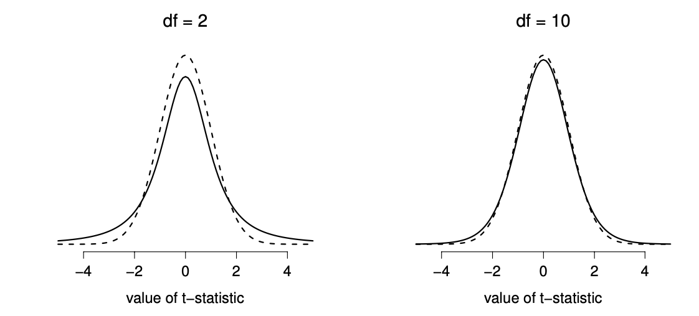

# Week 6: Hypothesis Testing[^week6-hypothesistesting-1]

[^week6-hypothesistesting-1]: Adapted nearly verbatim from Chapter 11 and 13 in Navarro, D. ["Learning Statistics with R."](https://learningstatisticswithr.com) R code from Emily Kothe's Bookdown adaptation of [Learning statistics with R](https://github.com/ekothe/rbook)

> *The process of induction is the process of assuming the simplest law that can be made to harmonize with our experience. This process, however, has no logical foundation but only a psychological one. It is clear that there are no grounds for believing that the simplest course of events will really happen. It is an hypothesis that the sun will rise tomorrow: and this means that we do not know whether it will rise.*
>
> -- Ludwig Wittgenstein[^week6-hypothesistesting-2]

[^week6-hypothesistesting-2]: The quote comes from Wittgenstein's (1922) text, *Tractatus Logico-Philosphicus*.

In the last chapter, we discussed estimation and sampling theory: "big ideas" in inferential statistics. It's now time to put these ideas to practical use with **hypothesis testing**. In its most abstract form, hypothesis testing is really very simple: the researcher has some theory about the world and wants to determine whether or not the data actually support that theory. However, the details are messy, and most people find the theory of hypothesis testing to be a very frustrating part of statistics.

The structure of this chapter is as follows. Firstly, I'll describe how hypothesis testing works, in a fair amount of detail, using a simple running example to show you how a hypothesis test is "built". I'll try to avoid being too dogmatic while doing so, and focus instead on the underlying logic of the testing procedure. Then, we will apply this logic to something which is done very often in research: comparing means.

## A menagerie of hypotheses {#hypotheses}
Eventually we all succumb to madness. For me, that day will arrive once I'm finally promoted to full professor. Safely ensconced in my ivory tower, happily protected by tenure, I will finally be able to take leave of my senses (so to speak), and indulge in that most thoroughly unproductive line of psychological research: the search for extrasensory perception (ESP).[^week6-hypothesistesting-3]

[^week6-hypothesistesting-3]: My apologies to anyone who actually believes in this stuff, but on my reading of the literature on ESP, it's just not reasonable to think this is real. To be fair, though, some of the studies are rigorously designed; so it's actually an interesting area for thinking about psychological research design. And of course it's a free country, so you can spend your own time and effort proving me wrong if you like, but I wouldn't think that's a terribly practical use of your intellect.

Let's suppose that this glorious day has come. My first study is a simple one, in which I seek to test whether clairvoyance (the claimed ability to gain information about an object, person, location, or physical event through extrasensory perception) exists. The participants in my study sit down at a table and are shown a card by an experimenter. The card is black on one side and white on the other. The experimenter takes the card away, and places it on a table in an adjacent room. The card is placed black side up or white side up completely at random, with the randomization occurring after the experimenter has left the room with the participant. A second experimenter comes in and asks the participant which side of the card is now facing upwards. The card is in the adjacent room, so the participant should have no way of knowing which side is facing upwards! Or do they...?

This is purely a one-shot experiment. Each person sees only one card, and gives only one answer; and at no stage is the participant actually in contact with someone who knows the right answer. My data set, therefore, is very simple. I have asked the question of $n$ people, and some number $X$ of these people have given the correct response. To make things concrete, let's suppose that I have tested $n = 100$ people, and $X = 62$ of these got the answer right... a surprisingly large number, we'd expect approximately 50 correct answers, but is it large enough for me to feel safe in claiming I've found evidence for extrasensory perception? This is the situation where hypothesis testing comes in useful. However, before we talk about how to *test* hypotheses, we need to be clear about what we mean by hypotheses.

### Research hypotheses versus statistical hypotheses
The first distinction that you need to keep clear in your mind is between **research hypotheses** and **statistical hypotheses**. In my ESP study, my overall scientific goal is to demonstrate that clairvoyance exists. In this situation, I have a clear research goal: I am hoping to discover evidence for ESP. In other situations I might actually be a lot more neutral than that, so I might say that my research goal is to determine whether or not clairvoyance exists. Regardless of how I want to portray myself, the basic point that I'm trying to convey here is that a research hypothesis involves making a substantive, testable scientific claim... if you are a psychologist, then your research hypotheses are fundamentally *about* psychological constructs. Any of the following would count as **research hypotheses**:

-   **Listening to music reduces your ability to pay attention to other things**. This is a claim about the causal relationship between two psychologically meaningful concepts (listening to music and paying attention to things), so it's a perfectly reasonable research hypothesis.
-   **Intelligence is related to personality**. Like the last one, this is a relational claim about two psychological constructs (intelligence and personality), but the claim is weaker: correlation is not causation.
-   **Intelligence is speed of information processing**. This hypothesis has a quite different character: it's not actually a relational claim at all. It's an ontological claim about the fundamental character of intelligence (and I'm pretty sure it's wrong).

It's worth expanding on the last research hypothesis actually. It's usually easier to think about how to construct experiments to test research hypotheses of the form "does X affect Y?" than it is to address claims like "what is X?" And in practice, what usually happens is that you find ways of testing relational claims that follow from your ontological ones. For instance, if I believe that intelligence *is* speed of information processing in the brain, my experiments will often involve looking for relationships between measures of intelligence and measures of speed. As a consequence, most everyday research questions do tend to be relational in nature, but they're almost always motivated by deeper ontological questions about the state of nature.

Notice that in practice, my research hypotheses could overlap a lot. My ultimate goal in the ESP experiment might be to test an ontological claim like "ESP exists", but I might operationally restrict myself to a narrower hypothesis like "Some people can 'see' objects in a clairvoyant fashion". 

As you can see, research hypotheses can be somewhat messy at times; and ultimately they are *scientific* claims. **Statistical hypotheses** are neither of these two things. Statistical hypotheses must be mathematically precise, and they must correspond to specific claims about the characteristics of the data generating mechanism (i.e., the "population"). Even so, the intent is that statistical hypotheses bear a clear relationship to the substantive research hypotheses that you care about! For instance, in my ESP study my research hypothesis is that some people are able to see through walls or whatever. What I want to do is to "map" this onto a statement about how the data were generated. So let's think about what that statement would be. The quantity that I'm interested in within the experiment is $P(\mbox{correct})$, the true-but-unknown **probability** with which the participants in my experiment answer the question correctly. Let's use the Greek letter $\theta$ (theta) to refer to this probability. Here are four different statistical hypotheses:

-   If ESP doesn't exist and if my experiment is well designed, then my participants are just guessing. So I should expect them to get it right half of the time and so my statistical hypothesis is that the true probability of choosing correctly is $\theta = 0.5$.
-   Alternatively, suppose ESP does exist and participants can see the card. If that's true, people will perform better than chance. The statistical hypothesis would be that $\theta > 0.5$.
-   A third possibility is that ESP does exist, but the colors are all reversed and people don't realise it (okay, that's wacky, but you never know...). If that's how it works then you'd expect people's performance to be *below* chance. This would correspond to a statistical hypothesis that $\theta < 0.5$.
-   Finally, suppose ESP exists, but I have no idea whether people are seeing the right color or the wrong one. In that case, the only claim I could make about the data would be that the probability of making the correct answer is *not* equal to 50. This corresponds to the statistical hypothesis that $\theta \neq 0.5$.

All of these are legitimate examples of a statistical hypothesis because they are statements about a **population parameter** and are meaningfully related to my experiment.

What this discussion makes clear, I hope, is that when attempting to construct a statistical hypothesis test the researcher actually has two quite distinct hypotheses to consider. First, he or she has a research hypothesis (a claim about something), and this corresponds to a statistical hypothesis (a claim about the data generating population). In my ESP example, these might be:

```{r echo=FALSE}
knitr::kable(data.frame(stringsAsFactors=FALSE,
   `My research hypothesis` = c("ESP exists"),
   `My statistical hypothesis` = c("$\\theta \\neq 0.5$")), 
   col.names = c("My research hypothesis","My statistical hypothesis"))
```

The key thing to recognise is this: *a statistical hypothesis test is a test of the statistical hypothesis, not the research hypothesis*. If your study is badly designed, then the link between your research hypothesis and your statistical hypothesis is broken. To give a silly example, suppose that my ESP study was conducted in a situation where the participant can actually see the card reflected in a window; if that happens, I would be able to find very strong evidence that $\theta \neq 0.5$, but this would tell us nothing about whether "ESP exists".

### Null hypotheses and alternative hypotheses
So far, so good. I have a research hypothesis that corresponds to what I want to **believe about the world**, and I can map it onto a statistical hypothesis that corresponds to what I want to **believe about how the data were generated**. It's at this point that things get somewhat counterintuitive for a lot of people. Because what I'm about to do is invent a new statistical hypothesis (the "null" hypothesis, $H_0$) that corresponds to the exact opposite of what I want to believe, and then focus exclusively on that, almost to the neglect of the thing I'm actually interested in (the "alternative" hypothesis: $H_1$). In our ESP example, the null hypothesis is that $\theta = 0.5$, since that's what we'd expect if ESP *didn't* exist. My hope, of course, is that ESP is totally real, and so the *alternative* to this null hypothesis is $\theta \neq 0.5$. In essence, what we're doing here is dividing up the possible values of $\theta$ into two groups: those values that I really hope aren't true (the null), and those values that I'd be happy with if they turn out to be right (the alternative). Having done so, the important thing to recognise is that the goal of a hypothesis test is *not* to show that the alternative hypothesis is true; the goal is to show that the null hypothesis is false. Most people find this pretty weird.

The best way to think about it, in my experience, is to imagine that a hypothesis test is a criminal trial: *the trial of the null hypothesis*. The null hypothesis is the defendant, the researcher is the prosecutor, and the statistical test itself is the judge. Just like a criminal trial, there is a presumption of innocence: the null hypothesis is *deemed* to be true unless you, the researcher, can prove beyond a reasonable doubt that it is false. You are free to design your experiment however you like (within reason, obviously!), and your goal when doing so is to maximise the chance that the data will yield a conviction... for the crime of being false. The catch is that the statistical test sets the rules of the trial, and those rules are designed to protect the null hypothesis -- specifically to ensure that if the null hypothesis is actually true, the chances of a false conviction are guaranteed to be low. This is pretty important: after all, the null hypothesis doesn't get a lawyer. And given that the researcher is trying desperately to prove it to be false, *someone* has to protect it.

## Two types of errors {#errortypes}
Before going into details about how a statistical test is constructed, it's useful to understand the philosophy behind it. I hinted at it when pointing out the similarity between a null hypothesis test and a criminal trial, but I should now be explicit. Ideally, we would like to construct our test so that we never make any errors. Unfortunately, since the world is messy, this is never possible. Sometimes you're just really unlucky: for instance, suppose you flip a coin 10 times in a row and it comes up heads all 10 times. That feels like very strong evidence that the coin is biased, but of course there's a 1 in 1024 chance that this would happen even if the coin was totally fair[^week6-hypothesistesting-4]. In other words, in real life we *always* have to accept that there's a chance that we did the wrong thing. As a consequence, the goal behind statistical hypothesis testing is not to *eliminate* errors, but to *minimise* them.

[^week6-hypothesistesting-4]: $\frac{1}{0.5^{10}}$ or try it in R: `dbinom(10,10,0.5)`

At this point, we need to be a bit more precise about what we mean by "errors". Firstly, let's state the obvious: it is either the case that the null hypothesis is true, or it is false; and our test will either reject the null hypothesis or retain it.[^week6-hypothesistesting-5] So, as the table below illustrates, after we run the test and make our choice, one of four things might have happened:

[^week6-hypothesistesting-5]: An aside regarding the language you use to talk about hypothesis testing. Firstly, one thing you really want to avoid is the word "prove": a statistical test really doesn't *prove* that a hypothesis is true or false. Proof implies certainty, and as the saying goes, statistics means never having to say you're certain. On that point almost everyone would agree. However, beyond that there's a fair amount of confusion. Some people argue that you're only allowed to make statements like "rejected the null", "failed to reject the null", or possibly "retained the null". According to this line of thinking, you can't say things like "accept the alternative" or "accept the null". Personally I think this is too strong: in my opinion, this conflates null hypothesis testing with Karl Popper's falsificationist view of the scientific process. While there are similarities between falsificationism and null hypothesis testing, they aren't equivalent. However, while I personally think it's fine to talk about accepting a hypothesis (on the proviso that "acceptance" doesn't actually mean that it's necessarily true, especially in the case of the null hypothesis), many people will disagree. And more to the point, you should be aware that this particular weirdness exists, so that you're not caught unaware by it when writing up your own results.

```{r echo=FALSE}
knitr::kable(data.frame(stringsAsFactors=FALSE,
NANA = c("$H_0$ is true", "$H_0$ is false"),
`retain.$H_0$` = c("correct decision", "error (type II)"),
`retain.$H_0$` = c("error (type I)", "correct decision")
), col.names = c("", "retain $H_0$", "reject $H_0$"))

```

As a consequence there are actually *two* different types of error here. If we reject a null hypothesis that is actually true, then we have made a **type I error**. On the other hand, if we retain the null hypothesis when it is in fact false, then we have made a **type II error**.

Remember how I said that statistical testing was kind of like a criminal trial? Well, I meant it. A criminal trial requires that you establish "beyond a reasonable doubt" that the defendant did it. All of the evidentiary rules are (in theory, at least) designed to ensure that there's (almost) no chance of wrongfully convicting an innocent defendant. The trial is designed to protect the rights of a defendant: as the English jurist William Blackstone famously said, it is "better that ten guilty persons escape than that one innocent suffer." In other words, a criminal trial doesn't treat the two types of error in the same way... punishing the innocent is deemed to be much worse than letting the guilty go free. A statistical test is pretty much the same: the single most important design principle of the test is to *control* the probability of a type I error, to keep it below some fixed probability. This probability, which is denoted $\alpha$, is called the **significance level** of the test. And I'll say it again, because it is so central to the whole set-up... a hypothesis test is said to have significance level $\alpha$ if the type I error rate is no larger than $\alpha$.

So, what about the type II error rate? Well, we'd also like to keep those under control too, and we denote this probability by $\beta$. However, it's much more common to refer to the **power** of the test, which is the probability with which we reject a null hypothesis when it really is false, which is $1-\beta$. To help keep this straight, here's the same table again, but with the relevant numbers added:

```{r echo=FALSE}
knitr::kable(data.frame(stringsAsFactors=FALSE,
NANA = c("$H_0$ is true", "$H_0$ is false"),
retain = c("$1-\\alpha$ (probability of correct retention)",
                   "$\\beta$ (type II error rate)"),
reject = c("$\\alpha$ (type I error rate)",
                   "$1-\\beta$  (power of the test)")), col.names=c("", "retain $H_0$", "reject $H_0$")
)

```

A "powerful" hypothesis test is one that has a small value of $\beta$, while still keeping $\alpha$ fixed at some (small) desired level. By convention, scientists mostly make use of three different $\alpha$ levels: $.05$, $.01$ and $.001$. Notice the asymmetry here... the tests are designed to *ensure* that the $\alpha$ level is kept small, but there's no corresponding guarantee regarding $\beta$. We'd certainly *like* the type II error rate to be small, and we try to design tests that keep it small, but this is very much secondary to the overwhelming need to control the type I error rate. As Blackstone might have said if he were a statistician, it is "better to retain 10 false null hypotheses than to reject a single true one". To be honest, I don't know that I agree with this philosophy -- there are situations where I think it makes sense, and situations where I think it doesn't -- but that's neither here nor there. It's how the tests are built.

## Test statistics and sampling distributions {#teststatistics}
At this point we need to start talking specifics about how a hypothesis test is constructed. To that end, let's return to the ESP example. Let's ignore the actual data that we obtained, for the moment, and think about the structure of the experiment. Regardless of what the actual numbers are, the *form* of the data is that $X$ out of $N$ people correctly identified the colour of the hidden card. Moreover, let's suppose for the moment that the null hypothesis really is true: ESP doesn't exist, and the true probability that anyone picks the correct colour is exactly $\theta = 0.5$. What would we *expect* the data to look like? Well, obviously, we'd expect the proportion of people who make the correct response to be pretty close to 50%. Or, to phrase this in more mathematical terms, we'd say that $X/N$ is approximately $0.5$. Of course, we wouldn't expect this fraction to be *exactly* 0.5: if, for example we tested $N=100$ people, and $X = 53$ of them got the question right, we'd probably be forced to concede that the data are quite consistent with the null hypothesis. On the other hand, if $X = 99$ of our participants got the question right, then we'd feel pretty confident that the null hypothesis is wrong. Similarly, if only $X=3$ people got the answer right, we'd be similarly confident that the null was wrong. Let's be a little more technical about this: we have a quantity $X$ that we can calculate by looking at our data; after looking at the value of $X$, we make a decision about whether to believe that the null hypothesis is correct, or to reject the null hypothesis in favour of the alternative. The name for this thing that we calculate to guide our choices is a **test statistic**.

Having chosen a test statistic, the next step is to state precisely which values of the test statistic would cause to reject the null hypothesis, and which values would cause us to keep it. In order to do so, we need to determine what the **sampling distribution of the test statistic** would be if the null hypothesis were actually true (we talked about sampling distributions earlier in Section \@ref(sampdistmain)). Why do we need this? Because this distribution tells us exactly what values of $X$ our null hypothesis would lead us to expect. And therefore, we can use this distribution as a tool for assessing how closely the null hypothesis agrees with our data.

```{r samplingdist, fig.cap="The sampling distribution for our test statistic $X$ when the null hypothesis is true. For our ESP scenario, this is a binomial distribution. Not surprisingly, since the null hypothesis says that the probability of a correct response is $\\theta = .5$, the sampling distribution says that the most likely value is 50 (our of 100) correct responses. Most of the probability mass lies between 40 and 60.", echo=FALSE}


nhstImg <- list()
emphCol <- rgb(0,0,1)
emphColLight <- rgb(.5,.5,1)
emphGrey <- grey(.5)

eps <- TRUE
colour <- TRUE
	width <- 8
	height <- 5.5
	
	# distribution
	x <- 0:100
	y <- dbinom(x,100,.5)
	
	# plot
	plot(x,y,type="h",lwd=3, col=ifelse(colour,emphCol,"black"),
		xlab="Number of Correct Responses (X)", ylab="Probability",
		main="Sampling Distribution for X if the Null is True",
		font.main=1, frame.plot=FALSE
	)
```

How do we actually determine the sampling distribution of the test statistic? For a lot of hypothesis tests this step is actually quite complicated, but fortunately for us, our ESP example provides us with one of the easiest cases. Our population parameter $\theta$ is just the overall probability that people respond correctly when asked the question, and our test statistic $X$ is the **count** of the number of people who did so, out of a sample size of $N$. We've seen a distribution like this before, in Section \@ref(binomdist): that's exactly what the binomial distribution describes! So, to use the notation and terminology that I introduced in that section, we would say that the null hypothesis predicts that $X$ is binomially distributed, which is written $$
X \sim \mbox{Binomial}(\theta,N)
$$ Since the null hypothesis states that $\theta = 0.5$ and our experiment has $N=100$ people, we have the sampling distribution we need. This sampling distribution is plotted in Figure \@ref(fig:samplingdist). No surprises really: the null hypothesis says that $X=50$ is the most likely outcome, and it says that we're almost certain to see somewhere between 40 and 60 correct responses.

## Making decisions {#decisionmaking}
Okay, we're very close to being finished. We've constructed a test statistic ($X$), and we chose this test statistic in such a way that we're pretty confident that if $X$ is close to $N/2$ then we should retain the null, and if not we should reject it. The question that remains is this: exactly which values of the test statistic should we associate with the null hypothesis, and which exactly values go with the alternative hypothesis? In my ESP study, for example, I've observed a value of $X=62$. What decision should I make? Should I choose to believe the null hypothesis, or the alternative hypothesis?

### Critical regions and critical values
To answer this question, we need to introduce the concept of a **critical region** for the test statistic $X$. The critical region of the test corresponds to those values of $X$ that would lead us to reject null hypothesis (which is why the critical region is also sometimes called the rejection region). How do we find this critical region? Well, let's consider what we know:

-   $X$ should be very big or very small in order to reject the null hypothesis.
-   If the null hypothesis is true, the sampling distribution of $X$ is Binomial$(0.5, N)$.
-   If $\alpha =.05$, the critical region must cover 5% of this sampling distribution.

It's important to make sure you understand this last point: the critical region corresponds to those values of $X$ for which we would reject the null hypothesis, and the sampling distribution in question describes the probability that we would obtain a particular value of $X$ if the null hypothesis were actually true. Now, let's suppose that we chose a critical region that covers 20% of the sampling distribution, and suppose that the null hypothesis is actually true. What would be the probability of incorrectly rejecting the null? The answer is of course 20%. And therefore, we would have built a test that had an $\alpha$ level of $0.2$. If we want $\alpha = .05$, the critical region is only *allowed* to cover 5% of the sampling distribution of our test statistic.

```{r crit2, fig.cap="The critical region associated with the hypothesis test for the ESP study, for a hypothesis test with a significance level of $\\alpha = .05$. The plot itself shows the sampling distribution of $X$ under the null hypothesis: the grey bars correspond to those values of $X$ for which we would retain the null hypothesis. The blue bars show the critical region: those values of $X$ for which we would reject the null. Because the alternative hypothesis is two sided (i.e., allows both $\\theta <.5$ and $\\theta >.5$), the critical region covers both tails of the distribution. To ensure an $\\alpha$ level of $.05$, we need to ensure that each of the two regions encompasses 2.5% of the sampling distribution.", echo=FALSE}
	# needed for printing
	width <- 8
	height <- 5.5
	
	setUpPlot <- function() {
		
		plot.new()
		plot.window(xlim=c(0,100),ylim=c(0,.08))
		axis(1)
		title(xlab="Number of Correct Responses (X)")
		
	}
	
	addDistPlot <- function(x,y,z) {
		
		# colour key
		col.key <- c(
			 grey(.9),
			 ifelse(colour,emphCol,"black")
		)
		
		# plot
		lines(x,y,col=col.key[as.numeric(z)+1],type="h",lwd=3)
		
	}
	
	addArrow <- function(x,h, text) {
		
		arrows(x0 = x[1], y0 = h, x1 = x[2], y1 = h, length = .1)
		lines(c(x[1],x[1]),c(h-.002,h+.002),'type'="l")
		
	}
	
	# distribution
	x <- 0:100
	y <- dbinom(x,100,.5)
	
	# plot 1
	setUpPlot()
	z <- x<=40 | x>=60
	addDistPlot(x,y,z)
	h <- .03
	addArrow(c(40,20),h)
	addArrow(c(60,80),h)	
	text(22,h+.013,"lower critical region")
	text(22,h+.007,"(2.5% of the distribution)")
	text(75,h+.013,"upper critical region")
	text(75,h+.007,"(2.5% of the distribution)")
	title(main="Critical Regions for a Two-Sided Test",font.main=1)
```

As it turns out, those three things uniquely solve the problem: our critical region consists of the most *extreme values*, known as the **tails** of the distribution. This is illustrated in Figure \@ref(fig:crit2). As it turns out, if we want $\alpha = .05$, then our critical regions correspond to $X \leq 40$ and $X \geq 60$.[^week6-hypothesistesting-6] That is, if the number of people saying "true" is between 41 and 59, then we should retain the null hypothesis. If the number is between 0 to 40 or between 60 to 100, then we should reject the null hypothesis. The numbers 40 and 60 are often referred to as the **critical values**, since they define the edges of the critical region.

[^week6-hypothesistesting-6]: Strictly speaking, the test I just constructed has $\alpha = .057$, which is a bit too generous. However, if I'd chosen 39 and 61 to be the boundaries for the critical region, then the critical region only covers 3.5% of the distribution. I figured that it makes more sense to use 40 and 60 as my critical values, and be willing to tolerate a 5.7% type I error rate, since that's as close as I can get to a value of $\alpha = .05$.

At this point, our hypothesis test is essentially complete: (1) we choose an $\alpha$ level (e.g., $\alpha = .05$, (2) come up with some test statistic (e.g., $X$) that does a good job (in some meaningful sense) of comparing $H_0$ to $H_1$, (3) figure out the sampling distribution of the test statistic on the assumption that the null hypothesis is true (in this case, binomial) and then (4) calculate the critical region that produces an appropriate $\alpha$ level (0-40 and 60-100). All that we have to do now is calculate the value of the test statistic for the real data (e.g., $X = 62$) and then compare it to the critical values to make our decision. Since 62 is greater than the critical value of 60, we would reject the null hypothesis. Or, to phrase it slightly differently, we say that the test has produced a **significant** result.

### A note on statistical "significance"
> *Like other occult techniques of divination, the statistical method has a private jargon deliberately contrived to obscure its methods from non-practitioners.*
>
> -- Attributed to G. O. Ashley[^week6-hypothesistesting-7]

[^week6-hypothesistesting-7]: The internet seems fairly convinced that Ashley said this, though I can't for the life of me find anyone willing to give a source for the claim.

A very brief digression is in order at this point, regarding the word "significant". The concept of statistical significance is actually a very simple one, but has a very unfortunate name. If the data allow us to reject the null hypothesis, we say that "the result is *statistically significant*", which is often shortened to "the result is significant". This terminology is rather old, and dates back to a time when "significant" just meant something like "indicated", rather than its modern meaning, which is much closer to "important". As a result, a lot of modern readers get very confused when they start learning statistics, because they think that a "significant result" must be an important one. It doesn't mean that at all. All that "statistically significant" means is that the data allowed us to reject a null hypothesis. Whether or not the result is actually important in the real world is a very different question, and depends on all sorts of other things.

### The difference between one sided and two sided tests {#onesidedtests}
There's one more thing I want to point out about the hypothesis test that I've just constructed. If we take a moment to think about the statistical hypotheses I've been using, $$
\begin{array}{cc}
H_0 : & \theta = .5 \\
H_1 : & \theta \neq .5 
\end{array}
$$ we notice that the alternative hypothesis covers *both* the possibility that $\theta < .5$ and the possibility that $\theta > .5$. This makes sense if I really think that ESP could produce better-than-chance performance *or* worse-than-chance performance (and there are some people who think that). In statistical language, this is an example of a **two-sided test**. It's called this because the alternative hypothesis covers the area on both "sides" of the null hypothesis, and as a consequence the critical region of the test covers both tails of the sampling distribution (2.5% on either side if $\alpha =.05$), as illustrated earlier in Figure \@ref(fig:crit2).

However, that's not the only possibility. It might be the case, for example, that I'm only willing to believe in ESP if it produces better than chance performance. If so, then my alternative hypothesis would only covers the possibility that $\theta > .5$, and as a consequence the null hypothesis now becomes $\theta \leq .5$: $$
\begin{array}{cc}
H_0 : & \theta \leq .5 \\
H_1 : & \theta > .5 
\end{array}
$$ When this happens, we have what's called a **one-sided test**, and when this happens the critical region only covers one tail of the sampling distribution. This is illustrated in Figure \@ref(fig:crit1).

```{r crit1, echo=FALSE, fig.cap="The critical region for a one sided test. In this case, the alternative hypothesis is that $\\theta > .05$, so we would only reject the null hypothesis for large values of $X$. As a consequence, the critical region only covers the upper tail of the sampling distribution; specifically the upper 5% of the distribution. Contrast this to the two-sided version earlier)"}
setUpPlot()
	z <- x>=58
	addDistPlot(x,y,z)
	h <- .03
	addArrow(c(58,80),h)	
	text(75,h+.013,"critical region")
	text(75,h+.007,"(5% of the distribution)")
	title(main="Critical Region for a One-Sided Test",font.main=1)
```

## The $p$ value of a test {#pvalue}
In one sense, our hypothesis test is complete; we've constructed a test statistic, figured out its sampling distribution if the null hypothesis is true, and then constructed the critical region for the test. Nevertheless, I've actually omitted the most important number of all: **the $p$ value**. It is to this topic that we now turn.

There are actually different ways of interpreting a $p$ value, that reflect very different ways of thinking about hypothesis tests. We will stick to interpreting a $p$ value as is done in most introductory textbooks, but please be aware this is not the only way of thinking about $p$ values. In fact, how the $p$ value is used in practice is a mix of several school of thoughts, which makes the whole thing kind of a mess, but it's a mess we have to deal with.

### The probability of extreme data
This definition of the $p$-value comes from Sir Ronald Fisher (yes, [him again](#pears-r)) and is the one that you tend to see in most introductory statistics textbooks. Notice how, when I constructed the critical region, it corresponded to the *tails* (i.e., extreme values) of the sampling distribution? That's not a coincidence: almost all "good" tests have this characteristic (good in the sense of minimising our type II error rate, $\beta$). The reason for that is that a good critical region almost always corresponds to those values of the test statistic that are least likely to be observed if the null hypothesis is true. If this rule is true, then we can define the $p$-value as the probability that we would have observed a test statistic that is at least as extreme as the one we actually did get. In other words, if the data are extremely implausible according to the null hypothesis, then the null hypothesis is probably wrong.

### A common mistake
Unfortunately, there is an explanation of $p$-values that people sometimes give, especially when they're first learning statistics, and it is **absolutely and completely wrong**. This mistaken approach is to refer to the $p$ value as "the probability that the null hypothesis is true". It's an intuitively appealing way to think, but it's wrong in two key respects: (1) null hypothesis testing is a frequentist tool, and the frequentist approach to probability does *not* allow you to assign probabilities to the null hypothesis... according to this view of probability, the null hypothesis is either true or it is not; it cannot have a "5% chance" of being true. (2) even within the Bayesian approach, which does let you assign probabilities to hypotheses, the $p$ value would not correspond to the probability that the null is true; this interpretation is entirely inconsistent with the mathematics of how the $p$ value is calculated. Put bluntly, despite the intuitive appeal of thinking this way, there is *no* justification for interpreting a $p$ value this way. Never do it.

## Running the hypothesis test in practice
At this point some of you might be wondering if the running example we've been using is a "real" hypothesis test, or just a toy example that I made up. It's real. I built the test from first principles, thinking that it was the simplest possible problem that you might ever encounter in real life. The test actually exists and is called the **binomial test**. It's implemented by an R function called `binom.test()`. To test the null hypothesis that the response probability is 0.5 (`p = .5`),[^week6-hypothesistesting-8] using data in which `x = 62` of `n = 100` people made the correct response, here's how to do it in R:

[^week6-hypothesistesting-8]: Note that the `p` here has nothing to do with a $p$ value. The `p` argument in the `binom.test()` function corresponds to the probability of making a correct response, according to the null hypothesis. In other words, it's the $\theta$ value.

```{r,echo=T}
binom.test( x=62, n=100, p=.5 )
```

Right now, this output looks pretty unfamiliar to you, but you can see that it's telling you more or less the right things. Specifically, the $p$-value of 0.02 is less than the usual choice of $\alpha = .05$, so you can reject the null. 

## Using hypothesis tests to compare means
The running example we've used until now was exactly that: an example to explain the foundations of hypothesis testing, but limited in scope. The outcome variable was binomial: we counted the number of times participants successfully "sensed" the color of the card. However, when conducting research, you're more likely to find yourself in a situation where your outcome variable is continuous, and what you're interested in is whether the average value of the outcome variable is higher in one group or another.

For instance, a psychologist might want to know if anxiety levels are higher among parents than non-parents, or if working memory capacity is reduced by listening to music (relative to not listening to music). In a medical context, we might want to know if a new drug increases or decreases blood pressure. An agricultural scientist might want to know whether adding phosphorus to Australian native plants will kill them. In all these situations, our outcome variable is a fairly continuous, interval or ratio scale variable; and our predictor is a binary "grouping" variable. In other words, we want to compare the means of the two groups.

The standard answer to the problem of comparing means is to use something called a $t$-test, of which there are several varieties depending on exactly what question you want to solve. As a consequence, the majority of the rest of this chapter focuses on different types of the $t$-test: one sample $t$-tests are discussed in Section \@ref(onesamplettest), independent samples $t$-tests are discussed in Section \@ref(welchttest), and paired samples $t$-tests are discussed in Section \@ref(pairedsamplesttest). The later sections of the chapter focus on the assumptions of the $t$-tests, and possible remedies if they are violated. However, before discussing any of these useful things, we'll start with a discussion of the $z$-test.

## The one-sample $z$-test
In this section I'll describe one of the most useless tests in all of statistics: the $z$-test. Seriously -- this test is almost never used in real life. Its only real purpose is that, when teaching statistics, it's a very convenient stepping stone along the way towards the $t$-test, which is probably the most (over)used tool in all statistics.

### The inference problem that the test addresses
To introduce the idea behind the $z$-test, let's use a simple example. A friend of mine, Dr Zeppo, grades his introductory statistics class on a curve. Let's suppose that the average grade in his class is 67.5, and the standard deviation is 9.5. Of his many hundreds of students, it turns out that 20 of them also take psychology classes. Out of curiosity, I find myself wondering: do the psychology students tend to get the same grades as everyone else (i.e., mean 67.5) or do they tend to score higher or lower? He emails me their grades and I load them into R:

```{r,echo=T}
grades <- c(50, 60, 60, 64, 66, 66, 67, 69, 70, 74, 
            76, 76, 77, 79, 79, 79, 81, 82, 82, 89)
```

and calculate the mean:

```{r,echo=T}
mean(grades)
```

Hm. It *might* be that the psychology students are scoring a bit higher than normal: that sample mean of $\bar{x} = 72.3$ is a fair bit higher than the hypothesised population mean of $\mu = 67.5$, but on the other hand, a sample size of $N = 20$ isn't all that big. Maybe it's pure chance.

To answer the question, it helps to be able to write down what it is that I think I know. Firstly, I know that the sample mean is $\bar{X} = 72.3$. If I'm willing to assume that the psychology students have the same standard deviation as the rest of the class then I can say that the population standard deviation is $\sigma = 9.5$. I'll also assume that the psychology student grades are normally distributed.

Next, it helps to be clear about what I want to learn from the data. In this case, my research hypothesis relates to the *population* mean $\mu$ for the psychology student grades, which is unknown. Specifically, I want to know if $\mu = 67.5$ or not. Given that this is what I know, can we devise a hypothesis test to solve our problem? The data, along with the hypothesised distribution from which they are thought to arise, are shown in Figure \@ref(fig:zeppo). Not entirely obvious what the right answer is, is it? For this, we are going to need some statistics.

```{r zeppo, fig.cap="The theoretical distribution (solid line) from which the psychology student grades (blue bars) are supposed to have been generated.", echo=FALSE}

ttestImg <- list()
emphCol <- rgb(0,0,1)
emphColLight <- rgb(.5,.5,1)
emphGrey <- grey(.5)

colour <- TRUE

plotHist <- function(x,...) {
    hist( x, border="white", 
          col=ifelse(colour,emphColLight,emphGrey),...
    )
    axis(1)
  }
 
  # needed for printing
  width <- 6
  height <- 6
  
  # Zeppo
  plotHist(grades,xlim=c(40,90),xlab="Grades",axes=FALSE, ylab="", main="", freq=FALSE)

  lines( x<-40:90, dnorm(x,67.5,10), lwd=3, col="black")

```

### Constructing the hypothesis test
The first step in constructing a hypothesis test is to be clear about what the null and alternative hypotheses are. This isn't too hard to do. Our null hypothesis, $H_0$, is that the true population mean $\mu$ for psychology student grades is 67.5; and our alternative hypothesis is that the population mean *isn't* 67.5. If we write this in mathematical notation, these hypotheses become: $$
\begin{array}{ll}
H_0: & \mu = 67.5 \\
H_1: & \mu \neq 67.5
\end{array}
$$ though to be honest this notation doesn't add much to our understanding of the problem, it's just a compact way of writing down what we're trying to learn from the data. The null hypotheses $H_0$ and the alternative hypothesis $H_1$ for our test are both illustrated in Figure \@ref(fig:ztesthyp). In addition to providing us with these hypotheses, the scenario outlined above provides us with a fair amount of background knowledge that might be useful. Specifically, there are two special pieces of information that we can add:

1.  The psychology grades are normally distributed.
2.  The true standard deviation of these scores $\sigma$ is known to be 9.5.

For the moment, we'll act as if these are absolutely trustworthy facts. In real life, this kind of absolutely trustworthy background knowledge doesn't exist, and so if we want to rely on these facts we'll just have make the *assumption* that these things are true. 

```{r ztesthyp,  fig.cap="Graphical illustration of the null and alternative hypotheses assumed by the one sample $z$-test (the two sided version, that is). The null and alternative hypotheses both assume that the population distribution is normal, and additionally assumes that the population standard deviation is known (fixed at some value $\\sigma_0$). The null hypothesis (left) is that the population mean $\\mu$ is equal to some specified value $\\mu_0$. The alternative hypothesis is that the population mean differs from this value, $\\mu \\neq \\mu_0$.", echo=FALSE}

	
	width <- 12
	height <- 4
	
	plotOne <- function( sigEx ) {

		x <- seq(-4,4,.1)
		y <- dnorm(x,0,1)

		plot.new()
		
		old <- par( no.readonly = TRUE )
		par( mfcol= c(1,2), mfg = c(1,1))

		plot.window( xlim = range(x), 
	             	ylim = range(y)*1.2)

		# plot density
		lines( x ,y, lw =2 )

		# lines and mean
		lines(x=c(0,0), y = c(0,max(y)))
		text(x=0, y = max(y)*1.1, 
	     	labels= expression(mu == mu[0])
		)    

		# sd lines and text
		tmp <- dnorm(-1,0,1)
		lines(x=c(-1,0), y = rep(tmp,2))
		text(x=-2.25, y = tmp, 
	     	labels= sigEx
	     )

		axis(side = 1, labels = F)
		title( main = "null hypothesis", font.main = 1)
		title( xlab = "value of X", mgp = c(1,1,0))

		par( mfg = c(1,2))

		plot.window( xlim = range(x), 
	             ylim = range(y)*1.2)


				y <- dnorm(x,-.75,1)

		# plot density
		lines( x ,y, lw =2 )

		# lines and mean
		lines(x=c(0,0), y = c(0,max(y)))
		text(x=0, y = max(y)*1.1, 
	     	labels= expression(mu != mu[0])
	     )    

		# sd lines and text
		tmp <- dnorm(-1,0,1)
		lines(x=c(-1.75,-.75), y = rep(tmp,2))
		text(x=-3, y = tmp, 
	     	labels= sigEx
	     )

		axis(side = 1, labels = F)
		title( main = "alternative hypothesis", font.main = 1)
		title( xlab = "value of X", mgp = c(1,1,0))

		par(old)
	}
	

	# one sample z-test
	sigEx <- expression(sigma == sigma[0])
	plotOne( sigEx )
```

The next step is to figure out what we would be a good choice for a diagnostic test statistic; something that would help us discriminate between $H_0$ and $H_1$. Given that the hypotheses all refer to the population mean $\mu$, you'd feel pretty confident that the sample mean $\bar{X}$ would be a pretty useful place to start. What we could do, is look at the difference between the sample mean $\bar{X}$ and the value that the null hypothesis predicts for the population mean. In our example, that would mean we calculate $\bar{X} - 67.5$. More generally, if we let $\mu_0$ refer to the value that the null hypothesis claims is our population mean, then we'd want to calculate: $$
\bar{X} - \mu_0
$$ If this quantity equals or is very close to 0, things are looking good for the null hypothesis. If this quantity is a long way away from 0, then it's looking less likely that the null hypothesis is worth retaining. But how far away from zero should it be for us to reject $H_0$?

To figure that out, we need to be a bit more sneaky, and we'll need to rely on those two pieces of background knowledge that I wrote down previously, namely that the raw data are normally distributed, and we know the value of the population standard deviation $\sigma$. If the null hypothesis is actually true, and the true mean is $\mu_0$, then these facts together mean that we know the complete population distribution of the data: a normal distribution with mean $\mu_0$ and standard deviation $\sigma$. Adopting the notation from Section \@ref(norm-dist), a statistician might write this as: $$
X \sim \mbox{Normal}(\mu_0,\sigma)
$$ Okay, if that's true, then what can we say about the distribution of $\bar{X}$? Well, as we discussed earlier (see Section \@ref(clt)), the sampling distribution of the mean $\bar{X}$ is also normal, and has mean $\mu$. But the standard deviation of this sampling distribution $\mbox{SE}({\bar{X}})$, which is called the *standard error of the mean*, is: $$
\mbox{SE}({\bar{X}}) = \frac{\sigma}{\sqrt{N}}
$$ In other words, if the null hypothesis is true then the sampling distribution of the mean can be written as follows: $$
\bar{X} \sim \mbox{Normal}(\mu_0,\mbox{SE}({\bar{X}}))
$$ Now comes the trick. What we can do is convert the sample mean $\bar{X}$ into a standard score (Section \@ref(zscore)). This is conventionally written as $z$, but for now I'm going to refer to it as $z_{\bar{X}}$. (The reason for using this expanded notation is to help you remember that we're calculating standardised version of a sample mean, *not* a standardised version of a single observation, which is what a $z$-score usually refers to). When we do so, the $z$-score for our sample mean is: $$
z_{\bar{X}} = \frac{\bar{X} - \mu_0}{\mbox{SE}({\bar{X}})}
$$ or, equivalently: $$
z_{\bar{X}} =  \frac{\bar{X} - \mu_0}{\sigma / \sqrt{N}}
$$ This $z$-score is our test statistic. The nice thing about using this as our test statistic is that like all $z$-scores, it has a standard normal distribution: $$
z_{\bar{X}} \sim \mbox{Normal}(0,1)
$$ In other words, regardless of what scale the original data are on, the $z$-statistic itself always has the same interpretation: it's equal to the number of standard errors that separate the observed sample mean $\bar{X}$ from the population mean $\mu_0$ predicted by the null hypothesis. Better yet, regardless of what the population parameters for the raw scores actually are, the 5% critical regions for $z$-test are always the same, as illustrated in Figures \@ref(fig:ztest2) and \@ref(fig:ztest1). And what this meant, way back in the days where people did all their statistics by hand, is that someone could publish a table like this:

```{r fig.cap = "Critical $z$ values", echo=FALSE}
knitr::kable(tibble::tribble(
                         ~V1,                ~V2,                ~V3,
                      ".1",      "1.644854",       "1.281552",
                      ".05",      "1.959964",       "1.644854",
                      ".01",      "2.575829",       "2.326348",
                      ".001",      "3.290527",       "3.090232"
  ), col.names = c("desired $\\alpha$ level", " two-sided test", " one-sided test"), align = 'ccc')
```
which in turn meant that researchers could calculate their $z$-statistic by hand, and then look up the critical value in a text book. That was an incredibly handy thing to be able to do back then, but it's kind of unnecessary these days, since it's trivially easy to do it with software like R.

```{r ztest2, fig.cap="Rejection regions for the two-sided $z$-test", echo=FALSE}
  width <- 6
  height <- 4
  
  plot.new()
  plot.window( xlim=c(-3,3), ylim=c(0,.4) )
  
  crit <- qnorm(.975)
  x<-c(seq(crit,3,.01),3)
  y<-dnorm(x)
  polygon(c(x[1],x,3),c(0,y,0),
          col=ifelse(colour,emphColLight,emphGrey),
          density=10)
  
  crit <- qnorm(.025)
  x<-c(seq(-3,crit,.01),crit)
  y<-dnorm(x)
  polygon(c(x[1],x,crit),c(0,y,0),
          col=ifelse(colour,emphColLight,emphGrey),
          density=10)
  
  x <- seq(-3,3,.01)
  y <- dnorm(x)
  lines(x,y,lwd=3,col="black")

  axis(1,at=round(c(-3,crit,0,-crit,3),2),
       labels=c("",round(crit,2),"0",round(-crit,2),""))
  title(xlab="Value of z Statistic", main="Two Sided Test", font.main=1)
```

```{r ztest1, fig.cap="Rejection regions for the one-sided $z$-test", echo=FALSE}
  plot.new()
  plot.window( xlim=c(-3,3), ylim=c(0,.4) )
  
  crit <- qnorm(.95)
  x<-c(seq(crit,3,.01),3)
  y<-dnorm(x)
  polygon(c(x[1],x,3),c(0,y,0),
          col=ifelse(colour,emphColLight,emphGrey),
          density=10)
  
  x <- seq(-3,3,.01)
  y <- dnorm(x)
  lines(x,y,lwd=3,col="black")
  
  axis(1,at=round(c(-3,0,crit,3),2),
       labels=c("","0",round(crit,2),""))
  title(xlab="Value of z Statistic", main="One Sided Test", font.main=1)
```

### A worked example using R
Now, as I mentioned earlier, the $z$-test is almost never used in practice. It's so rarely used in real life that the basic installation of R doesn't have a built in function for it. However, the test is so incredibly simple that it's really easy to do one manually. Let's go back to the data from Dr Zeppo's class. Having loaded the `grades` data, the first thing I need to do is calculate the sample mean:

```{r,echo=T}
sample.mean <- mean( grades )
print(sample.mean)
```

Then, I create variables corresponding to known population standard deviation ($\sigma = 9.5$), and the value of the population mean that the null hypothesis specifies ($\mu_0 = 67.5$):

```{r,echo=T}
mu.null <- 67.5
sd <- 9.5
```

Let's also create a variable for the sample size. We could count up the number of observations ourselves, and type `N <- 20` at the command prompt, but counting is tedious and repetitive. Let's get R to do the tedious repetitive bit by using the `length()` function, which tells us how many elements there are in a vector:

```{r,echo=T}
N <- length(grades)
print(N)
```

Next, let's calculate the standard error of the mean:

```{r,echo=T}
sem <- sd / sqrt(N)
print(sem)
```

And finally, we calculate our $z$-score:

```{r,echo=T}
z.score <- (sample.mean - mu.null) / sem
print(z.score)
```

At this point, we would traditionally look up the value 2.26 in our table of critical values. Our original hypothesis was two-sided (we didn't really have any theory about whether psych students would be better or worse at statistics than other students) so our hypothesis test is two-sided (or two-tailed) also.

Looking at the little table that I showed earlier, we can see that 2.26 is bigger than the critical value of 1.96 that would be required to be significant at $\alpha = .05$, but smaller than the value of 2.58 that would be required to be significant at a level of $\alpha = .01$. Therefore, we can conclude that we have a significant effect, which we might write up by saying something like this:

> With a mean grade of 73.2 in the sample of psychology students, and assuming a true population standard deviation of 9.5, we can conclude that the psychology students have significantly different statistics scores to the class average ($z = 2.26$, $N=20$, $p<.05$).

However, what if want an exact $p$-value? Well, back in the day, the tables of critical values were huge, and so you could look up your actual $z$-value, and find the smallest value of $\alpha$ for which your data would be significant. However, looking things up in books is tedious, and typing things into computers is awesome. So let's do it using R instead. Now, notice that the $\alpha$ level of a $z$-test (or any other test, for that matter) defines the total area "under the curve" for the critical region, right? That is, if we set $\alpha = .05$ for a two-sided test, then the critical region is set up such that the area under the curve for the critical region is $.05$. And, for the $z$-test, the critical value of 1.96 is chosen that way because the area in the lower tail (i.e., below $-1.96$) is exactly $.025$ and the area under the upper tail (i.e., above $1.96$) is exactly $.025$. So, since our observed $z$-statistic is $2.26$, why not calculate the area under the curve below $-2.26$ or above $2.26$? In R we can calculate this using the `pnorm()` function. For the upper tail:

```{r,echo=T}
upper.area <- pnorm(q = z.score, lower.tail = FALSE)
print(upper.area)
```

The `lower.tail = FALSE` is me telling R to calculate the area under the curve from 2.26 *and upwards*. If I'd told it that `lower.tail = TRUE`, then R would calculate the area from 2.26 *and below*, and it would give me an answer 0.9880771. Alternatively, to calculate the area from $-2.26$ and below, we get

```{r,echo=T}
lower.area <- pnorm(q = -z.score, lower.tail = TRUE)
print(lower.area)
```

Thus we get our $p$-value:

```{r,echo=T}
p.value <- lower.area + upper.area
print(p.value)
```

### Assumptions of the $z$-test {#zassumptions}
All statistical tests make assumptions. Some tests make reasonable assumptions, while other tests do not. The test I've just described -- the one sample $z$-test -- makes three basic assumptions. These are:

-   *Normality*. As usually described, the $z$-test assumes that the true population distribution is normal.[^week6-hypothesistesting-9] is often pretty reasonable, and not only that, it's an assumption that we can check if we feel worried about it (but not during this course).
-   *Independence*. The second assumption of the test is that the observations in your data set are not correlated with each other, or related to each other in some funny way. This isn't as easy to check statistically: it relies a bit on good experimental design. An obvious (and stupid) example of something that violates this assumption is a data set where you "copy" the same observation over and over again in your data file: so you end up with a massive "sample size", consisting of only one genuine observation. More realistically, you have to ask yourself if it's really plausible to imagine that each observation is a completely random sample from the population that you're interested in. In practice, this assumption is never met; but we try our best to design studies that minimise the problems of correlated data.
-   *Known standard deviation*. The third assumption of the $z$-test is that the true standard deviation of the population is known to the researcher. This is just stupid. In no real world data analysis problem do you know the standard deviation $\sigma$ of some population, but are completely ignorant about the mean $\mu$. In other words, this assumption is *always* wrong.

[^week6-hypothesistesting-9]: Actually this is too strong. Strictly speaking the $z$ test only requires that the sampling distribution of the mean be normally distributed; if the population is normal then it necessarily follows that the sampling distribution of the mean is also normal. However, as we saw when talking about the central limit theorem, it's quite possible (even commonplace) for the sampling distribution to be normal even if the population distribution itself is non-normal. However, in light of the sheer ridiculousness of the assumption that the true standard deviation is known, there really isn't much point in going into details on this front!

In view of the stupidity of assuming that $\sigma$ is known, let's see if we can live without it. This takes us out of the dreary domain of the $z$-test, and into the magical kingdom of the $t$-test, with unicorns and fairies and leprechauns, and um...

## The one-sample $t$-test {#onesamplettest}
After some thought, I decided that it might not be safe to assume that the psychology student grades necessarily have the same standard deviation as the other students in Dr Zeppo's class. After all, if I'm entertaining the hypothesis that they don't have the same mean, then why should I believe that they absolutely have the same standard deviation? In view of this, I should really stop assuming that I know the true value of $\sigma$. This violates the assumptions of my $z$-test, so in one sense I'm back to square one. However, it's not like I'm completely bereft of options. After all, I've still got my raw data, and those raw data give me an *estimate* of the population standard deviation:

```{r}
sd(grades)
```

In other words, while I can't say that I know that $\sigma = 9.5$, I *can* say that $\hat\sigma = 9.52$.

Okay, cool. The obvious thing that you might think to do is run a $z$-test, but using the estimated standard deviation of 9.52 instead of relying on my assumption that the true standard deviation is 9.5. So, we could just type this new number into R and out would come the answer. And you probably wouldn't be surprised to hear that this would still give us a significant result. This approach is close, but it's not *quite* correct. Because we are now relying on an *estimate* of the population standard deviation, we need to make some adjustment for the fact that we have some uncertainty about what the true population standard deviation actually is. Maybe our data are just a fluke ... maybe the true population standard deviation is 11, for instance. But if that were actually true, and we ran the $z$-test assuming $\sigma=11$, then the result would end up being *non-significant*. That's a problem, and it's one we're going to have to address.

### Introducing the $t$-test
This ambiguity is annoying, and it was resolved in 1908 by a guy called William Sealy Gosset [@Student1908], who was working as a chemist for the Guinness brewery at the time [see @Box1987]. Because Guinness took a dim view of its employees publishing statistical analysis (apparently they felt it was a trade secret), he published the work under the pseudonym "A Student", and to this day, the full name of the $t$-test is actually ***Student's*** $t$-test. The key thing that Gosset figured out is how we should accommodate the fact that we aren't completely sure what the true standard deviation is.[^week6-hypothesistesting-10] The answer is that it subtly changes the sampling distribution. In the $t$-test, our test statistic (now called a $t$-statistic) is calculated in exactly the same way I mentioned above. If our null hypothesis is that the true mean is $\mu$, but our sample has mean $\bar{X}$ and our estimate of the population standard deviation is $\hat{\sigma}$, then our $t$ statistic is: $$
t = \frac{\bar{X} - \mu}{\hat{\sigma}/\sqrt{N} }
$$ The only thing that has changed in the equation is that instead of using the known true value $\sigma$, we use the estimate $\hat{\sigma}$. And if this estimate has been constructed from $N$ observations, then the sampling distribution turns into a $t$-distribution with $N-1$ ***degrees of freedom*** (df). The $t$ distribution is very similar to the normal distribution, but has "heavier" tails, as discussed earlier in Section \@ref(other-dist) and illustrated in Figure \@ref(fig:ttestdist). Notice, though, that as df gets larger, the $t$-distribution starts to look identical to the standard normal distribution. This is as it should be: if you have a sample size of $N = 70,000,000$ then your "estimate" of the standard deviation would be pretty much perfect, right? So, you should expect that for large $N$, the $t$-test would behave exactly the same way as a $z$-test. And that's exactly what happens!

[^week6-hypothesistesting-10]: Well, sort of. As I understand the history, Gosset only provided a partial solution: the general solution to the problem was provided by... Sir Ronald Fisher.

```{r ttestdist, fig.cap="The $t$ distribution with 2 degrees of freedom (left) and 10 degrees of freedom (right), with a standard normal distribution (i.e., mean 0 and std dev 1) plotted as dotted lines for comparison purposes. Notice that the $t$ distribution has heavier tails (higher kurtosis) than the normal distribution; this effect is quite exaggerated when the degrees of freedom are very small, but negligible for larger values. In other words, for large $df$ the $t$ distribution is essentially identical to a normal distribution.", echo=FALSE}


```

### Doing the test in R
As you might expect, the mechanics of the $t$-test are almost identical to the mechanics of the $z$-test. So there's not much point in going through the tedious exercise of showing you how to do the calculations using low level commands: it's pretty much identical to the calculations that we did earlier, except that we use the estimated standard deviation (i.e., something like `se.est <- sd(grades)`), and then we test our hypothesis using the $t$ distribution rather than the normal distribution (i.e. we use `pt()` rather than `pnorm()`. During the labs, instead of going through the calculations in tedious detail, for now we'll jump straight to showing you how $t$-tests are done in practice using the `t.test()` command:

```{r,echo=T}
t.test(grades, mu = 67.5)
```

So that seems straightforward enough. Now what do we *do* with this output? Well, since we're pretending that we actually care about my toy example, we're overjoyed to discover that the result is statistically significant (i.e. $p$ value below .05). We could report the result by saying something like this:

> With a mean grade of 72.3, the psychology students scored slightly higher than the average grade of 67.5 ($t(19) = 2.25$, $p<.05$).

### Assumptions of the one sample $t$-test {#ttestoneassumptions}
Okay, so what assumptions does the one-sample $t$-test make? Well, since the $t$-test is basically a $z$-test with the assumption of known standard deviation removed, you shouldn't be surprised to see that it makes the same assumptions as the $z$-test, minus the one about the known standard deviation. That is

-   *Normality*. We're still assuming that the population distribution (or sampling distribution of the mean) is normal.
-   *Independence*. Once again, we have to assume that the observations in our sample are generated independently of one another. See the earlier discussion about the $z$-test for specifics (Section \@ref(zassumptions)).

Overall, these two assumptions aren't terribly unreasonable, and as a consequence the one-sample $t$-test is pretty widely used in practice as a way of comparing a sample mean against a hypothesized population mean.

## The independent samples $t$-test
Although the one sample $t$-test has its uses, it's not the most typical example of a $t$-test. A much more common situation arises when you've got two different groups of observations. In psychology, this tends to correspond to two different groups of participants, where each group corresponds to a different condition in your study. For each person in the study, you measure some outcome variable of interest, and the research question that you're asking is whether or not the two groups have the same population mean. This is the situation that the independent samples $t$-test is designed for.

### The data
Suppose we have 33 students taking Dr Harpo's statistics lectures, and Dr Harpo doesn't grade to a curve. Actually, Dr Harpo's grading is a bit of a mystery, so we don't really know anything about what the average grade is for the class as a whole. There are two tutors for the class, Anastasia and Bernadette. There are $N_1 = 15$ students in Anastasia's tutorials, and $N_2 = 18$ in Bernadette's tutorials. The research question I'm interested in is whether Anastasia or Bernadette is a better tutor, or if it doesn't make much of a difference. Dr Harpo emails me the course grades as a data.frame:

```{r,echo=F,warning=F,error=F}
library(dplyr)
load ("data/harpo.Rdata" )
```

```{r,echo=F}
glimpse(harpo)
```

As we can see, there's a single data frame with two variables, `grade` and `tutor`. The `grade` variable is a numeric vector, containing the grades for all $N = 33$ students taking Dr Harpo's class; the `tutor` variable is a factor that indicates who each student's tutor was. The first six observations in this data set are shown below:

```{r,echo=T}
head(harpo)
```

We can calculate means and standard deviations, using the `mean()` and `sd()` functions. Rather than show the R output, here's a nice little summary table:

```{r echo=FALSE}
knitr::kable(tibble::tribble(
                        ~V1,       ~V2,         ~V3,    ~V4,
   "Anastasia's students", "74.53",    "9.00", "15",
   "Bernadette's students", "69.06",    "5.77",  "18"
  ), col.names = c("",  "mean", "std dev",  "N"), align="lccc")
```

Since it's always a good idea to look at your data, I've plotted histograms showing the distribution of grades for both tutors (Figure \@ref(fig:harpohistanastasia) and \@ref(fig:harpohistbernadette)). Inspection of these histograms suggests that the students in Anastasia's class may be getting slightly better grades on average, though they also seem a little more variable.

```{r harpohistanastasia, fig.cap="Histogram showing the overall distribution of grades for students in Anastasia's class", echo=FALSE}
  plotHist(harpo$grade[harpo$tutor == "Anastasia"],
           xlim=c(50,100),xlab="Grade", main="Anastasia's students",
           font.main=1,breaks=seq(50,100,5), ylim=c(0,7))
```

```{r harpohistbernadette, fig.cap="Histogram showing the overall distribution of grades for students in Bernadette's class", echo=FALSE}
  plotHist(harpo$grade[harpo$tutor == "Bernadette"],
           xlim=c(50,100),xlab="Grade", main="Bernadette's students",
           font.main=1,breaks=seq(50,100,5), ylim=c(0,7))
```

### Introducing the test {#welchttest}
The ***independent samples*** $t$-test comes in two different forms: Student's and Welch's. The original Student $t$-test is the simpler of the two, but relies on more restrictive assumptions than the Welch $t$-test. As such, it is generally advised to use the Welch $t$-test, which we'll explain in more detail below. The biggest problem with using the Student test is that it assumes that both groups have the same standard deviation. This is rarely true in real life: if two samples don't have the same means, why should we expect them to have the same standard deviation? There's really no reason to expect this assumption to be true. 

A graphical illustration of what the ***Welch*** $t$ test assumes about the data is shown in Figure \@ref(fig:ttesthyp2). Assuming for the moment that you want to run a two-sided test, the goal is to determine whether two "independent samples" of data are drawn from populations with the same mean (the null hypothesis) or different means (the alternative hypothesis). When we say "independent" samples, what we really mean here is that there's no special relationship between observations in the two samples. This probably doesn't make a lot of sense right now, but it will be clearer when we come to talk about the paired samples $t$-test later on. For now, let's just point out that if we have an experimental design where participants are randomly allocated to one of two groups, and we want to compare the two groups' mean performance on some outcome measure, then an independent samples $t$-test (rather than a paired samples $t$-test) is what we're after.

```{r ttesthyp2, fig.cap="Graphical illustration of the null and alternative hypotheses assumed by the Welch $t$-test. Like the Student test we assume that both samples are drawn from a normal population; but the alternative hypothesis no longer requires the two populations to have equal variance.", echo=FALSE}
	width <- 12
	height <- 4

	plotOne <- function( sd1 ) {
 
		Grade <- 40:100

		mu1 <- c(60, 75)
		mu0 <- 70
		sd0 <- 9

		plot.new()   # new figure window

		old <- par( no.readonly = TRUE )
	
		par( mfcol = c(1,2),  # array of two plots
	     	mfg = c(1,1) )   # start on the left

		ymax <- .07
		plot.window( xlim = range(Grade),
	        ylim = c(0, ymax)
	  	)

		# null distribution
		lines( x = Grade, 
	       y = ynull <- dnorm(Grade, mu0, sd0), 
	       lw = 2 )

		axis(side = 1, at = seq(40,100,10), labels = F)

		text(x = mu0, y = max(ynull)*1.1, 
	     expression(mu) , cex = 1.2)

		title( main = "null hypothesis", font.main = 1)
		title( xlab = "value of X", mgp = rep(1,3))

		par( mfg = c(1,2) ) 
		plot.window( xlim = range(Grade),
	             ylim = c(0, ymax) )


		# alternative distributions
		lines( x = Grade, 
	       y = ya1 <- dnorm(Grade, mu1[1], sd1[1]), 
	       lw = 2 )

		lines( x = Grade, 
	       y = ya2 <- dnorm(Grade, mu1[2], sd1[2]), 
	       lw = 2 )

		axis(side = 1, at = seq(40,100,10), labels = F)

		text(x = mu1[1], y = max(ya1)*1.1, 
	     expression(mu[1]) , cex = 1.2)
		text(x = mu1[2], y = max(ya2)*1.1, 
	     expression(mu[2]) , cex = 1.2)
	

		title( main = "alternative hypothesis", font.main = 1)
		title( xlab = "value of X", mgp = rep(1,3))
	
		par(old)
	
	}


	# print 
	sd1 <- c(6.5, 7.95)
	plotOne( sd1 )
```

Okay, so let's let $\mu_1$ denote the true population mean for group 1 (e.g., Anastasia's students), and $\mu_2$ will be the true population mean for group 2 (e.g., Bernadette's students),[^week6-hypothesistesting-11] and as usual we'll let $\bar{X}_1$ and $\bar{X}_2$ denote the observed sample means for both of these groups. Our null hypothesis states that the two population means are identical ($\mu_1 = \mu_2$) and the alternative to this is that they are not ($\mu_1 \neq \mu_2$). Written in mathematical-ese, this is... 

$$
\begin{array}{ll}
H_0: & \mu_1 = \mu_2  \\
H_1: & \mu_1 \neq \mu_2
\end{array}
$$

[^week6-hypothesistesting-11]: A funny question almost always pops up at this point: what the heck *is* the population being referred to in this case? Is it the set of students actually taking Dr Harpo's class (all 33 of them)? The set of people who might take the class (an unknown number) of them? Or something else? Does it matter which of these we pick? It's traditional in an introductory behavioural stats class to mumble a lot at this point, but since I get asked this question every year by my students, I'll give a brief answer. Technically yes, it does matter: if you change your definition of what the "real world" population actually is, then the sampling distribution of your observed mean $\bar{X}$ changes too. The $t$-test relies on an assumption that the observations are sampled at random from an infinitely large population; and to the extent that real life isn't like that, then the $t$-test can be wrong. In practice, however, this isn't usually a big deal: even though the assumption is almost always wrong, it doesn't lead to a lot of pathological behaviour from the test, so we tend to just ignore it.

To construct a hypothesis test that handles this scenario, we start by noting that if the null hypothesis is true, then the difference between the population means is *exactly* zero: $\mu_1 - \mu_2 = 0$

As a consequence, a diagnostic test statistic will be based on the difference between the two sample means. Because if the null hypothesis is true, then we'd expect 
$$\bar{X}_1 - \bar{X}_2$$ 
to be *pretty close* to zero. However, just like we saw with our one-sample tests (i.e., the one-sample $z$-test and the one-sample $t$-test) we have to be precise about exactly *how close* to zero this difference should be. And the solution to the problem is more or less the same one: we calculate a standard error estimate (SE), just like last time, and then divide the difference between means by this estimate. So our $t$-statistic will be of the form: 
$$t = \frac{\bar{X}_1 - \bar{X}_2}{\mbox{SE}({\bar{X}_1 - \bar{X}_2})}$$ 

We just need to figure out what the standard error estimate of the difference between sample means actually is. This is a bit trickier than was the case for what we've looked at so far, but it works out to this: 

$$
\mbox{SE}({\bar{X}_1 - \bar{X}_2}) = \sqrt{ \frac{{\hat{\sigma}_1}^2}{N_1} + \frac{{\hat{\sigma}_2}^2}{N_2} }
$$ 
Why it's calculated this way is beyond the scope of this book. In the Welch test, the "degrees of freedom" doesn't have to be a whole number any more, and it doesn't correspond all that closely to the "number of data points minus the number of constraints" anymore. The degrees of freedom are, in fact... 
$$
\mbox{df} = \frac{ ({\hat{\sigma}_1}^2 / N_1 + {\hat{\sigma}_2}^2 / N_2)^2 }{  ({\hat{\sigma}_1}^2 / N_1)^2 / (N_1 -1 )  + ({\hat{\sigma}_2}^2 / N_2)^2 / (N_2 -1 ) } 
$$ 

... which is all pretty straightforward and obvious, right? Well, perhaps not. It doesn't really matter for our purposes. Just as we saw with our one-sample test, the sampling distribution of this $t$-statistic is a $t$-distribution with the degrees of freedom above as long as the null hypothesis is true, and all of the assumptions of the test are met. 

### Doing the test in R
Not surprisingly, you can run an independent samples $t$-test using the `t.test()` function. The exact usage of `t.test()` for independent samples will be explained during the lab, but it looks as follows:

```{r,echo=T}
t.test( formula = grade ~ tutor, data = harpo )
```

The output has a very familiar form. First, it tells you what test was run, and it tells you the names of the variables that you used. The second part of the output reports the sample means and standard deviations for both groups (i.e., both tutorial groups). The third section of the output states the null hypothesis and the alternative hypothesis in a fairly explicit form. It then reports the test results: just like last time, the test results consist of a $t$-statistic, the degrees of freedom, the $p$-value and a confidence interval. 

It's pretty important to be clear on what this confidence interval actually refers to: it is a confidence interval for the *difference* between the group means. In our example, Anastasia's students had an average grade of 74.5, and Bernadette's students had an average grade of 69.1, so the difference between the two sample means is 5.4. But of course the difference between population means might be bigger or smaller than this. The confidence interval tells you that there's a 95% chance that the true difference between means lies between -0.1 and 11.0.

In any case, the difference between the two groups is not significant (just barely), so we might write up the result using text like this:

> The mean grade in Anastasia's class was 74.5%, whereas the mean in Bernadette's class was 69.1%. A Welch's independent samples $t$-test showed that this difference was not significant ($t(23.03) = 2.03$, $p<.05$, $CI_{95} = [-0.1, 11.0]$).


### Positive and negative $t$ values
Before moving on to talk about the assumptions of the $t$-test, there's one additional point I want to make about the use of $t$-tests in practice. The first one relates to the sign of the $t$-statistic (that is, whether it is a positive number or a negative one). One very common worry that students have when they start running their first $t$-test is that they often end up with negative values for the $t$-statistic, and don't know how to interpret it. In fact, it's not at all uncommon for two people working independently to end up with R outputs that are almost identical, except that one person has a negative $t$ values and the other one has a positive $t$ value. Assuming that you're running a two-sided test, then the $p$-values will be identical. On closer inspection, the students will notice that the confidence intervals also have the opposite signs. This is perfectly okay: whenever this happens, what you'll find is that the two versions of the R output arise from slightly different ways of running the $t$-test. What's happening here is very simple. The $t$-statistic that R is calculating here is always of the form $$
t = \frac{\mbox{(mean 1)} -\mbox{(mean 2)}}{ \mbox{(SE)}}
$$ If "mean 1" is larger than "mean 2" the $t$ statistic will be positive, whereas if "mean 2" is larger then the $t$ statistic will be negative. Similarly, the confidence interval that R reports is the confidence interval for the difference "(mean 1) minus (mean 2)", which will be the reverse of what you'd get if you were calculating the confidence interval for the difference "(mean 2) minus (mean 1)".

Okay, that's pretty straightforward when you think about it, but now consider our $t$-test comparing Anastasia's class to Bernadette's class. Which one should we call "mean 1" and which one should we call "mean 2". It's arbitrary. However, you really do need to designate one of them as "mean 1" and the other one as "mean 2". Not surprisingly, the way that R handles this is also pretty arbitrary. In earlier versions of the book I used to try to explain it, but after a while I gave up, because it's not really all that important, and to be honest I can never remember myself. Whenever I get a significant $t$-test result, and I want to figure out which mean is the larger one, I don't try to figure it out by looking at the $t$-statistic. Why would I bother doing that? It's foolish. It's easier just look at the actual group means, since the R output actually shows them!

### Assumptions of the test {#assumptions}
As always, our hypothesis test relies on some assumptions. So what are they? For the Welch t-test there are two assumptions, the first one we saw previously in the context of the one sample $t$-test (see Section \@ref(ttestoneassumptions)):

-   *Normality*. Like the one-sample $t$-test, it is assumed that the data are normally distributed. Specifically, we assume that both groups are normally distributed.
-   *Independence*. Once again, it is assumed that the observations are independently sampled. In the context of the Welch test this has two aspects to it. Firstly, we assume that the observations within each sample are independent of one another (exactly the same as for the one-sample test). However, we also assume that there are no cross-sample dependencies. If, for instance, it turns out that you included some participants in both experimental conditions of your study (e.g., by accidentally allowing the same person to sign up to different conditions), then there are some cross sample dependencies that you'd need to take into account.

## The paired-samples $t$-test {#pairedsamplesttest}
An independent samples $t$-test is intended to be used in a situation where you have two samples that are, well, independent of one another. This situation arises naturally when participants are assigned randomly to one of two experimental conditions, but it provides a very poor approximation to other sorts of research designs. In particular, a repeated measures design -- in which each participant is measured (with respect to the same outcome variable) in both experimental conditions -- is not suited for analysis using independent samples $t$-tests. For example, we might be interested in whether listening to music reduces people's working memory capacity. To that end, we could measure each person's working memory capacity in two conditions: with music, and without music. In an experimental design such as this one each participant appears in *both* groups. This requires us to approach the problem in a different way; by using the ***paired samples*** $t$-test.

### The data
The data set that we'll use this time comes from Dr Chico's class.[^week6-hypothesistesting-14] In her class, students take two major tests, one early in the semester and one later in the semester. To hear her tell it, she runs a very hard class, one that most students find very challenging; but she argues that by setting hard assessments, students are encouraged to work harder. Her theory is that the first test is a bit of a "wake up call" for students: when they realise how hard her class really is, they'll work harder for the second test and get a better mark. Is she right? To test this, let's have a look at the data.frame she sent me:

[^week6-hypothesistesting-14]: At this point we have Drs Harpo, Chico and Zeppo. No prizes for guessing who Dr Groucho is.

```{r,echo=F}
load("data/chico.Rdata")
```

```{r, echo=T}
glimpse(chico)     
```

The data frame `chico` contains three variables: an `id` variable that identifies each student in the class, the `grade_test1` variable that records the student grade for the first test, and the `grade_test2` variable that has the grades for the second test. Here's the first six students:

```{r,echo=T}
head(chico)
```

At a glance, it does seem like the class is a hard one (most grades are between 50% and 60%), but it does look like there's an improvement from the first test to the second one. If we take a quick look at the descriptive statistics:

```{r,echo=T}
chico %>% summarise(n = length(grade_test1),
                       mean_grade_test1 = mean(grade_test1),
                       sd_grade_test1 = sd(grade_test1),
                       mean_grade_test2 = mean(grade_test2),
                       sd_grade_test2 = sd(grade_test2),) %>%
  knitr::kable()

```

we see that this impression seems to be supported. Across all 20 students the mean grade for the first test is 57%, but this rises to 58% for the second test. Although, given that the standard deviations are 6.6% and 6.4% respectively, it's starting to feel like maybe the improvement is just illusory; maybe just random variation. This impression is reinforced when you see the means and confidence intervals plotted in Figure \@ref(fig:pairedta). If we were to rely on this plot alone, we'd come to the same conclusion that we got from looking at the descriptive statistics. Looking at how wide those confidence intervals are, we'd be tempted to think that the apparent improvement in student performance is pure chance.

```{r pairedta, fig.cap="Mean grade for test 1 and test 2, with associated 95% confidence intervals", echo=FALSE,out.width="75%"}


```

Nevertheless, this impression is wrong. To see why, take a look at the scatterplot of the grades for test 1 against the grades for test 2. shown in Figure \@ref(fig:pairedtb).

```{r pairedtb, fig.cap="Scatterplot showing the individual grades for test 1 and test 2", out.width="75%", echo=FALSE}

knitr::include_graphics("figures/pairedtb.png")

```
In this plot, each dot corresponds to the two grades for a given student: if their grade for test 1 ($x$ co-ordinate) equals their grade for test 2 ($y$ co-ordinate), then the dot falls on the line. Points falling above the line are the students that performed better on the second test. Critically, almost all of the data points fall above the diagonal line: almost all of the students *do* seem to have improved their grade, if only by a small amount. This suggests that we should be looking at the *improvement* made by each student from one test to the next, and treating that as our raw data. To do this, we'll need to create a new variable for the `improvement` that each student makes, and add it to the `chico` data frame. The easiest way to do this is as follows:

```{r,echo=T}
chico$improvement <- chico$grade_test2 - chico$grade_test1 
```

Notice that I assigned the output to a variable called `chico$improvement`. That has the effect of creating a new variable called `improvement` inside the `chico` data frame. So now when I look at the `chico` data frame, I get an output that looks like this:

```{r,echo=T}
head(chico)
```

Now that we've created and stored this `improvement` variable, we can draw a histogram showing the distribution of these improvement scores, shown in Figure \@ref(fig:pairedtc).

```{r pairedtc, fig.cap="Histogram showing the improvement made by each student in Dr Chico's class. Notice that almost the entire distribution is above zero: the vast majority of students did improve their performance from the first test to the second one", echo=FALSE}


```
When we look at histogram, it's very clear that there *is* a real improvement here. The vast majority of the students scored higher on test 2 than on test 1, reflected in the fact that almost the entire histogram is above zero. So you can see, qualitatively, what's going on: there is a real "within student" improvement (everyone improves by about 1%), but it is very small when set against the quite large "between student" differences (student grades vary by about 20% or so).

### What is the paired samples $t$-test?
In light of the previous exploration, let's think about how to construct an appropriate $t$ test. One possibility would be to try to run an independent samples $t$-test using `grade_test1` and `grade_test2` as the variables of interest. However, this is clearly the wrong thing to do: the independent samples $t$-test assumes that there is no particular relationship between the two samples. Yet clearly that's not true in this case, because of the repeated measures structure to the data. To use the language that I introduced in the last section, if we were to try to do an independent samples $t$-test, we would be conflating the ***within subject*** differences (which is what we're interested in testing) with the ***between subject*** variability (which we are not).

The solution to the problem is obvious, I hope, since we already did all the hard work in the previous section. Instead of running an independent samples $t$-test on `grade_test1` and `grade_test2`, we run a *one-sample* $t$-test on the within-subject difference variable, `improvement`. To formalise this slightly, if $X_{i1}$ is the score that the $i$-th participant obtained on the first variable, and $X_{i2}$ is the score that the same person obtained on the second one, then the difference score is: 
$$
D_{i} = X_{i1} - X_{i2} 
$$ 
Notice that the difference scores is *variable 1 minus variable 2* and not the other way around, so if we want improvement to correspond to a positive valued difference, we actually want "test 2" to be our "variable 1". Equally, we would say that $\mu_D = \mu_1 - \mu_2$ is the population mean for this difference variable. So, to convert this to a hypothesis test, our null hypothesis is that this mean difference is zero; the alternative hypothesis is that it is not: 
$$
\begin{array}{ll}
H_0: & \mu_D = 0  \\
H_1: & \mu_D \neq 0
\end{array}
$$ 
(this is assuming we're talking about a two-sided test here). This is more or less identical to the way we described the hypotheses for the one-sample $t$-test: the only difference is that the specific value that the null hypothesis predicts is 0. And so our $t$-statistic is defined in more or less the same way too. If we let $\bar{D}$ denote the mean of the difference scores, then 
$$
t = \frac{\bar{D}}{\mbox{SE}({\bar{D}})}
$$ 
which is 
$$
t = \frac{\bar{D}}{\hat\sigma_D / \sqrt{N}}
$$ 
where $\hat\sigma_D$ is the standard deviation of the difference scores. Since this is just an ordinary, one-sample $t$-test, with nothing special about it, the degrees of freedom are still $N-1$. And that's it: the paired samples $t$-test really isn't a new test at all: it's a one-sample $t$-test, but applied to the difference between two variables. It's actually very simple; the only reason it merits a discussion as long as the one we've just gone through is that you need to be able to recognise *when* a paired samples test is appropriate, and to understand *why* it's better than an independent samples $t$ test.

### Doing the test in R
How do you do a paired samples $t$-test in R. One possibility is to follow the process I outlined above: create a "difference" variable and then run a one sample $t$-test on that. Since we've already created a variable called `chico$improvement`, let's do that:

```{r,echo=T}
t.test(chico$improvement, mu=0)
```

Alternatively you could do the following, giving you the exact same output:

```{r,echo=T}
t.test( x = chico$grade_test2,   # variable 1 is the "test2" scores
         y = chico$grade_test1,   # variable 2 is the "test1" scores
         paired = TRUE           # paired test
 )
```
 
## That's it for this week...
... and for new materials during this course. Null hypothesis significance testing (NHST) is one of the most ubiquitous elements to statistical theory. The vast majority of scientific papers report the results of some hypothesis test or another. As a consequence it is almost impossible to get by in science without having at least a cursory understanding of NHST and what a $p$-value means.

During the labs we will walk through the formal steps of conducting NHSTs ($t$-tests in particular), use R to run tests on our own data and discuss some of things to be mindful of when conducting statistical tests. As a reminder, there are additional practice materials for this week on [SOWISO](https://cloud.sowiso.nl). The materials on SOWISO have a slightly different take on NHST and show you how to do many of the calculations we do in R by hand. 
